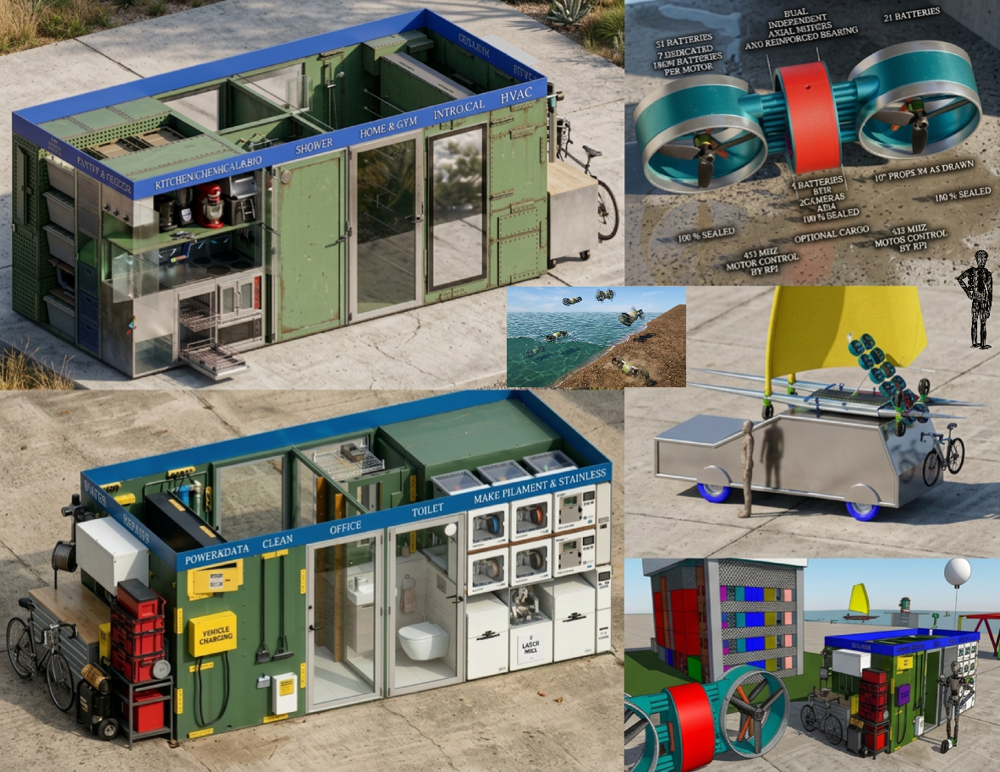
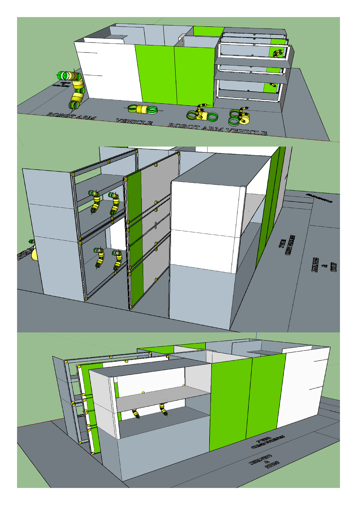

# ALWAYS ON

**License:** CC BY-NC-SA  
**Project origin:** Building ~2010 · Drone ~2012 · Linux systems ~2023  
**Supporting project plan:** https://archive.org/details/@scott_widmann  
**Current project website:** https://www.300x3.com

---

**Architecture, Installation, Configuration, Operations, and Status**

## Document Status and Reading Guide

This README is the single authoritative document for the ALWAYS ON project. It
contains the intended architecture, implemented configuration, operational
requirements, validation evidence, approved deviations, known issues, and work
queue.

Every material statement in this document belongs to one of the following
categories:

| Category | Meaning |
|---|---|
| **Architecture requirement** | Mandatory final-state design constraint |
| **Implemented** | Verified as deployed or tested on the current host |
| **Planned** | Approved design not yet implemented |
| **Blocked** | Requires an operator decision, credential, key ceremony, hardware connection, or other prerequisite |
| **Deviation** | Approved difference between intended architecture and current implementation |
| **Work item** | A discrete task with acceptance criteria |
| **Issue** | A recorded defect, ambiguity, or implementation risk |

When the current implementation differs from an architecture requirement, the
difference must be recorded in **Approved Deviations and Open Decisions** with
a rationale, compensating controls, owner, and resolution condition.

**Last consolidated review:** 2026-08-29

---

# 1. System Purpose

ALWAYS ON is a compartmentalized, on-premises platform supporting an automated
approximately 160-square-foot modular live/fabricate facility and an
accompanying modular micro-aircraft carrier.

The platform supports:

- Drone telemetry and field communications.
- Photogrammetry and mapping.
- Vehicle simulation.
- Fabrication, facility, inventory, kitchen, and logistics simulation.
- Static public sales content.
- Hosted payment checkout and receipt generation.
- Mastodon-based customer and community follow-up.
- Local LM Studio and OpenClaw-assisted support workflows.
- Corda-backed provenance, receipts, entitlements, and approved state records.
- Encrypted pCloud archival replication and controlled IPFS artifact
  distribution.

The system is designed around **strict isolation**. Sales, AI, payments,
mapping, field telemetry, vehicle simulation, fabrication simulation, archive,
and ledger services must not share broad networks, credentials, writable
storage, databases, or unrestricted host access.

The current workstation is a development, integration, and validation host. It
uses Kubuntu 26.04 LTS software, an AMD CPU, and an EVGA NVIDIA GTX 1080.
Future compute-intensive production workloads may move to an immersion-cooled
server rack and a Raspberry Pi edge-computing cluster.

Kubuntu is appropriate for the current workstation role because KDE supports
QGroundControl, Gazebo visualization, GPU diagnostics, Tokodon, and general
engineering workflows while retaining an Ubuntu LTS package base. Ubuntu 26.04
LTS standard support is scheduled through April 2031.

Podman is the only supported container runtime. Containers are managed through
systemd Quadlet definitions rather than Docker Compose, shell-wrapper
orchestration, or a Docker daemon.

---

# 2. Platform Baseline

## 2.1 Intended Platform Standard

| Area | Architecture requirement |
|---|---|
| Host OS | Kubuntu 26.04 LTS workstation |
| Current CPU/GPU | AMD CPU and EVGA NVIDIA GTX 1080 |
| Future compute | Immersion-cooled server rack and Raspberry Pi edge cluster |
| Container engine | Podman only |
| Container lifecycle | systemd and Podman Quadlet |
| Public website | Static HTML in pCloud Public Folder |
| Payments | Provider-hosted checkout and verified payment events; no local card handling |
| Sales and support | Sales API, PostgreSQL, Mastodon integration, OpenClaw, and LM Studio |
| Drone compute | Raspberry Pi 5 with Waveshare SX1262-class LoRa top-hat |
| Drone autopilot | 3DR N1 connected to Raspberry Pi 5 by MAVLink |
| Desktop radio | Heltec WiFi LoRa 32 V3 through stable USB serial path |
| Field protocol | RNS/Reticulum and MeshChatX over raw LoRa unless a true LoRaWAN deployment is selected |
| Mapping | WebODM and supporting services under Podman |
| Mapping storage | `/media/scottw/500GBPHOTOGRAM/` |
| Vehicle simulation | ROS 2 Lyrical, Gazebo Sim 10.5.0, ArduPilot SITL, MAVLink, QGroundControl |
| Fabrication simulation | ROS 2 Lyrical, Gazebo Sim 10.5.0, robot cells, additive manufacturing, storage, kitchen, and logistics models |
| Ledger | Corda core behind a dedicated ledger-ingestion gateway |
| Archive | Local source data, signed manifests, encrypted pCloud replication, private or encrypted IPFS workflow |
| Monitoring | Prometheus-compatible metrics, alerts, health checks, and protected administration access |
| Backup | PostgreSQL/Corda-aware backup, restic or equivalent encrypted backup, and scheduled restore testing |

## 2.2 Current Host Facts

| Area | Verified current value |
|---|---|
| Kernel | `7.0.0-30-generic` |
| Podman | `5.7.0` |
| Podman networks | Ten `ao-*` networks present; internal workload-domain isolation verified |
| GPU | EVGA NVIDIA GTX 1080 |
| NVIDIA driver | `580.173.02` |
| NVIDIA integration | CDI devices registered, including `nvidia.com/gpu=0` |
| Simulation stack | ROS 2 Lyrical at `/opt/ros/lyrical`; Gazebo Sim `10.5.0` |
| Host PostgreSQL | PostgreSQL `18.6`, loopback-only |
| Host Redis | Redis `8.0.5`, loopback-only |
| Mapping drive | ext4 `/dev/sdb1`; UUID verified; approximately 433.9 GB free of 457 GB |
| Mapping mount | `/media/scottw/500GBPHOTOGRAM/` |
| Current runtime model | Mixed rootless and system/rootful Podman evidence; see approved deviation section |

---

# 3. High-Level Architecture

## 3.1 Isolation Diagram

```text
                                  PUBLIC INTERNET
                                         │
                                         ▼
                    ┌─────────────────────────────────────┐
                    │ pCloud Public Folder                │
                    │ Static storefront only              │
                    │ Products - Docs - Legal - Links     │
                    └─────────┬───────────────┬───────────┘
                              │               │
                Hosted checkout               │ Community/support links
                              │               │
                              ▼               ▼
                 ┌────────────────────────────────────────┐
                 │ CONTROLLED INGRESS / EGRESS ADAPTERS    │
                 │ Payment ingress - Archive egress       │
                 │ Community egress - Build/update path   │
                 └───────────────┬────────────────────────┘
                                 │
           ┌─────────────────────┼─────────────────────┐
           ▼                     ▼                     ▼
┌──────────────────┐  ┌──────────────────┐  ┌──────────────────┐
│ PAYMENT DOMAIN   │  │ SALES / AI DOMAIN│  │ ARCHIVE ADAPTER  │
│ Webhook verifier │  │ Sales API         │  │ pCloud/IPFS      │
│ Normalizer       │  │ Sales PostgreSQL  │  │ encrypted export │
└────────┬─────────┘  │ Mastodon adapter  │  └──────────────────┘
         │            │ OpenClaw/LM Studio│
         │            └────────┬──────────┘
         │                     │ Signed receipt manifests
         ▼                     ▼
             ┌──────────────────────────────────────────┐
             │ LEDGER-INGEST DOMAIN                     │
             │ mTLS - authorization - schema validation │
             │ signatures - idempotency - audit         │
             └──────────────────┬───────────────────────┘
                                │
                                ▼
             ┌──────────────────────────────────────────┐
             │ LEDGER-CORE DOMAIN                       │
             │ Corda node - Corda database - PKI        │
             └──────────────────────────────────────────┘

Drone Pi 5 + Waveshare ─ LoRa ─ Heltec V3 ─► FIELD DOMAIN ─────┐
                                                               │
WebODM/imagery intake ─────────────────────► MAPPING DOMAIN ───┤
                                                               ├─ Signed manifests only
Vehicle ROS/Gazebo/SITL ───────────────────► VEHICLE SIM ──────┤
                                                               │
Fabrication ROS/Gazebo ────────────────────► FABRICATION SIM ──┘
                                                               ▼
                                                    LEDGER-INGEST
```

The public storefront has no direct route to the Kubuntu host’s field,
mapping, simulation, database, AI, Podman, or Corda-core services.

## 3.2 Canonical Implementation Status

| Domain or component | Architecture requirement | Current implementation state | Status | Blocking condition or next action |
|---|---|---|---|---|
| Host platform | Kubuntu, Podman, Quadlet, protected administration | Host inventory and base platform verified | Implemented | Maintain version matrix |
| Domain isolation | Separate workload networks with explicit approved paths | Ten internal workload networks and isolation test verified | Implemented | Add narrow adapters only as required |
| Mapping | Dedicated mapping domain and photogrammetry drive | GPU-enabled WebODM smoke test completed; orthophoto produced | Implemented with deviation | Formalize steady-state rootless/system model |
| Field and LoRa | Raspberry Pi 5, Waveshare LoRa, Heltec V3 gateway | Heltec V3 not connected; no live link test | Blocked | Connect Heltec V3 by USB-C |
| Vehicle simulation | Isolated ROS/Gazebo/ArduPilot SITL domain | Headless Gazebo and ROS-Gazebo bridge smoke test passed | Implemented | Add scenario and QGroundControl validation as needed |
| Fabrication simulation | Isolated ROS/Gazebo facility domain | Headless simulation smoke test passed | Implemented | Expand facility models and safety scenarios |
| Ledger | Corda core behind mTLS ingestion gateway | Corda 5.2.2 scaffolded | Blocked | Complete operator key and certificate ceremony |
| Sales and payment | Hosted payment flow and verified events | Sales DB deployed; payment provider and API pending | Planned | Select provider and implement verifier/API |
| Mastodon and OpenClaw | Restricted local support/community workflow | Local stack in progress; OAuth/client issues recorded | In progress | Complete Tokodon and local LLM validation |
| Archive | Encrypted off-host replication and controlled IPFS workflow | Local restic backup and restore validation complete | Partially implemented | Provision pCloud/archive credentials and test replication |
| Backup and restore | Encrypted backup plus recurring restore testing | Encrypted restic snapshot and isolated restore test complete | Implemented | Automate recurring schedule |


## 3.3 DATABASES

PostgreSQL 18 host cluster, loopback-only
├── salesdb       # Authoritative sales system
├── cordadb       # Corda core persistence
├── mappingdb     # WebODM mapping persistence
├── grafana       # Optional; Grafana private metadata
├── metabase      # Optional; Metabase private metadata
└── postgres      # Administrative/maintenance database

---

# 4. Security, Isolation, and Data Policy

## 4.1 Non-Negotiable Rules

1. Inspect before changing.
2. Preserve existing data.
3. Never format, repartition, delete, prune, or overwrite without explicit
   operator approval.
4. Never install Docker daemon, Docker Compose, or Watchtower.
5. Use Podman and Quadlet only.
6. Never expose a public port without explicit operator approval.
7. Never place secrets in scripts, logs, HTML, Git, pCloud Public Folder, IPFS,
   Corda payloads, shell history, or documentation examples.
8. Never use `--privileged` as a default.
9. Use pinned image digests for operational services.
10. Verify the photogrammetry drive before deploying or operating WebODM.
11. Record commands, versions, significant output, and failures in the
    installation or operational journal.
12. Stop and report conflicts involving services, packages, networks, mounts,
    ports, serial devices, firewall policy, or existing data.
13. Do not broaden network access, filesystem access, container privileges, or
    secret access merely to bypass an error.
14. Require explicit human approval before publishing external communications,
    initiating payments, changing production credentials, deleting data, or
    modifying external records.

## 4.2 Data Classification

| Classification | Examples | Handling requirement |
|---|---|---|
| Public | Storefront HTML, intentionally published documentation, approved product data | May be placed in pCloud Public Folder |
| Internal operational | Non-sensitive configuration, health data, non-sensitive manifests, unit status | Restricted local access; do not publish by default |
| Sensitive | Customer contact data, payment references, precise telemetry, sensitive imagery, proprietary technical designs | Domain-restricted storage; encrypted backup; no public IPFS |
| Secret | Passwords, tokens, API keys, private keys, Corda keystores, archive credentials, radio keys | Podman secrets, systemd credentials, or approved secret files only |

## 4.3 Prohibited Paths

```text
Sales/AI → MAVLink, ArduPilot, ROS, Gazebo, LoRa, RNS, MeshChatX
Sales/AI → WebODM workers, raw imagery, Corda core
Payment → OpenClaw, LM Studio, Mastodon, field, mapping, simulation
Field → payment provider, Mastodon, OpenClaw, LM Studio, Corda core
Mapping → flight control, LoRa/RNS, payment provider, Mastodon, Corda core
Vehicle simulation → live drones, live radios, sales, payments, Corda core
Fabrication simulation → live machinery during phase one, sales, payments, Corda core
Public internet → PostgreSQL, Redis, WebODM workers, LM Studio, Corda,
                  ROS, MAVLink, Gazebo, QGroundControl, RNS, MeshChatX
```

## 4.4 Approved Internal Paths

```text
Sales receipt manifest ───────────────► Ledger-ingestion gateway
Verified payment event ───────────────► Sales API and/or ledger-ingestion gateway
Field telemetry manifest ─────────────► Ledger-ingestion gateway
Mapping deliverable manifest ─────────► Ledger-ingestion gateway
Vehicle simulation manifest ──────────► Ledger-ingestion gateway
Fabrication simulation manifest ──────► Ledger-ingestion gateway

Ledger receipt or entitlement status ─► Authorized service through narrow API
Signed mission release ───────────────► Field mission-release service
Validated image set ──────────────────► WebODM intake service
```

All cross-domain requests require:

- Mutual TLS.
- A dedicated service certificate or identity.
- Signed payload where durable provenance is required.
- Schema validation.
- Timestamp and nonce or equivalent replay defense.
- Durable idempotency key handling.
- Audit record.
- Explicit authorization policy.

Mutual TLS authenticates transport peers. Detached manifest signatures permit
independent verification after storage, export, or audit. These are separate
controls and should be used together for provenance-bearing artifacts.

---

# 5. Network Domains and Controlled External Access

## 5.1 Workload Domains

| Podman network | Purpose | Public exposure | Permitted output |
|---|---|---|---|
| `ao-sales` | Sales API, sales PostgreSQL, Mastodon adapter, OpenClaw, LM Studio | No direct public exposure | Signed order, receipt, and entitlement manifests |
| `ao-payment` | Provider webhook verifier and payment adapter | No direct public exposure | Verified normalized payment state |
| `ao-field` | Heltec gateway, RNS/MeshChatX, telemetry spool, mission-release service | No direct public exposure | Signed telemetry and mission manifests |
| `ao-mapping` | WebODM, NodeODM, Redis, mapping DB, imagery intake/exporter | Operator/VPN access only when approved | Signed mapping deliverable manifests |
| `ao-sim-vehicle` | ROS 2, Gazebo, ArduPilot SITL, MAVLink, QGroundControl simulation | No direct public exposure | Signed vehicle-simulation manifests |
| `ao-sim-fabrication` | ROS 2, Gazebo, robot cells, additive manufacturing, facility model | No direct public exposure | Signed fabrication-simulation manifests |
| `ao-ledger-ingest` | mTLS validation gateway, authorization, audit, idempotency | No direct public exposure | Corda receipt IDs and status |
| `ao-ledger-core` | Corda node, Corda database, certificate/keystore material | No direct public exposure | No direct output |
| `ao-data` | Narrow controlled data plumbing where unavoidable | No direct public exposure | Controlled references only |
| `ao-admin` | Monitoring, backup, restore validation, administration | VPN or explicitly allowlisted administration only | Operational reports |

All workload-domain networks are `Internal=true`. CIDRs are recorded in:

```text
/ALWAYSON/config/platform/network-cidrs.yaml
```

No workload service may receive unrestricted Internet access simply by joining
its application-domain network.

## 5.2 Controlled Ingress and Egress Adapters

External connectivity is allowed only through narrowly scoped, independently
reviewed adapters. These adapters are architecture-controlled exceptions, not
general-purpose Internet access.

| Adapter/network | Purpose | Direction | Mandatory controls |
|---|---|---|---|
| `ao-ingress-payment` | Payment-provider webhook receiver or approved relay | Inbound | Minimal listener, provider-signature verification, rate limits, audit log, normalized event output |
| `ao-egress-archive` | Encrypted pCloud replication and approved IPFS operations | Outbound | Destination allowlist, TLS validation, encrypted payloads, separate credentials, transfer audit |
| `ao-egress-community` | Approved Mastodon/community activity when remote connectivity is explicitly enabled | Outbound | Approved host allowlist, minimum OAuth scope, rate limits, publication approval log |
| `ao-build-update` | Image and package acquisition before controlled promotion | Outbound | Verified source, digest capture, update audit, no direct workload attachment |

No sales, mapping, field, simulation, database, AI, or ledger-core container may
attach directly to an Internet-capable network. An external adapter must use
separate credentials, destination allowlists, validated DNS/TLS, firewall
policy, minimal permissions, and connection logging.

---

# 6. Component Boundaries, GUI Reporting Tools, and Operator Access

## 6.1 Component Boundary Matrix

| Component | Owning domain | Inputs accepted | Outputs allowed | Persistent data | External connectivity |
|---|---|---|---|---|---|
| Sales API | `ao-sales` | Verified payment state and approved support requests | Signed receipt/entitlement manifests | Sales PostgreSQL | None directly |
| Payment verifier | `ao-payment` | Provider webhook or approved relay event | Verified normalized payment event | Minimal event and audit record | Through `ao-ingress-payment` only |
| Mapping intake | `ao-mapping` | Authenticated imagery upload | Validated image-set reference | Intake, validation, quarantine record | None directly |
| WebODM/NodeODM | `ao-mapping` | Validated mapping task input | Processing output to mapping exporter | Dedicated photogrammetry volume | None directly |
| Field gateway | `ao-field` | USB serial LoRa frames | Normalized telemetry manifest | Raw packet store and telemetry spool | USB serial and radio only |
| Vehicle simulator | `ao-sim-vehicle` | Approved scenario/model artifact | Signed simulation manifest | Vehicle simulation data path | None directly |
| Fabrication simulator | `ao-sim-fabrication` | Approved facility/task model | Signed simulation manifest | Fabrication simulation data path | None directly |
| Ledger ingestion | `ao-ledger-ingest` | Signed mTLS manifests | Receipt/status response | Audit and idempotency state | Only to ledger core |
| Ledger core | `ao-ledger-core` | Ledger-ingestion gateway requests only | No direct public output | Corda state and PKI | None directly |
| Archive adapter | `ao-egress-archive` | Approved encrypted archive bundle | Replication result/status | Staging and transfer log | Outbound only |
| Community adapter | `ao-egress-community` | Approved publication or support request | Remote delivery/status response | Publication audit log | Outbound only |

## 6.A GUI Reporting Tools and Podman Network Mapping

This subsection is an **architecture requirement**. It defines the required
relationship between operator GUIs, reporting tools, dashboards, desktop
clients, external provider dashboards, workload domains, and Podman networks.

WORK 000020 implements, documents, validates, and provides evidence for this
requirement. It does not redefine, weaken, or replace it.

An **associated domain** identifies the operator workflow a tool serves. It does
not grant broad Podman-network membership, database access, host access, shared
storage, shared credentials, or cross-domain control. A host desktop
application, host browser, or external provider dashboard has no Podman network
attachment unless it is itself implemented as a container attached to that
network.

`ao-admin` is the protected administration, monitoring, and reporting plane. It
may host Grafana for operational dashboards and alerts, Metabase for FOSS
accounting/database-heavy reporting, and narrowly authorized administration
tools. It must not become a shared universal network. `ao-data` remains narrow
controlled data plumbing, not a default GUI, shared-database, or reporting
network.

### 6.A.1 GUI ↔ Podman Network Mapping

| # | GUI / workflow | Software or service | Podman network mapping — all ten `ao-*` networks | Approved access path | Status |
|---:|---|---|---|---|---|
| 1 | Mastodon web / Tokodon client | Mastodon web, streaming, Sidekiq, database, Redis; Tokodon host client | **Associated:** `ao-sales`. **Actual attachment:** Mastodon containers: `ao-sales` only; Tokodon: none. **No access:** `ao-admin`, `ao-data`, `ao-field`, `ao-ledger-core`, `ao-ledger-ingest`, `ao-mapping`, `ao-payment`, `ao-sim-fabrication`, `ao-sim-vehicle`. | Approved `localhost` Mastodon web/streaming origin; loopback-only publication when enabled. | In progress; local service model exists. Tokodon/OAuth validation remains under WORK 000010. |
| 2 | WebODM browser UI | WebODM web application, worker, broker, database, NodeODM; host browser | **Associated:** `ao-mapping`. **Actual attachment:** WebODM components: `ao-mapping` only; browser: none. **No access:** `ao-admin`, `ao-data`, `ao-field`, `ao-ledger-core`, `ao-ledger-ingest`, `ao-payment`, `ao-sales`, `ao-sim-fabrication`, `ao-sim-vehicle`. | Approved loopback WebODM listener; VPN/authenticated access only if separately approved. | Implemented with deviation; smoke test and UI path verified. Final rootless/system/mixed designation remains required. |
| 3 | QGroundControl simulation client | QGroundControl host app; ArduPilot SITL and MAVLink router | **Associated:** `ao-sim-vehicle`. **Actual attachment:** QGroundControl: none; simulation services: `ao-sim-vehicle` only. **No access:** `ao-admin`, `ao-data`, `ao-field`, `ao-ledger-core`, `ao-ledger-ingest`, `ao-mapping`, `ao-payment`, `ao-sales`, `ao-sim-fabrication`. | Approved local SITL/MAVLink-router endpoint; `ROS_DOMAIN_ID=21`; `GZ_PARTITION=alwayson_vehicle_sim`. | Planned GUI workflow; headless vehicle simulation and ROS-Gazebo bridge verified. |
| 4 | Gazebo visualization — vehicle | ROS 2 Lyrical and Gazebo Sim 10.5.0 | **Associated:** `ao-sim-vehicle`. **Actual attachment:** Host GUI: none; simulation services: `ao-sim-vehicle` only. **No access:** `ao-admin`, `ao-data`, `ao-field`, `ao-ledger-core`, `ao-ledger-ingest`, `ao-mapping`, `ao-payment`, `ao-sales`, `ao-sim-fabrication`. | Approved vehicle ROS/Gazebo visualization path; separate DDS/interface policy remains required. | Planned GUI; headless runtime verified. |
| 5 | Gazebo visualization — fabrication | ROS 2 Lyrical and Gazebo Sim 10.5.0 | **Associated:** `ao-sim-fabrication`. **Actual attachment:** Host GUI: none; simulation services: `ao-sim-fabrication` only. **No access:** `ao-admin`, `ao-data`, `ao-field`, `ao-ledger-core`, `ao-ledger-ingest`, `ao-mapping`, `ao-payment`, `ao-sales`, `ao-sim-vehicle`. | Approved fabrication ROS/Gazebo visualization path; `ROS_DOMAIN_ID=22`; `GZ_PARTITION=alwayson_fabrication_sim`. | Planned GUI; headless runtime verified. |
| 6 | LM Studio / OpenClaw support chat | LM Studio host-local model server; OpenClaw restricted support service | **Associated:** `ao-sales`. **Actual attachment:** LM Studio: none while host-local; OpenClaw: `ao-sales` only if containerized. **No access:** `ao-admin`, `ao-data`, `ao-field`, `ao-ledger-core`, `ao-ledger-ingest`, `ao-mapping`, `ao-payment`, `ao-sim-fabrication`, `ao-sim-vehicle`. | Host desktop use; approved loopback inference endpoint or narrow authenticated bridge only. | In progress; endpoint and container/host boundary require formalization under WORK 000010. |
| 7 | Grafana operational monitoring dashboard | Grafana plus Prometheus-compatible metrics collector/exporters | **Associated:** `ao-admin`. **Actual attachment:** Grafana and metrics collector containers: `ao-admin` only. **No broad attachment:** `ao-data`, `ao-field`, `ao-ledger-core`, `ao-ledger-ingest`, `ao-mapping`, `ao-payment`, `ao-sales`, `ao-sim-fabrication`, `ao-sim-vehicle`. Read-only metrics/status collection occurs only through documented narrow exporter, relay, scrape, or push paths. | VPN or authenticated, allowlisted administration access only. | Planned; implements Section 17.2 operational monitoring and alerting requirements. |
| 8 | Metabase accounting, sales, and database-heavy reporting GUI | Metabase preferred FOSS BI/reporting service; Apache Superset or Redash may be evaluated only through a documented approved decision | **Associated:** `ao-admin`. **Actual attachment:** Metabase container: `ao-admin` only. **No broad attachment:** `ao-data`, `ao-field`, `ao-ledger-core`, `ao-ledger-ingest`, `ao-mapping`, `ao-payment`, `ao-sales`, `ao-sim-fabrication`, `ao-sim-vehicle`. Metabase receives only approved read-only reporting connections, views, or projections. | VPN or authenticated, allowlisted administration access. Dedicated least-privilege reporting identities use approved loopback/tunnel/bridge paths. | Planned. Implement after reporting views, reporting identities, and sales/payment workflow are approved. |
| 9 | Sales, receipt, fulfillment, entitlement, return, and approved support reporting | Metabase dashboards, saved questions, filters, exports, and approved SQL models; optional DBeaver host client for exceptional analysis | **Associated:** `ao-admin` reporting plane; sales data remains authoritative in the sales system. **Actual attachment:** Metabase: `ao-admin` only; DBeaver host client: none. **No broad attachment:** `ao-data`, `ao-field`, `ao-ledger-core`, `ao-ledger-ingest`, `ao-mapping`, `ao-payment`, `ao-sales`, `ao-sim-fabrication`, `ao-sim-vehicle`. | Metabase uses approved read-only reporting views and identities. DBeaver uses an explicit purpose-limited loopback or approved tunneled connection. | Planned after sales API, payment verifier, reporting schema/views, and payment-provider workflow are implemented. |
| 10 | Ledger provenance, receipt, entitlement, approval, release, and ingestion reporting | Metabase for approved ledger reporting; Grafana for Corda/ingest health; Corda-supported management/API/CLI for administration | **Associated:** `ao-admin` reporting plane; approved data originates through `ao-ledger-ingest`. **Actual attachment:** Metabase/Grafana: `ao-admin` only; ledger-ingestion service: `ao-ledger-ingest`; Corda core: `ao-ledger-core`. **No broad attachment:** `ao-data`, `ao-field`, `ao-mapping`, `ao-payment`, `ao-sales`, `ao-sim-fabrication`, `ao-sim-vehicle`; no browser GUI in `ao-ledger-core`. | VPN or authenticated administration access. Metabase reads approved reporting views/projections through a dedicated reporting identity; Grafana receives supported metrics/status only. | Planned/blocked pending key/certificate ceremony, Corda status/metrics configuration, and approved reporting projection. |
| 11 | Backup/restore status display | Restic plus approved status scripts, Grafana panels, or protected dashboard | **Associated:** `ao-admin`. **Actual attachment:** Dashboard/status service: `ao-admin` only; host-local tool: none. **No broad attachment:** `ao-data`, `ao-field`, `ao-ledger-core`, `ao-ledger-ingest`, `ao-mapping`, `ao-payment`, `ao-sales`, `ao-sim-fabrication`, `ao-sim-vehicle`; approved job/status artifacts only. | Same protected administration boundary as Grafana and Metabase. | Planned; backup and isolated restore evidence already exist. |
| 12 | Field gateway / link-quality display | Heltec V3 gateway service; local display and/or approved Grafana-derived metrics | **Associated:** `ao-field`. **Actual attachment:** Gateway: `ao-field` only; host display: none; Grafana: `ao-admin` only. **No access:** `ao-data`, `ao-ledger-core`, `ao-ledger-ingest`, `ao-mapping`, `ao-payment`, `ao-sales`, `ao-sim-fabrication`, `ao-sim-vehicle`; `ao-admin` receives derived metrics only. | Approved USB serial/local diagnostic display or protected Grafana dashboard. | Blocked under WORK 000050 pending Heltec V3 connection. |
| 13 | Ledger/Corda console and maintenance | Corda-supported management API/CLI and approved diagnostic tooling; not Metabase | **Associated:** `ao-ledger-ingest` and `ao-ledger-core`. **Actual attachment:** Management/status client: documented narrow path only; ingestion: `ao-ledger-ingest`; Corda core: `ao-ledger-core`; optional dashboard: `ao-admin`. **No access:** `ao-data`, `ao-field`, `ao-mapping`, `ao-payment`, `ao-sales`, `ao-sim-fabrication`, `ao-sim-vehicle`; no browser GUI deployed inside ledger core. | Narrow approved operator-management path after key/certificate ceremony; no public access. | Blocked pending Section 18.3 ceremony and current ledger backend diagnosis. |
| 14 | PostgreSQL reporting, schema inspection, and controlled administration | DBeaver host client preferred for expert SQL; optional pgAdmin in `ao-admin`; Metabase for routine reporting | **Associated:** Approved host-loopback data administration and `ao-admin` reporting. **Actual attachment:** DBeaver: none; optional pgAdmin/Metabase: `ao-admin` only. **No implied attachment:** `ao-data` does not grant general database access; no broad membership in `ao-field`, `ao-ledger-core`, `ao-ledger-ingest`, `ao-mapping`, `ao-payment`, `ao-sales`, `ao-sim-fabrication`, or `ao-sim-vehicle`. | Explicit loopback or approved narrow tunnel/bridge using a dedicated least-privilege database identity. | Planned. PostgreSQL is loopback-only; formal reporting/maintenance roles and views are required. |
| 15 | Redis diagnostic client | Optional Redis Insight or equivalent; not a routine reporting tool | **Associated:** Approved Redis diagnostics only. **Actual attachment:** Host desktop client: none; optional web GUI: `ao-admin` only. **No broad attachment:** All workload networks unless a separate explicit diagnostic endpoint/path is approved. | Explicit loopback or approved narrow diagnostic path using a scoped Redis ACL identity. | Optional/planned only if diagnostic value justifies deployment. |
| 16 | Payment-provider dashboard | Selected external provider hosted dashboard | **Associated:** Provider-hosted payment administration. **Actual attachment:** None. The provider dashboard is not a Podman service. **No access:** No attachment to `ao-admin`, `ao-data`, `ao-field`, `ao-ledger-core`, `ao-ledger-ingest`, `ao-mapping`, `ao-payment`, `ao-sales`, `ao-sim-fabrication`, or `ao-sim-vehicle`. | Provider-authenticated browser workflow. | Blocked/open pending payment-provider selection. |
| 17 | No GUI — controlled data services | Host PostgreSQL 18.6, Redis 8.0.5, and explicitly approved data paths | **Associated:** `ao-data` only where narrow controlled plumbing is required. **Actual attachment:** Only individually approved components. **No GUI access:** `ao-data` is not a general GUI/database network and does not imply access to `ao-admin`, `ao-field`, `ao-ledger-core`, `ao-ledger-ingest`, `ao-mapping`, `ao-payment`, `ao-sales`, `ao-sim-fabrication`, or `ao-sim-vehicle`. | Host services remain loopback-only; administration/reporting uses dedicated host or `ao-admin` identities and paths. | Implemented as intentional GUI-less controlled plumbing. |
| 18 | No GUI — payment verifier | Provider webhook verifier and payment adapter | **Associated:** `ao-payment`. **Actual attachment:** Payment verifier: `ao-payment` only; approved payment-ingress adapter only when implemented. **No access:** `ao-admin`, `ao-data`, `ao-field`, `ao-ledger-core`, `ao-ledger-ingest`, `ao-mapping`, `ao-sales`, `ao-sim-fabrication`, `ao-sim-vehicle`; `ao-admin` may receive derived health metrics only. | Provider-hosted checkout and provider dashboard; local verifier has no GUI. | Blocked/open pending provider decision under Section 18.4. |

### 6.A.2 Reporting Tool Roles

| Tool | Primary purpose | Mandatory boundary |
|---|---|---|
| **Metabase** | FOSS accounting-style and database-heavy reporting: sales, orders, receipts, fulfillment, entitlements, returns, approved support summaries, ledger/provenance projections, saved questions, dashboards, filters, and exports | Runs in `ao-admin`; accesses only approved read-only reporting views/projections using dedicated reporting identities; never receives superuser, database-owner, application-owner, migration, backup, payment-provider, or Corda-key credentials. |
| **Grafana** | Operational monitoring: metrics, service health, alerts, queue depth, latency, resource use, storage, GPU state, backup age, restore-test status, certificate expiry, and ingest failures | Runs in `ao-admin`; consumes only approved metrics/status paths; never becomes a general database, shell, container-management, or control path. |
| **Corda management/API/CLI** | Corda lifecycle, configuration, certificate-aware administration, and controlled maintenance | Uses a documented narrow management path after the required ceremony; it is not replaced by Metabase or Grafana. |
| **DBeaver / optional pgAdmin** | Exceptional SQL analysis, schema inspection, backup/restore validation, and controlled database maintenance | Uses an explicit least-privilege identity and loopback or approved narrow tunnel/bridge; it is not the routine accounting/reporting surface. |
| **Payment-provider dashboard** | Provider-authoritative charges, refunds, disputes, payouts, exports, and reconciliation | External provider service; no Podman network attachment and no replacement of local verified-event controls. |

Metabase may report on approved Corda-derived business and provenance data only
through a deliberate read-only reporting projection, approved views, supported
status interface, or ledger-ingestion audit/status records. Metabase must not
become the primary interface to Corda internal persistence tables, administer
Corda, receive Corda private keys/keystores, or create a broad route into
`ao-ledger-core`.

### 6.A.3 Conformance Requirements

All current and future GUI, dashboard, reporting, database-administration, and
operator-access implementations must comply with this subsection and Sections
4, 5, 14, and 17.

- Every tool must have a named operator purpose, actual runtime placement,
  approved data/status source, documented access path, and explicit
  implementation status.
- Every containerized GUI must have documented Podman-network membership,
  listener policy, service owner, image digest, authentication method, and
  least-privilege identity.
- Every host desktop GUI and provider dashboard must be recorded as having no
  Podman network attachment unless it is actually containerized.
- Reporting identities must enforce read-only access in the underlying database
  or service. A GUI read-only setting is not sufficient.
- `ao-admin` receives only approved narrow exporter, status, reporting-view,
  projection, API, relay, tunnel, or push paths. It must not join every
  workload network.
- `ao-data` is not a shared database, general reporting network, or
  authorization bypass.
- No GUI may add a public listener, broad host networking, unrestricted Podman
  socket access, `--privileged`, shared writable storage, or unrelated-domain
  secret merely to simplify deployment or troubleshooting.
- Any material deviation requires an approved deviation record under Section
  18 before production declaration.

The machine-readable implementation inventory for this requirement is:

```text
/ALWAYSON/config/platform/gui-boundary-matrix.yaml
```

---

# 7. Public Storefront and Payment Policy

## 7.1 Storefront Boundary

The public storefront is static HTML hosted in the pCloud Public Folder. 
HTML project github: https://github.com/300x3/voron-creations-hub

```text
pCloud Public Folder
├── index.html
├── products/
├── catalog/
├── support/
├── community/
├── legal/
│   ├── privacy.html
│   ├── terms.html
│   ├── returns.html
│   └── shipping.html
└── assets/
    ├── css/
    ├── js/
    ├── images/
    └── downloads/
```

The public site may include:

- Product catalog and documentation.
- Hosted payment checkout links.
- Provider-controlled payment buttons.
- Order follow-up and support links.
- Mastodon/community links.
- AI-assisted support entry points that do not expose private infrastructure.
- Shipping, return, warranty, privacy, and legal content.

The public site must never include:

- Payment-provider secret keys.
- Corda keys, RPC credentials, or node addresses.
- Mastodon OAuth tokens.
- pCloud archive credentials.
- IPFS private keys or swarm keys.
- Local hostnames, LAN addresses, Podman ports, or private API routes.
- Database connection strings.
- Drone radio configuration, control endpoints, or flight-control access.
- Internal service certificates, identifiers, or diagnostic output.

## 7.2 Payment and Settlement Policy

ALWAYS ON does not process, transmit, or store payment-card numbers, CVV
values, or payment-provider secret material in the storefront, sales database,
Corda, Git repository, logs, pCloud Public Folder, or IPFS.

The default payment model is provider-hosted checkout. The selected provider is
responsible for payment-card capture and authorization. The local
payment-verifier service accepts only provider-signed webhook events and stores
normalized business state.

| Payment method | Intended use | Required control |
|---|---|---|
| Hosted card checkout | Standard online transactions | Provider-hosted checkout, signature-verified webhook, no local card handling |
| Hosted PayPal checkout | Optional provider-supported checkout | Provider-controlled flow and verified event |
| Wire transfer | Approved high-value transactions | Manual reconciliation, operator approval, auditable reference record |
| Other payment methods | Disabled by default | Requires documented provider terms, accounting treatment, refund process, and explicit operator approval |

Corda does not accept payment cards and does not replace payment-provider,
banking, tax, consumer-protection, accounting, refund, or other legal
obligations. Corda may record approved receipt, fulfillment, entitlement, or
provenance state after a payment event has been verified or manually
reconciled.

Zelle, USDC, cryptocurrency, or other alternative payment methods are not part
of the production payment flow unless separately approved, documented for legal
and accounting treatment, and implemented with appropriate controls. They must
not be described as mechanisms for bypassing payment-processing fees.

**Approved 2026-08-28 (§18.4):** Zelle is approved for direct US payments using
the manual-reconciliation path: operator verifies receipt out-of-band, creates
an auditable reference record, and only then may a receipt manifest proceed to
`ao-ledger-ingest`. No automated Zelle verification exists.

## 7.3 Sales and Receipt Sequence

```text
Customer browser
      │
      ▼
pCloud static storefront
      │
      ▼
Provider-hosted checkout or approved wire-transfer request
      │
      ▼
Payment provider or reconciliation process
      │
      ▼
Controlled payment ingress adapter
      │
      ▼
Verified payment event
      │
      ▼
Sales API and sales PostgreSQL
      ├── Order record
      ├── Receipt record
      ├── Fulfillment state
      └── Entitlement state
              │
              ▼
Signed receipt manifest
              │
              ▼
Ledger-ingestion gateway
              │
              ▼
Corda receipt and entitlement state
```

---

# 8. Mapping and Photogrammetry

## 8.1 Dedicated Storage

The dedicated local workspace for WebODM and photogrammetry is:

```text
/media/scottw/500GBPHOTOGRAM/
```

This drive is authoritative for:

- Incoming drone imagery.
- Validated imagery sets.
- Rejected and quarantined uploads.
- WebODM media and project data.
- NodeODM intermediates.
- Mapping deliverables.
- Mapping processing and provenance manifests.
- pCloud/IPFS archive staging.
- Mapping-database backup exports.

WebODM must not use the root filesystem, `$HOME`, or Podman writable container
layers for high-volume processing.

## 8.2 Required Directory Tree

```text
/media/scottw/500GBPHOTOGRAM/
├── README.md
├── .mounted-ok
├── incoming/
│   ├── drone/
│   ├── operator/
│   └── quarantine/
├── validated/
│   └── <mission-id>/
├── rejected/
│   └── <mission-id-or-date>/
├── webodm/
│   ├── media/
│   ├── projects/
│   ├── nodeodm/
│   ├── temp/
│   └── logs/
├── deliverables/
│   └── <mission-id>/
│       ├── orthophoto/
│       ├── point-cloud/
│       ├── dem-dsm/
│       ├── textured-model/
│       ├── reports/
│       └── manifest/
├── manifests/
│   ├── intake/
│   ├── processing/
│   └── ledger-submissions/
├── exports/
│   ├── pcloud-staging/
│   └── ipfs-staging/
├── backups/
│   └── mapping-db/
├── retention/
│   ├── pending-review/
│   └── eligible-for-archive/
└── tmp/
    └── processing/
```

No directory in this tree may be world-writable. Use dedicated mapping
ownership, explicit groups, and ACLs only when necessary.

## 8.3 Mapping Processing Flow

```text
Authenticated drone or operator upload
      │
      ▼
Imagery-ingest service
      ├── File type validation
      ├── SHA-256 checksum
      ├── EXIF and metadata validation
      ├── Mission association
      ├── Storage quota check
      ├── File-count validation
      └── Quarantine on failure
              │
              ▼
WebODM API and project task creation
              │
              ▼
Queue / Redis
              │
              ▼
NodeODM processing worker
      ├── Orthomosaic
      ├── Point cloud
      ├── DSM / DEM
      ├── Textured model
      └── Processing report
              │
              ▼
Mapping-result exporter
      ├── Hashes outputs
      ├── Generates signed manifest
      ├── Stages approved archive bundle
      └── Submits signed manifest to ledger ingestion
```

## 8.4 Persistent Locations

| Data | Location |
|---|---|
| Raw images | `/media/scottw/500GBPHOTOGRAM/incoming/` |
| Validated images | `/media/scottw/500GBPHOTOGRAM/validated/` |
| WebODM media/projects | `/media/scottw/500GBPHOTOGRAM/webodm/` |
| Intermediate work | `/media/scottw/500GBPHOTOGRAM/webodm/nodeodm/` and `tmp/` |
| Deliverables | `/media/scottw/500GBPHOTOGRAM/deliverables/` |
| Mapping PostgreSQL | `/ALWAYSON/data/mapping/postgres/` or approved Podman volume |
| Redis persistence | `/ALWAYSON/data/mapping/redis/` |
| Signed manifests | `/ALWAYSON/artifacts/mapping-manifests/` |

## 8.5 Mapping Mount Validation

The drive must be identified by filesystem UUID, not by `/dev/sdX`.

WebODM must refuse to start when:

- The mount is absent.
- The mountpoint resolves to the root filesystem.
- The mounted UUID differs from the approved UUID.
- `.mounted-ok` is absent.
- Available space is below the configured minimum.
- Required directories are missing.
- Mapping service ownership or permissions are incorrect.

Required validation:

```bash
lsblk -f
findmnt /media/scottw/500GBPHOTOGRAM
blkid
df -hT /media/scottw/500GBPHOTOGRAM
```

Begin with CPU-only validation. Enable GTX 1080 access only after validated
container GPU runtime, driver compatibility, measurable workload benefit, and a
documented CPU-only recovery path.

---

# 9. Field and LoRa Architecture

## 9.1 Drone-Side System

```text
ArduPilot flight controller
       │ MAVLink through UART or USB
       ▼
Raspberry Pi 5
       ├── MAVLink collector and mission agent
       ├── Local encrypted telemetry spool
       ├── RNS / Reticulum node
       ├── MeshChatX application
       ├── Packet signing and acknowledgement
       └── Waveshare SX1262-class LoRa HAT
                  │
                  ▼
              LoRa RF link
```

## 9.2 Desktop Gateway

```text
Heltec WiFi LoRa 32 V3
       │ USB-C serial
       ▼
/dev/serial/by-id/...
       │
       ▼
Heltec gateway service
       ├── Serial framing
       ├── Link-health and RSSI/SNR metrics
       ├── Packet authentication
       ├── Duplicate and replay detection
       ├── RNS / MeshChatX adapter
       ├── Raw-packet storage
       ├── Telemetry normalization
       └── Signed telemetry-manifest exporter
```

Both radio ends must be verified as compatible US915 hardware variants.
Matching SX1262-family radio chips do not guarantee protocol compatibility.

Version-controlled profiles:

```text
/ALWAYSON/config/field/heltec-v3/radio-profile-us915.yaml
/ALWAYSON/config/drone/waveshare-lora/radio-profile-us915.yaml
```

The profiles must define identical or explicitly interoperable values for:

- Frequency or channel plan.
- Bandwidth.
- Spreading factor.
- Coding rate.
- Preamble length.
- Transmit power.
- Sync word or network identifier.
- Packet framing.
- Maximum packet size.
- Encryption key identifier.
- Device public identity.
- Sequence number and replay-protection policy.
- Acknowledgement policy.
- Retry and backoff policy.
- Airtime limits.

Do not describe this system as LoRaWAN unless it implements a true LoRaWAN
device, gateway, and network-server architecture.

---

# 10. Simulation Architecture

## 10.1 Vehicle Simulation

```text
ao-sim-vehicle
├── ROS 2 Lyrical
├── Gazebo Sim 10.5.0
├── ArduPilot SITL
├── ROS-Gazebo bridge
├── MAVLink router
├── QGroundControl simulation client
├── Optional Stable-Baselines3 evaluation
├── Mission and scenario runner
└── Vehicle-result exporter
```

```text
ROS_DOMAIN_ID=21
GZ_PARTITION=alwayson_vehicle_sim
```

Vehicle profiles may model separate or modular configurations, including:

- Multirotor or bicopter profile.
- Fixed-wing VTOL tailsitter profile.
- Rover or quadcycle profile.
- Dual-rotating underwater/submersible profile.
- Wind, terrain, obstacles, routing, takeoff, and landing.
- Camera, GPS, IMU, barometer, rangefinder, battery, and MAVLink behavior.
- GPS loss, packet loss, actuator faults, sensor drift, and failsafe handling.

Vehicle simulation must never connect to live flight controllers, field radios,
real drone telemetry, payment services, customer records, or Corda core.

## 10.2 Fabrication and Facility Simulation

```text
ao-sim-fabrication
├── ROS 2 Lyrical
├── Gazebo Sim 10.5.0
├── Robot-arm cells and assembly stations
├── 3D-printer cells
├── LPBF cells
├── Storage and inventory cells
├── Refrigerator, freezer, and pantry models
├── Kitchen and pass-through models
├── Carousels and conveyors
├── Facility scheduler
├── Safety-zone and interlock model
└── Fabrication-result exporter
```

```text
ROS_DOMAIN_ID=22
GZ_PARTITION=alwayson_fabrication_sim
```

```text
Storage
   │
   ▼
Carousel or conveyor
   │
   ▼
Robot-arm pickup
   │
   ├── 3D printing
   ├── LPBF process area
   ├── Assembly
   ├── Refrigerator or pantry
   └── Kitchen or pass-through
```

Phase one is simulation only. It must not command live robot arms, printers,
LPBF systems, refrigeration, carousels, kitchen equipment, or other machinery.

Vehicle and fabrication simulation domains require separate:

- Podman networks.
- ROS domain IDs.
- Gazebo partitions.
- DDS configuration.
- Service identities.
- Filesystem mounts.
- Result directories.
- Ledger client certificates.
- Git repositories or clearly separated repository subtrees.
- Artifact manifests.

Use Git for SDF, URDF/Xacro, world files, robot definitions, safety zones,
task plans, and launch configurations. Use Git LFS or a separate artifact
repository for large meshes, textures, point clouds, and generated results.

---

# 11. Ledger, Provenance, Archive, and IPFS

## 11.1 Ledger Authority Policy

Corda is the authoritative ledger for approved business provenance, receipt,
entitlement, fulfillment-approval, and release-approval records.

Corda is not the authoritative store for domain-operational source data.

| Domain | Authoritative operational data |
|---|---|
| Sales | Sales PostgreSQL order, fulfillment, and customer-service records |
| Payment | Verified provider event record and normalized payment state |
| Field | Raw packet store, telemetry spool, and mission records |
| Mapping | Validated imagery, WebODM project data, processing outputs, and deliverables |
| Vehicle simulation | Scenario definitions, run data, and result artifacts |
| Fabrication simulation | Facility/task models, safety scenarios, and result artifacts |
| Archive | Encrypted archive objects and retention records |

Corda records signed references, hashes, approved transitions, and
entitlement/provenance data that permit verification without duplicating
sensitive or high-volume data.

## 11.2 Ledger Flow

```text
Domain event or artifact
      │
      ▼
SHA-256 content hash
      │
      ▼
Signed manifest
      │
      ▼
Ledger-ingestion gateway
      ├── Mutual TLS
      ├── Authorization
      ├── Schema validation
      ├── Signature verification
      ├── Idempotency
      └── Audit logging
              │
              ▼
Corda transaction
              │
              ▼
Receipt, entitlement, provenance, or approval state
```

## 11.3 Corda Stores

| Object type | Corda record |
|---|---|
| Sales | Order ID, receipt state, SKU, entitlement, fulfillment state, payment-provider reference hash |
| Telemetry | Device ID, mission ID, batch hash, time window, quality status |
| Mapping | Source-manifest hash, processing-profile hash, deliverable hashes, license/ownership state |
| Vehicle simulation | Scenario, model, software hashes, result hash, approval state |
| Fabrication simulation | Facility model/task-plan hash, result hash, safety/approval state |
| Releases | Software, firmware, container, or artifact hash; signer; release status |

## 11.4 Corda Does Not Store

- Card numbers, CVV, payment secrets, or raw payment webhooks.
- Full customer PII.
- Raw telemetry streams.
- Drone images.
- GeoTIFFs, point clouds, or models.
- ROS bags, MAVLink logs, or large simulation outputs.
- Sensitive LLM prompts or completions.
- Private keys.

## 11.5 Manifest Format

```json
{
  "object_id": "UUID",
  "object_type": "sales_receipt | telemetry_batch | map_product | vehicle_simulation | fabrication_simulation",
  "origin_domain": "sales | field | mapping | sim_vehicle | sim_fabrication",
  "created_at_utc": "ISO-8601 UTC timestamp",
  "schema_version": "1.0",
  "content_hash_sha256": "HEX_DIGEST",
  "content_size_bytes": 0,
  "local_storage_reference": "opaque internal reference",
  "ipfs_cid": "optional encrypted CID",
  "pcloud_archive_reference": "optional opaque encrypted reference",
  "authorization_policy_id": "policy ID",
  "producer_key_id": "service key ID",
  "signature": "detached signature"
}
```

## 11.6 pCloud and IPFS Rules

```text
Local source data
      │
      ├── Content hash
      ├── Signed manifest
      ├── Corda receipt or approval state
      ├── Encrypted pCloud archive
      └── Private or encrypted IPFS distribution
```

- Local source data remains authoritative.
- Encrypt before pCloud archival replication unless an explicitly approved
  equivalent encryption control applies.
- Do not place private data, PII, payment data, private keys, raw telemetry,
  sensitive imagery, or proprietary technical designs on public IPFS.
- Use a private IPFS swarm, controlled pinning, or encryption before IPFS for
  sensitive artifacts.
- Record content hash and CID separately.
- Store only CIDs and encrypted archive references in Corda.
- Archive replication occurs only through `ao-egress-archive`.

---

# 12. Host Installation and Configuration

## 12.1 Installation Journal

Create the journal before installation activity:

```bash
sudo install -d -m 0750 -o "$USER" -g "$USER" /ALWAYSON/logs/installation
touch /ALWAYSON/logs/installation/agent-install.log
chmod 0640 /ALWAYSON/logs/installation/agent-install.log
```

## 12.2 Initial Non-Destructive Inventory

Run before installing or changing anything:

```bash
{
  echo "===== Timestamp ====="
  date --iso-8601=seconds

  echo "===== Host ====="
  hostnamectl

  echo "===== OS ====="
  cat /etc/os-release

  echo "===== Kernel ====="
  uname -a

  echo "===== CPU / RAM ====="
  lscpu
  free -h

  echo "===== Storage ====="
  lsblk -o NAME,SIZE,FSTYPE,FSVER,LABEL,UUID,MOUNTPOINTS
  df -hT

  echo "===== Photogrammetry Mount ====="
  findmnt /media/scottw/500GBPHOTOGRAM || true

  echo "===== Podman ====="
  command -v podman || true
  podman version 2>&1 || true
  podman info 2>&1 || true

  echo "===== systemd ====="
  systemd --version

  echo "===== cgroups ====="
  stat -fc %T /sys/fs/cgroup

  echo "===== GPU ====="
  lspci -nnk | grep -A3 -Ei 'VGA|3D|NVIDIA' || true
  command -v nvidia-smi && nvidia-smi || true

  echo "===== Network ====="
  ip -brief address
  ss -tulpn
  ss -tulpn6

  echo "===== Firewall ====="
  sudo ufw status verbose 2>&1 || true
  sudo nft list ruleset 2>&1 || true

  echo "===== Existing systemd services ====="
  systemctl --user list-unit-files --type=service 2>&1 || true

  echo "===== Existing containers: current user ====="
  podman ps -a 2>&1 || true

  echo "===== Existing containers: system store ====="
  sudo podman ps -a 2>&1 || true

  echo "===== Existing Podman networks: current user ====="
  podman network ls 2>&1 || true

  echo "===== Existing Podman networks: system store ====="
  sudo podman network ls 2>&1 || true

  echo "===== Serial devices ====="
  ls -l /dev/serial/by-id/ 2>&1 || true
} | tee -a /ALWAYSON/logs/installation/agent-install.log
```

Pause and report if:

- The photogrammetry drive is not mounted.
- The mountpoint is an ordinary root-filesystem directory.
- Mapping storage is below 100 GB free.
- Existing WebODM, Podman, Docker, Corda, PostgreSQL, ROS, Gazebo, or related
  services conflict.
- NVIDIA driver state is broken.
- cgroups v2 or the selected Podman runtime mode does not work.
- Firewall policy conflicts with intended isolation.
- A proposed service port is already bound.
- Heltec cannot be found through a stable `/dev/serial/by-id/` path.

## 12.3 Host Dependencies

After inventory review and explicit operator approval:

```bash
sudo apt update

sudo apt install -y \
  podman \
  uidmap \
  slirp4netns \
  fuse-overlayfs \
  containernetworking-plugins \
  nftables \
  ufw \
  git \
  curl \
  jq \
  ca-certificates \
  gnupg \
  openssl \
  restic \
  smartmontools \
  lm-sensors \
  acl \
  python3 \
  python3-venv \
  python3-pip
```

Verify:

```bash
podman version
podman info --debug
systemctl --user status
loginctl show-user "$USER" -p Linger
test "$(stat -fc %T /sys/fs/cgroup)" = "cgroup2fs" && echo "cgroups v2 active"
sudo aa-status || true
```

---

# 13. Podman Runtime and Quadlet Policy

## 13.1 Rootless and System-Level Podman

Ordinary application workloads should use rootless Podman and user-level
Quadlet units.

Rootless Quadlet definitions are normally stored in:

```text
~/.config/containers/systemd/
```

System-level Quadlet definitions are stored in:

```text
/etc/containers/systemd/
```

System-level services are permitted only where a documented host-hardware,
GPU, storage, networking, or service-management requirement makes rootless
operation unsuitable.

## 13.2 Approved Deviation: Mixed Podman Stores

**Architecture requirement:** Rootless Podman is the preferred default for
ordinary workloads.

**Current implementation:** Mapping smoke-test evidence indicates that at least
some WebODM operations executed through the system/rootful Podman store. The
evidence includes root-owned mapping backup artifacts and system-side container
storage. An empty `podman ps -a` result from an operator shell does not mean
system-store containers, images, volumes, or networks are absent.

**Compensating controls:**

- No `--privileged` containers.
- Internal mapping network only.
- Explicit bind mounts limited to approved mapping paths.
- Pinned image digests.
- systemd resource limits and restart policy.
- Validated NVIDIA CDI access only where required.
- No direct public listener.
- Backup and restore evidence retained.

**Resolution condition:** Before production declaration, record the approved
steady-state model for every domain: rootless, system-level, or mixed. Record
the unit owner, Quadlet location, storage path, network owner, GPU access
method, and rationale.

## 13.3 `/ALWAYSON` Layout

```text
/ALWAYSON/
├── README.md
├── VERSION
├── docs/
├── storefront/
│   ├── source/
│   ├── build/
│   ├── releases/
│   ├── manifests/
│   └── pcloud-public-folder/
├── quadlet/
│   ├── networks/
│   ├── volumes/
│   ├── sales/
│   ├── payment/
│   ├── field/
│   ├── mapping/
│   ├── sim-vehicle/
│   ├── sim-fabrication/
│   ├── ledger/
│   ├── archive/
│   └── operations/
├── config/
│   ├── platform/
│   ├── storefront/
│   ├── sales/
│   ├── payment/
│   ├── drone/
│   ├── field/
│   ├── mapping/
│   ├── sim-vehicle/
│   ├── sim-fabrication/
│   ├── ledger/
│   ├── mastodon/
│   ├── pcloud/
│   └── ipfs/
├── secrets/
├── data/
├── artifacts/
├── ipfs/
├── pcloud/
├── backups/
├── logs/
├── scripts/
├── tests/
└── tmp/
```

Initialize source control:

```bash
cd /ALWAYSON
git init
git branch -M main

cat > .gitignore <<'EOF'
secrets/
data/
logs/
tmp/
backups/
pcloud/restore-cache/
EOF

git add .gitignore
git commit -m "Initialize ALWAYS ON configuration repository"
```

## 13.4 Quadlet Network Template

```ini
# /ALWAYSON/quadlet/networks/ao-mapping.network
[Network]
NetworkName=ao-mapping
Driver=bridge
Internal=true
```

## 13.5 Quadlet Service Template

```ini
# /ALWAYSON/quadlet/mapping/webodm-web.container
[Unit]
Description=ALWAYS ON WebODM Web Service
After=network-online.target
Wants=network-online.target

[Container]
Image=REPLACE_WITH_APPROVED_IMAGE_DIGEST
ContainerName=webodm-web
Network=ao-mapping.network
Volume=/media/scottw/500GBPHOTOGRAM/webodm/media:/webodm/app/media:Z
Volume=/ALWAYSON/config/mapping/webodm:/config:ro,Z
NoNewPrivileges=true

[Service]
Restart=on-failure
RestartSec=15
MemoryMax=12G
CPUQuota=600%
TimeoutStartSec=180

[Install]
WantedBy=default.target
```

This is a structural template only. The exact image, API settings, mounts,
service name, environment, and GPU configuration must be taken from the tested
and approved WebODM version.

---

# 14. Secrets, Service Identity, and Version Controls

## 14.1 Secret Delivery

Use Podman secrets or systemd credentials. Prefer file-based secret delivery
rather than environment variables.

| Secret | Authorized domain |
|---|---|
| Sales database password | Sales only |
| Payment webhook secret | Payment verifier only |
| Payment-provider API secret | Payment adapter only |
| Mastodon OAuth credential | Community adapter only |
| Local AI credential/configuration if required | AI service only |
| Field radio key | Field only |
| Drone signing key | Drone device only |
| Corda certificates and keystores | Ledger core only |
| Ledger client certificates | One distinct certificate per exporter/domain |
| pCloud archive credential | Archive adapter only |
| IPFS private-swarm/pinning credential | Archive adapter only |

Example:

```ini
[Container]
Secret=sales_db_password,target=/run/secrets/db_password,uid=10001,gid=10001,mode=0400
```

KDE Wallet may hold interactive operator credentials, but unattended production
services must use systemd credentials, Podman secrets, or approved
service-specific secret files. Secret rotation, revocation, expiration, and
recovery procedures must be documented before production use.

## 14.2 Version Matrix

Maintain:

```text
/ALWAYSON/config/platform/version-matrix.yaml
```

```yaml
host:
  os_release: ""
  kernel: ""
  systemd: ""
  podman: ""
  quadlet_capability: ""
  netplan: ""
  nftables: ""
  ufw: ""

gpu:
  model: "EVGA NVIDIA GTX 1080"
  nvidia_driver: ""
  container_runtime_integration: ""
  cuda_runtime_image_digest: ""

mapping:
  webodm_image_digest: ""
  nodeodm_image_digest: ""
  postgresql_version: ""
  redis_version: ""
  processing_profiles_commit: ""

simulation:
  ros2_distribution: "lyrical"
  gazebo_release: "10.5.0"
  ardupilot_commit: ""
  qgroundcontrol_version: ""
  sb3_version: ""

ledger:
  corda_version: ""
  cordapp_hashes: ""
  postgres_version: ""
  certificate_profile_version: ""
```

---

# 15. Sales, Mastodon, OpenClaw, and Local AI

## 15.1 Sales Database

Use a dedicated sales PostgreSQL database with separate roles:

```text
salesdb
sales_api_role
sales_migration_role
sales_backup_role
```

Core tables:

```text
customers
customer_contacts
products
product_versions
orders
order_lines
payment_provider_events
payment_references
receipts
fulfillment_events
entitlements
returns
support_cases
audit_events
```

## 15.2 Community and AI Controls

Mastodon/community controls:

- Dedicated OAuth registration.
- Minimum necessary scopes.
- External access only through `ao-egress-community` when explicitly enabled.
- Rate limits.
- Separate approval workflow.
- Immutable publication audit log.
- No payment, field, mapping, simulation, or Corda-core access.

OpenClaw defaults to draft generation. Human approval is required for pricing,
orders, shipping, warranties, financial topics, technical claims, safety
guidance, legal statements, and any external publication.

## 15.3 Local 300X3 Mastodon Deployment

The local Mastodon instance is branded **300X3** and is intended for local
operator use through Tokodon and OpenClaw.

Architecture requirements:

- Containers run in the internal sales/community environment.
- Web and streaming ports bind to `127.0.0.1` only when enabled.
- No federation or SMTP is enabled unless explicitly approved.
- `localhost` is the supported loopback origin for clients.
- No credentials, OAuth secrets, access tokens, or account passwords are
  committed to Git or included in this README.
- Production external deployment must use HTTPS. The loopback-only
  `RAILS_FORCE_SSL=false` exception is permitted only for the documented local
  validation environment.

Known Mastodon implementation notes:

1. A loopback-only validation instance may require `RAILS_FORCE_SSL=false`;
   production must retain TLS/HTTPS.
2. Mastodon host validation requires the configured local or web domain. Use
   `localhost` or an approved proxy host rewrite; do not substitute arbitrary
   loopback host headers.
3. OAuth password grant is unavailable in the current documented Mastodon
   version. Use an operator-controlled local token path or an authorization-code
   workflow.
4. Newly created accounts may require explicit approval before API access.

---

# 16. Scripts and Operational Standards

## 16.1 Scripts Layout

```text
/ALWAYSON/scripts/
├── bootstrap/
│   ├── 00-inventory.sh
│   ├── 01-verify-photogrammetry-mount.sh
│   ├── 02-install-host-dependencies.sh
│   ├── 03-create-operational-layout.sh
│   └── 04-create-podman-networks.sh
├── deploy/
│   ├── deploy-quadlet-domain.sh
│   ├── validate-quadlet-domain.sh
│   ├── enable-domain-services.sh
│   └── rollback-domain.sh
├── validation/
│   ├── check-photogrammetry-mount.sh
│   ├── check-open-ports.sh
│   ├── check-network-isolation.sh
│   ├── check-secrets-exposure.sh
│   ├── check-gpu-runtime.sh
│   ├── check-ledger-ingest.sh
│   └── capture-version-matrix.sh
├── mapping/
├── radio/
├── simulation/
├── storefront/
├── ledger/
├── backup/
├── restore/
└── maintenance/
```

## 16.2 Script Standard

Every script begins with:

```bash
#!/usr/bin/env bash
set -Eeuo pipefail
IFS=$'\n\t'
```

Every script must:

- Use absolute paths.
- Validate prerequisites.
- Log in UTC.
- Avoid secrets.
- Support `--dry-run` for external or destructive activity.
- Use locks where concurrent invocation could corrupt data.
- Return meaningful exit codes.
- Avoid `eval`.
- Avoid unexamined `|| true`.
- Validate canonical paths before move or delete activity.
- Verify the photogrammetry mount before mapping activity.
- Refuse to delete outside explicitly approved and validated paths.
- Write an audit entry for operational changes.

---

# 17. Backup, Restore, Monitoring, and Completion Criteria

## 17.1 Backup and Restore Policy

Use a 3-2-1 strategy: three copies, two media types, and one off-host/off-site
copy.

| Frequency | Required activity |
|---|---|
| Continuous or 15-minute where enabled | Database WAL/archive strategy for critical recovery objectives |
| Hourly incremental | Configuration, manifests, sales records, field telemetry, current project data |
| Daily | PostgreSQL dumps, Corda backup, mapping manifests, simulation exports, storefront releases |
| Weekly | Repository integrity check and off-host copy validation |
| Monthly | Isolated restore test |
| Quarterly | Full disaster-recovery exercise |

Restore testing must:

1. Restore to an isolated test path or test host.
2. Validate database integrity.
3. Recalculate artifact hashes.
4. Compare hashes with stored manifests.
5. Verify associated Corda receipt/manifests where available.
6. Record operator, source backup ID, result, and exceptions.
7. Alert on failure.

## 17.2 Monitoring

Monitoring runs in `ao-admin` and is exposed only through VPN or authenticated
administration access.

Monitor at minimum:

| Component | Required metrics |
|---|---|
| Host | CPU, RAM, storage health, disk usage, temperature, GPU state, kernel errors |
| Podman/systemd | Unit state, restart loops, health, image digest |
| Mapping | Queue depth, failures, duration, disk space, CPU/GPU use |
| Field | Packet rate, RSSI, SNR, retries, replay rejections, spool depth, gateway uptime |
| Sales | Payment-verification failures, receipt failures, orders, API latency |
| AI/community | Model latency, request count, GPU use, approval queue, OAuth failures |
| Vehicle simulation | Scenario success, SITL/ROS/Gazebo health, result export |
| Fabrication simulation | Task state, collision/safety events, result export |
| Ledger | Corda health, ingest failures, certificate expiry, backup age |
| Backup | Last success, repository health, restore-test result, queue age |

Alerts must cover disk pressure, backup failure, failed restore tests, container
restart loops, unexpected listeners, failed payment verification, radio
disconnection, WebODM backlog, GPU contention, expired certificates, and denied
cross-domain traffic.

## 17.3 Completion Evidence

No installation or deployment agent may claim completion until it produces:

1. Host inventory report.
2. Photogrammetry-drive report with mount source, UUID, filesystem, free space,
   ownership, and permission validation.
3. Installed package and version matrix.
4. Rootless and/or system Podman/Quadlet verification.
5. GPU driver and container-runtime validation.
6. Podman network list and domain-isolation results.
7. IPv4 and IPv6 firewall/listening-port report.
8. WebODM CPU-only smoke-test result using the dedicated drive.
9. Vehicle-simulation smoke-test result.
10. Fabrication-simulation smoke-test result.
11. Heltec stable serial-device detection and LoRa-link test result.
12. Ledger-ingestion test and Corda receipt result.
13. Sales receipt-manifest test without payment secrets.
14. Backup execution result.
15. At least one isolated restore-test result.
16. A current list of unresolved blockers, deviations, risks, and actions
    requiring human approval.

---

# 18. Approved Deviations and Open Decisions

## 18.1 Simulation Baseline Deviation

**Decision:** ROS 2 Lyrical and Gazebo Sim 10.5.0 are the installed baseline.

**Status:** Approved on 2026-08-24.

**Rationale:** The installed and smoke-tested environment differs from an
earlier Jazzy/Harmonic draft.

**Required control:** Record versions, image digests, compatibility test
results, and any future migration plan in the version matrix.

## 18.2 Corda Database Placement Deviation

**Decision:** `cordadb` is provisioned on the host PostgreSQL 18 cluster rather
than a dedicated container-scoped PostgreSQL instance.

**Status:** Approved and recorded in the ledger scaffold journal.

**Required control:** Document database roles, host-loopback binding, backup
scope, restore procedure, and separation from sales/mapping databases.

## 18.3 Corda Deployment Blocker

**Status:** Blocked.

**Condition:** Corda node deployment requires the operator key and certificate
ceremony.

**Rule:** Do not generate, replace, export, or activate production ledger keys
without explicit operator approval and recorded ceremony output.

## 18.4 Payment Provider Decision

**Status:** Decided 2026-08-28.

**Decision:** PayPal (hosted checkout, provider-signed webhooks) plus **Zelle**
for direct US payments, used from an operator-built custom HTML storefront.
The storefront HTML will be developed externally (lovable.dev) and linked into
this project; it remains static and is served from the pCloud Public Folder.

**Controls required before enabling:**

- PayPal: hosted checkout only; signature-verified webhook via
  `ao-ingress-payment` -> `ao-payment` verifier; credentials via §14.1 secret
  delivery; no PayPal secret material in the repo, logs, or pCloud.
- Zelle: manual reconciliation path only (equivalent to the wire-transfer
  policy in §7.2): operator-verified receipt, auditable reference record,
  explicit operator approval per §7.2. Zelle provides no public webhooks/API,
  so no automated verification is permitted until a documented control exists.
- Storefront: static HTML only; no server-side code in the pCloud Public
  Folder; all dynamic behavior goes through the payment and community
  adapters. Evaluate the lovable.dev-produced HTML against §4 data policy and
  the prohibited-paths list before linking.

The prior provider-evaluation draft is retained at
`docs/compliance/payment-provider-evaluation.md` for record.

---

# 19. Work Queue and Issue Log

## WORK 000010 — Validate Tokodon, Local Mastodon, OpenClaw, and Local LLM

**Status:** Blocked pending operator-led interactive login and confirmation.

**Objective:** Validate that the local 300X3 Mastodon instance can be opened in
Tokodon using the designated administrator account, and validate a local-only
conversation workflow with the OpenClaw bot backed by an explicitly selected
local LM Studio model.

**Preconditions:**

- Mastodon web and streaming services are healthy on loopback.
- The administrator account is approved.
- OAuth application credentials are present in the approved secret store.
- A local LM Studio model is loaded and its local endpoint is verified.
- The operator is present to complete interactive authentication and approve
  OAuth actions or any publication.

**Acceptance criteria:**

- Tokodon connects using `localhost` or another explicitly approved origin.
- OAuth completes without insecure-cookie or forced-HTTPS failure.
- OpenClaw generates a local draft response through the configured local model.
- No external publication occurs without explicit operator approval.
- Logs contain no credentials, tokens, prompts, or sensitive content.

## WORK 000020 — Graphic User Interface Review

**Status:** In progress — Part A delivered; admin-plane monitoring/Metabase
deployed. Remaining scope (WebODM/QGroundControl/Gazebo interactive GUIs, sales
DB reporting integration, field link test) awaits the `pkexec` post-deploy
authorization step documented in `quadlet/operations/pkexec-post-deploy.sh`.

**Objective:** Identify GUI components that remain unimplemented or lack an
operator workflow ACCORDING TO SECTION 6.A OF THIS README.

**Scope:**

- WebODM operator workflow.
- QGroundControl simulation workflow.
- Gazebo visualization workflow.
- Tokodon/Mastodon workflow.
- Local LM Studio/OpenClaw workflow.
- Sales/support administration workflow.
- Monitoring dashboard.
- Backup/restore status display.
- Field gateway/link-quality display.

**Acceptance criteria:**

- Each GUI has a named operator purpose.
- Each GUI has an access boundary.
- Each GUI has a startup, health-check, and shutdown procedure.
- Each GUI has a documented data source and no unauthorized cross-domain access.

**Review findings (2026-08-29):**

- WebODM UI: implemented with deviation (smoke test apt-76 passed); operator
  workflow recorded with startup/health/shutdown procedures.
- QGroundControl: AppImage installed
  (`~/Applications/QGroundControl-x86_64.AppImage`) but workflow unvalidated;
  sim-vehicle Quadlet directory still empty.
- Gazebo visualization (vehicle and fabrication): headless runtimes verified;
  GUI clients planned; separate DDS/interface policy still required.
- Tokodon/Mastodon: Tokodon installed; Mastodon Quadlet stack deployed
  (containers currently exited); loopback listeners 3000 (nginx proxy) and 4000
  (streaming) verified; OAuth validation blocked under WORK 000010.
- LM Studio/OpenClaw: in progress; unexplained loopback listeners
  (`127.0.0.1:8000`, `127.0.0.1:18789`) recorded for positive identification.
- Sales/support administration: planned; Metabase not deployed; reporting
  roles/views per Section 15.1 required.
- Monitoring dashboard: planned; Grafana/collectors not deployed.
- Backup/restore status: CLI-only (restic snapshot `548d9910` verified);
  dashboard display planned.
- Field gateway/link-quality: blocked under WORK 000050 (Heltec V3 not
  connected); MeshChatX AppImage installed.
- Every entry declares its Podman network mapping (or explicit no-attachment),
  no-access network list, data source, and procedures; no entry grants
  cross-domain access or an `ao-admin` broad membership.

## WORK 000030 — Sales, Payment, Mastodon, and Ledger Readiness

**Status:** In progress.

**Outstanding items:**

- Select payment provider.
- Provision payment credentials through approved secret delivery.
- Implement payment verifier and normalized event model.
- Implement sales API and receipt/fulfillment workflow.
- Provision pCloud credentials for archive replication.
- Complete Mastodon OAuth validation.
- Complete Corda operator key and certificate ceremony.

**Acceptance criteria:**

- No payment secret appears in Git, logs, HTML, or Corda.
- A test payment event produces a verified normalized record.
- A sales receipt manifest can be generated without exposing sensitive data.
- Corda ingest receives only approved signed manifest data.
- Mastodon/OpenClaw operation remains restricted to approved paths.

## WORK 000040 — Off-Host Archive Credential Review

**Status:** Blocked pending operator confirmation.

**Objective:** Confirm whether required pCloud/archive credentials exist in the
approved KDE Wallet location and/or approved service-secret store.

**Rules:**

- Do not print, copy, export, or expose credential values.
- Confirm only credential presence, account purpose, expiration state, and
  whether a service-specific secret can be provisioned.
- Perform a non-destructive encrypted replication test only after approval.

## WORK 000050 — Heltec V3 Connection and Field Link Test

**Status:** Blocked pending physical hardware connection.

**Operator action required:** Connect the Heltec WiFi LoRa 32 V3 by USB-C.

**Acceptance criteria:**

- Device appears at a stable `/dev/serial/by-id/` path.
- Device identity and firmware state are recorded.
- US915 radio profile is validated against the Raspberry Pi/Waveshare profile.
- Link test records RSSI, SNR, packet loss, retry behavior, and replay defense.
- No live flight-control command path is enabled during validation.

## ISSUE 000100 — Host Runtime Re-Check

**Status:** Verified 2026-08-26.

| Item | Verified value |
|---|---|
| Kernel | `7.0.0-30-generic` |
| Podman | `5.7.0`; rootless operation as `scottw`; ten `ao-*` workload networks recorded |
| GPU | GTX 1080; driver `580.173.02`; CDI devices registered |
| Simulation | ROS 2 Lyrical at `/opt/ros/lyrical`; Gazebo Sim `10.5.0` |
| Host data services | PostgreSQL `18.6` and Redis `8.0.5`, loopback-only |
| Photogrammetry drive | ext4 `/dev/sdb1`; UUID verified; approximately 433.9 GB free of 457 GB |

## ISSUE 000200 — Podman Store Visibility

**Status:** Documented.

Rootless and system/rootful Podman use separate stores. Container, image, and
volume visibility depends on the invoking identity and storage location. An
empty `podman ps -a` under an operator account does not prove that system-level
containers are missing.

The mapping smoke-test evidence, retained backups, and orthophoto deliverables
indicate that system/rootful WebODM activity occurred during validation. See
the mixed-Podman deviation in Section 13.

## ISSUE 000300 — Photogrammetry Tree Addendum

**Status:** Resolved 2026-08-26.

The empty stray directory:

```text
/media/scottw/500GBPHOTOGRAM/incom/
```

was identified as an unused typo duplicate of `incoming/` and removed with
operator approval. The drive tree now matches the required structure.

## ISSUE 000400 — Remediation Record

**Status:** Partially resolved.

- Podman socket bridges: mapping and sales tunnels verified; ledger backend EOF
  diagnosis remains pending an operator-run privileged command.
- Quadlet image sources: six container units carry recorded SHA-256 image
  digests.
- Secret wiring: intentionally incomplete until secret provisioning is approved.
- Listener policy: prior `:80` nginx and `:1716` KDE Connect exposure issues
  resolved; current listener state must continue to be monitored.
- GPU documentation: toolkit/CDI/smoke-test state reconciled with version
  matrix.
- Backup summary: aligned with hourly incremental and daily dump policy.
- Version matrix: refreshed with kernel, Quadlet capability, and ArduPilot
  commit information; QGroundControl and Stable-Baselines3 remain
  not-installed markers where applicable.

## ISSUE 000500 — Architecture and Deployment Decisions

**Status:** Open and tracked.

- Simulation baseline is ROS 2 Lyrical and Gazebo Sim 10.5.0.
- `cordadb` currently uses host PostgreSQL 18 rather than a dedicated
  container-scoped PostgreSQL instance.
- Corda node deployment remains blocked pending the operator key/certificate
  ceremony.
- Mapping runtime model requires final designation as rootless, system-level,
  or mixed.
- Controlled ingress/egress adapters remain architecture requirements and must
  be implemented before enabling external payment, archive, or community
  connectivity.

## ISSUE 000600 — Mastodon Setup

**Status:** In progress.

- Loopback validation may require `RAILS_FORCE_SSL=false`; production external
  access must use HTTPS.
- Mastodon host validation requires `localhost` or an approved configured host.
- OAuth password grant is unavailable in the documented version; use an
  operator-controlled local token path or authorization-code flow.
- Newly created accounts may need explicit approval before API use.

---

# 20. Current Verification Evidence

| Item | Evidence | Status |
|---|---|---|
| Host inventory | Inventory report completed | Complete |
| Photogrammetry drive | UUID verified; directory tree created | Complete |
| Package/version matrix | Captured and refreshed | Complete |
| GUI boundary matrix (WORK 000020) | `config/platform/gui-boundary-matrix.yaml` created; 10 entries validated (YAML), covering all Section 6.A scope items | Partial |
| Rootless Podman and Quadlet | Verified; mixed-store deviation documented | Complete with deviation |
| GPU runtime | Driver/CDI verified; CPU baseline and GPU smoke completed | Complete |
| Domain network isolation | Internal workload networks and test verified | Complete |
| Firewall and ports | UFW active; prior `:80` and `:1716` exposure cleared | Complete |
| WebODM smoke test | `apt-76`; 76 images; GPU-enabled orthophoto produced | Complete |
| Vehicle simulation | Headless Gazebo 300-iteration and ROS-Gazebo bridge test | Complete |
| Fabrication simulation | Headless Gazebo 300-iteration and bridge test | Complete |
| Heltec/LoRa | Deferred; physical Heltec V3 not connected | Blocked |
| Corda receipt | Corda 5.2.2 scaffolded; key ceremony pending | Blocked |
| Sales receipt manifest | Sales DB deployed; provider/API pending | Partial |
| Backup | Encrypted restic snapshot `548d9910` completed | Complete |
| Restore | File hash validated; database 14/14 tables restored | Complete |
| GUI boundary matrix (WORK 000020) | `config/platform/gui-boundary-matrix.yaml`; 10 entries reviewed | Partial |
| Monitoring stack (ao-admin) | Prometheus + node_exporter + Grafana deployed as user Quadlet units on `ao-admin` (10.89.9.0/24); loopback listeners 127.0.0.1:9090 and 127.0.0.1:3001 verified; self and node-host scrape `up` | Complete |
| Metabase reporting (ao-admin) | Deployed and healthy (127.0.0.1:3002, API /api/health 200); sales-DB read-only role pending pkexec-post-deploy.sh | Partial |
| WebODM operator workflow restart | Stack in quadlet/mapping/ (system store); restart deferred to pkexec-post-deploy.sh | Partial |

---

# 21. Status References

Review the following before changing the platform:

```text
README.md
VERSION
git log
docs/compliance/installation-status.md
/ALWAYSON/
```

The current repository README, local working folder, verification evidence,
version matrix, and issue log must be reviewed before beginning new work.

---


