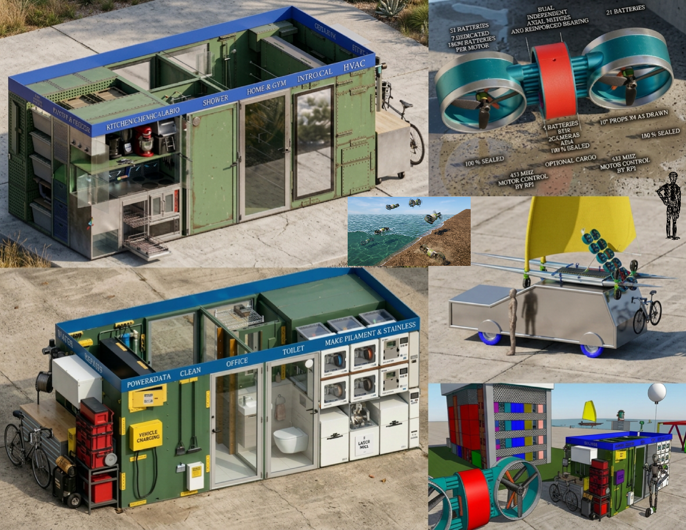
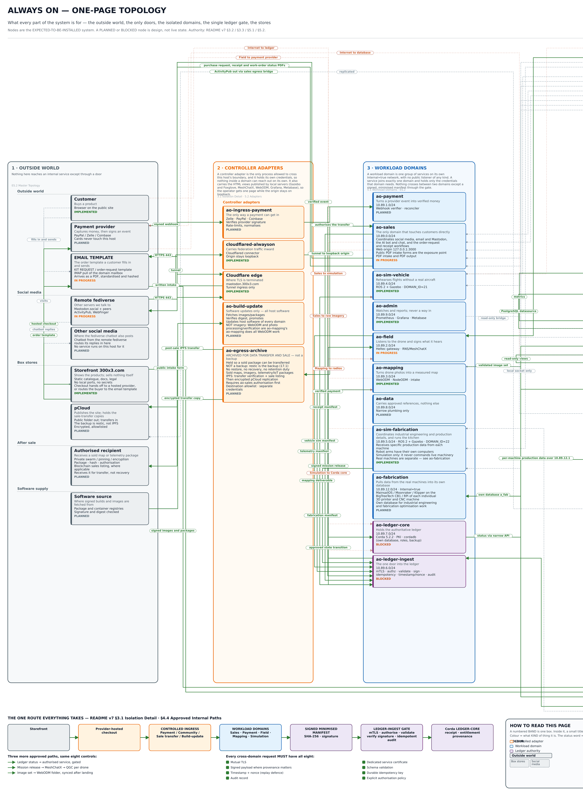
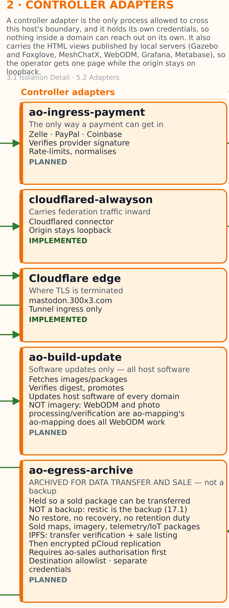
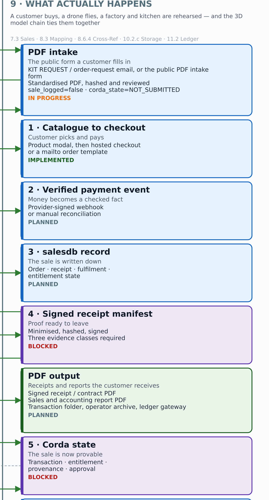
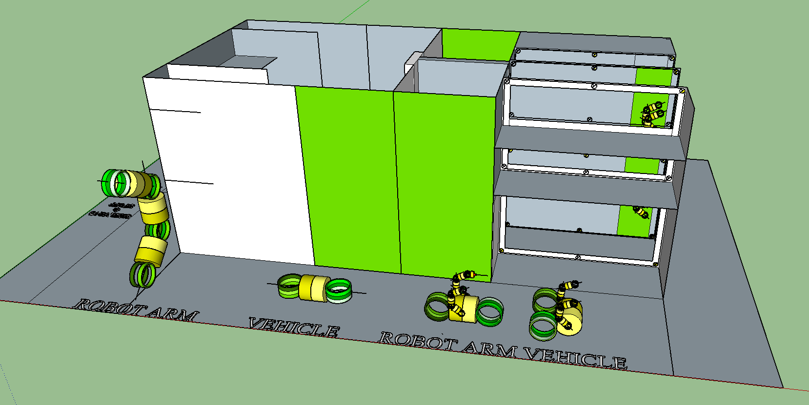
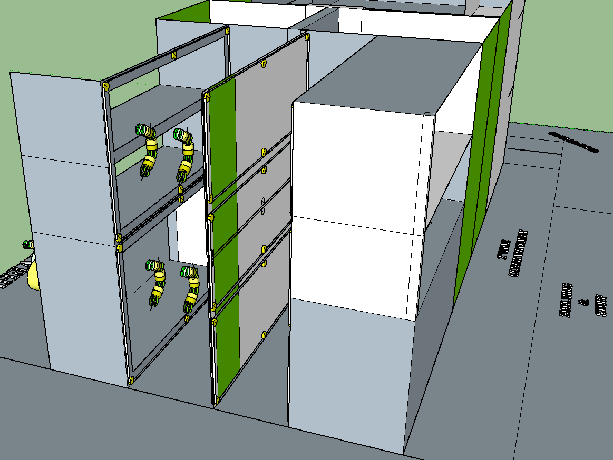
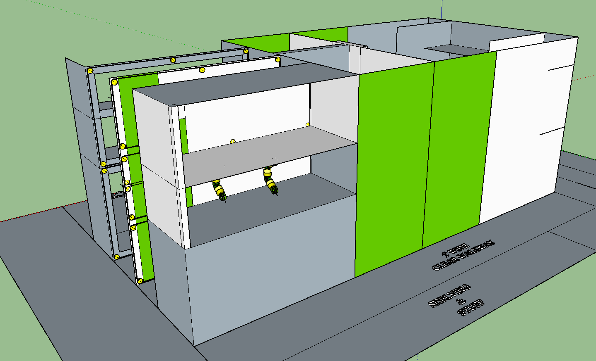

# ALWAYS ON

| Field | Value |
|---|---|
| Document | Complete single-file architecture, integration, security, operations, evidence, and active-work report |
| License | CC BY-NC-SA — creativecommons.org |
| Project origin | Building ~2010 · Drone ~2012 · Equipment ~2022 · Linux systems ~2023 |
| **Why** | **A fully autonomous live/work/fabricate area supporting air/land/sea vehicles, and the daily-carry equipment that goes with them. The goal: it literally does everything itself — for any business, and any owner, even when the internet turns off — at the size of a small storage unit, a garage, or a parking space.** |
| Website | https://www.300x3.com |
| Supporting plan | https://archive.org/details/@scott_widmann |
| Created with | Bluebeam and LibreDraw (PDF project plan), Perplexity.ai, Cline.bot |
| Revision | 2026-10-02 — GitHub review pass; see `docs/readme-change-log.md` |
| Current main host | ATX desktop - running Linux Kubuntu |
| Peripheral host | Drone — Raspberry Pi 5 and Autopilot Module, running KaliOS |
| Format rule | Tables and topology diagrams are primary; original detailed commands/evidence are retained in-place below for operational completeness |
| Reading order | **ES.1** is the specification of intended architecture and **ES.2** is the master topology. **Sections 1–16 are specification**: the planned future state, stated once, with no status, history, revision, or decision in them. **Sections 17–19 carry everything current**: §17 backup/restore/monitoring, this document approved deviations, and §19 the single status log of components, outstanding work and verification evidence. §19.2 also carries verification evidence, and §20 is status references. Where §1–16 and §17–19 differ, §17–19 is the current fact and §1–16 is the requirement. Revision history for this document is in `docs/readme-change-log.md`, never in the body. |

## Contents

| Section | Title | Page |
|---|---|---:|
| ES | Executive Summary | 3 |
| ES.1 | Current Architecture Corrections | 3 |
| ES.2 | Master Topology | 4 |
| ES.3 | Detailed System Record | 12 |
| 1 | System Purpose | 13 |
| 2 | Platform Baseline | 14 |
| 3 | High-Level Architecture | 16 |
| 4 | Security, Isolation, and Data Policy | 21 |
| 5 | Network Domains and Controlled External Access | 24 |
| 6 | Component Boundaries, GUI Reporting Tools, and Operator Access | 29 |
| 7 | Public Storefront and Payment Policy | 31 |
| 8 | Mapping and Photogrammetry | 36 |
| 9 | Field and LoRa Architecture | 41 |
| 10 | Simulation Architecture | 43 |
| 11 | Ledger, Provenance, Archive, and IPFS | 48 |
| 12 | Host Installation and Configuration | 54 |
| 13 | Podman Runtime and Quadlet Policy | 57 |
| 14 | Secrets and Service Identity | 60 |
| 15 | Sales, Mastodon, OpenClaw, and Local AI | 63 |
| 16 | Scripts and Operational Standards | 68 |
| 16.4 | Document Coordination | 71 |
| 17 | Backup, Restore, Monitoring, and Completion Criteria | 70 |
| 19 | Current Status and Outstanding Work | 72 |
| 19.2 | Completed items and verification evidence | 74 |
| 19.3 | Operator setup priorities | 77 |
| 20 | Status References | 78 |

## Executive Summary

### ES.1 Current Architecture Corrections

| Subject | Current plan; replaces any contrary older text below |
|---|---|
| Social media | Most closely tied to the **remote fediverse**: public marketing/contact across website chat, email, Mastodon, and approved social channels, with the fediverse chatbot eventually routing into other social media systems. **OpenClaw** is the direct Mastodon publisher; its local output is standardized PDFs for order/follow-up/support/payment workflows, processed into the sales, payment, and ledger records. `ao-sales` connects to the remote fediverse only (§4.3) |
| LM Studio | Fundamental local LLM host for OpenClaw |
| Browser | Konqueror — dedicated browser for automation |
| Automated testing | Testing is being done with Playwright and Chrome (see section 20) |
| RNode client A — PEOPLE-RADIO | **MeshChatX**, which is the coordination system for the ALWAYS ON Reticulum network stack and the LoRa radios. It only needs to speak to the **Reticulum network stack**, and the RNode is its radio. **LoRaWAN for communication only** — the public human side (§9.2.2). **End-to-end encryption** is built into the stack: strong modern encryption by default, ephemeral keys, forward secrecy by default, and no unencrypted links or packets possible |
| RNode client B — DRONE-RADIO | **LoRa mesh RNode for drones only** — the private drone side. Carries a **dedicated RNS-enabled connection** from QGroundControl to the drones over DRONE-RADIO, so local QGC missions reach the QGC session on the Pi5 drone and missions can be **updated midflight** (§9.2.2) |
| Radios | **Wi-Fi** — Wi-Fi/Ethernet from the main desktop reaches the main internet; that desktop manages all DHCP. **2 LoRa radios** — `PEOPLE-RADIO` (915 MHz) = public human chat, `DRONE-RADIO` (917 MHz) = authenticated private drone mission/status traffic (§9.2.2) |
| QGroundControl | Desktop primary mission planning; KaliOS RPi5 fallback/out-of-range mission-update operation; and drone — KaliOS on the Raspberry Pi 5 with the Autopilot Module, running ArduPilot. It holds a **dedicated RNS-enabled connection to the drones over DRONE-RADIO**, and so receives **midflight mission updates** relayed by DRONE-RADIO to the QGC session on the Pi5 drone (§9.2.2) |
| **Email endpoint** | The storefront routes the buyer through the **EMAIL TEMPLATE** (not an inbox); the host reviews every purchase request against that template. Complete → published as a PDF, a **WORK ORDER REQUEST**; incomplete → sent back by email requesting the remaining information (§4.3) |
| Prometheus | Prometheus is for security only. It acts alone and independently, operating on the other systems to ensure security and to address any problems: time-series store, rule evaluation, alerting, and security evidence — **continuously hardened over the life of the system via ad-hoc security AI review** |
| Grafana | Dashboards and metrics only; it reads the databases that already exist and does not write to them |
| Metabase | Reporting only, and it does ad-hoc read-only reporting, so it requires **its own dedicated PostgreSQL application database** to hold its Metabase schema, saved questions, dashboards, and subscriptions. That application database holds Metabase's own state only — it is not a system of record for business data, and it never receives data from the reporting sources. Metabase connects to the other PostgreSQL and MySQL databases, and to local desktop-application SQLite files, as a **read-only** user in order to report on them, and it never writes to them. Ad-hoc reports that become recurring are promoted into stable Grafana dashboards |
| Corda | Blockchain-enabled accounting, ledger, receipt, entitlement, fulfillment, provenance, and approved state-transition system. Built on **Corda 5.2.2** against `cordadb` — one database within the regular host PostgreSQL 18 cluster, with its own roles and backup scope (§11.1) |
| IPFS | **File-transfer verification and, potentially, sales listing on a blockchain** for approved map/imagery and telemetry/product-operational packages. **It is not a backup.** No Corda/ledger/accounting dependency |
| Backup/restore | Local authority + **encrypted restic** (§17.1). Independent of IPFS and Corda. This is the *only* backup |
| Sale transfer | `ao-egress-archive` holds packages **"archived for data transfer and sale"** — a transfer copy, **not** a backup. IPFS first (transfer verification + possible blockchain listing), then encrypted pCloud. **Requires `ao-sales` authorisation** first (§11.6) |
| Secret authority | KDE Wallet; services needing Wallet secrets start after KDE login |
| GPU policy | Priority: desktop/Konqueror → SketchUp/SketchUp Web → active LM Studio/OpenClaw → ROS/Gazebo/SITL → WebODM batch |
| Additive fabrication | Real machines, not simulated cells: **MainsailOS/Moonraker/Klipper operate on each individual 3D printing machine**, each on its own BigTreeTech CB1 / Raspberry Pi; individual CNC machines likewise. These are **real peers**, not children of the simulated domain. `ao-sim-fabrication` **rehearses** the flow for the **kitchen, cooler/freezer/pantry carousel, storage carousel, and their robot-arm boxes** (2 arms in 2 boxes at storage, which organize and manage the additive-manufacturing machines; 2 arms on independent rails at the kitchen, which cook); it runs the kitchen and holds no production data. **The simulation does not manage those robot arms or carousels** — they need the separate future `ao-auto(kitchen,cool,store,fab)-` domain (§10.2) |
| **Real fabrication** | **`ao-fabrication`** is the real (non-simulated) fabrication domain, distinct from `ao-sim-fabrication` in every respect (§3.3.0): it **pulls data into its own database** for industrial engineering and fabrication optimisation — per-machine production data lands in **`a_fab`** (`10.89.12.0/24`, `Internal=true`). **bCNC** may be used on individual CNC machines and their own RPis where necessary — ideally tied to Klipper/MainsailOS |
| Simulation (fabrication) | `ao-sim-fabrication` requires, as baseline capability and not optional extras: **3D world setup** (its own world), **boning** (alignment and datum structure built into that world), **reinforcement learning objects** (the trainable entities for scenario and policy work), and an **HTML portal to operation** — set up and operated from a browser, with no desktop GUI client (§10.2) |
| Simulation (vehicles) | `ao-sim-vehicle` requires the same four baseline capabilities as `ao-sim-fabrication` (§10.1) |
| Home automation | Domoticz/RPi for the usual Domoticz home automation features: HVAC, doors/locks/access, security/alarms, lighting/scenes, cameras, weather, environmental sensing, media, and other typical Domoticz device classes; separate from printers and future building robotics |

### ES.2 Master Topology

This is the **single authoritative diagram of the entire project**. Every other
diagram in this document is a detail view of one part of it and must not contradict
it. Domain names, network names, and paths are abbreviated here and defined in full
in the sections referenced.





The panels above are the same graphic folded at its seam, for reading at a larger
scale. The seam falls on the gutter immediately left of the green section 4
(Stores and reporting) column, so each numbered column sits wholly within one
panel and none is split across the fold. For a fully zoomable,
resolution-independent view, or to open the two portrait panels side by side, use
the vector and self-contained viewer:

**[Open the live topology viewer](https://filedn.com/l5JNexbL2ipFNaQcAkmV7lQ/%2A%2A%2ACURRENT%2A%2A%2A/site/alwayson-single-topology.html)** — the interactive
diagram, hosted and always current (rebuilt 2026-10-02). This link is stable; it is
replaced in place each time the diagram is rebuilt, so it never changes.

| Artefact | Use it for |
|---|---|
| **[Live topology viewer](https://filedn.com/l5JNexbL2ipFNaQcAkmV7lQ/%2A%2A%2ACURRENT%2A%2A%2A/site/alwayson-single-topology.html)** | **Interactive, zoomable, self-contained HTML (rebuilt 2026-10-02). Hover a card to trace its links, click to pin, use find to jump to a node. Hosted copy at a stable link, so it is the one that stays current** |
| [ao-single-topology.svg](assets/ao-single-topology.svg) | Vector master. Scales to any zoom with no loss; opens in a browser or Inkscape |
| [ao-single-topology.html](assets/ao-single-topology.html) | The same viewer, committed here — works offline, no server needed |
| **[Software status — markdown](docs/software-status.md)** | **Every installed package, image, application and tool, in one table: what is installed, whether it is up to date, what is released, and whether it is pinned.** [PDF](docs/software-status.pdf) for printing and offline reading. Generated, not hand-maintained. Refresh with `sudo ./scripts/build-update/refresh-install-log.sh` |

Every detail view in this document is a zoom of that one master graphic, never a
separate diagram.

**The only public entries.** Nothing reaches an internal service directly. There are exactly four, each purpose-built and each carrying nothing but its own approved traffic:

| Entry | Network | What it carries | Direction and status |
|---|---|---|---|
| **Storefront** — `300x3.com` / `www.300x3.com`, static HTML in the pCloud Public Folder | pCloud (not a Podman network) | Products, docs, legal, downloads. Also the hosted-checkout origin and the public PDF intake forms. | Outbound publication; static asset delivery |
| **Federation and chat** — `mastodon.300x3.com`, and `chat.300x3.com` (OpenClaw relay / sitebot) | `ao-sales` via the Cloudflare Tunnel | `ao-sales` coordinates social media, email, and Mastodon; the AI bot and chat; and the order-request and receipt workflows. Mastodon web/streaming and OpenClaw chat. Origin stays loopback (`127.0.0.1:3000`, `:4000`, `:18790`). It is the only domain that touches customers directly. | Inbound via `cloudflared-alwayson.service`; outbound federation via Sidekiq on `ao-sales` |
| **`ao-ingress-payment`** | adapter | **Zelle, PayPal, and Coinbase payment verification.** Receives provider webhook/relay events, verifies the signature, and emits a normalized payment event. | Inbound. Deployable once the provider decision is recorded (§7.2) |
| **`ao-egress-archive`** | adapter | **Moving large data and the image/map/telemetry files into IPFS for transfer after sale**, plus encrypted pCloud replication. Destination allowlist, separate credentials, transfer audit. | Outbound. Deployable once archive credentials are provisioned |
| **`ao-html-window`** | adapter | **A public-facing (egress) window for viewing HTML content on the 300x3.com website.** It behaves like the locally hosted iframes in §7.1.2, but it only ever needs to publish to 300x3.com — not to the local loopback readers. It is view-only: it displays HTML and takes no input. Network `10.89.14.0/24`. | Outbound publication to 300x3.com only. Deployable |
| **`ao-build-update`** | adapter | **Software updates.** Image and package acquisition before controlled promotion, with digest capture and update audit. Never attaches to a workload. | Outbound. **Scaffolded — not enabled** (§5.2.1) |

**AO- means "ALWAYS ON".** Every `ao-*` network is one isolation domain. The internal workloads (`ao-payment`, `ao-field`, `ao-mapping`, `ao-sim-vehicle`, `ao-sim-fabrication`, `ao-ledger-ingest`, `ao-ledger-core`, `ao-data`, `ao-admin`, `ao-fabrication`) are all `Internal=true` with no public listener. `ao-sales` is the deliberate exception: it is `Internal=false` so Sidekiq can deliver ActivityPub to remote instances, and it is held to containment by having no attachment or route to any other `ao-*` domain. The adapters above are the other deliberate exceptions.

| Question | Answer |
|---|---|
| Where does money move? | Hosted checkout at the provider → `ao-ingress-payment` → verified event → `ao-payment`/`salesdb` → signed manifest → `ao-ledger-ingest` → Corda. Cards are never handled locally. |
| Where else does a transaction enter? | From the website: email → PDF → Corda processing. A customer email produces a standardized PDF request which is processed into the ledger workflow. |
| Where is the ledger (the only copy)? | `ao-ledger-core` on `cordadb` in PostgreSQL 18, a separate database with its own roles and backup scope. PostgreSQL is authoritative (§11.1). |
| What can the internet never reach? | The internal `ao-*` workload networks. All are `Internal=true` with no public listener. `ao-sales` is non-internal for ActivityPub delivery only, and still publishes no listener of its own. |
| What crosses a domain boundary? | Only a signed, minimized manifest through `ao-ledger-ingest`, under mTLS with authorization, replay defence, idempotency, and audit. |
| Where do secrets come from? | KDE Wallet, after Plasma login, by design. See §14.1.1. |
| What are the database reporting tools and their functions? | Three tools, and **all three are read-only over the databases that already exist — none of them is a system of record, and none of them ever writes to a source database.** **Prometheus** is the security instrument: it acts alone and independently on the other systems to ensure security and to address problems, and it keeps its own time-series store. **Grafana** is for stable dashboards and metrics. **Metabase** is for ad-hoc reporting by users. A recurring ad-hoc Metabase report that proves its worth is promoted into a stable Grafana dashboard. Each keeps its own application database, separate from every source database. See §3.3 and §6.A.2. |

The five points below are the ones most often asked about. Each is drawn in the master
graphic above.

**Two ALWAYS ON loopback listeners.** The Gazebo world portal (`:8765`) and the
ALWAYS ON operator console (`:8099`) **are part of ALWAYS ON** and are drawn as such in the
master topology. They are listed separately only because they are host services rather
than `ao-*` network members:

| ALWAYS ON loopback listener | Process | Status |
|---|---|---|
| `127.0.0.1:8765` | `ao-sim-fabrication-portal.service` | **Gazebo world portal**, view-only HTML, verified 200. Loopback only. Part of operating `ao-sim-fabrication` (§10.2) |
| `127.0.0.1:8081` | `ao-sim-fabrication-foxglove.service` | **Foxglove bridge**, a WebSocket server only — no HTTP, so a browser pointed at it gets no page. Loopback only. Carries the eight camera feeds to the `/viewer` client. Part of operating `ao-sim-fabrication` (§10.2) |
| `127.0.0.1:8099` | `python3` (`web-console-server.py`) | **ALWAYS ON operator console**, verified 200. **Not a deployed service** — no unit or timer starts it, so it is absent unless an operator runs it by hand. Open item in §19.1. See §19.2 |

**Other listeners on this host that are not part of ALWAYS ON.** The isolation
statements above describe `ao-*` infrastructure. A small number of other services
listen here; they are recorded so the exposure picture is exact rather than
overstated:

| Listener | Process | Status |
|---|---|---|
| `0.0.0.0:4242` | ReticulumMeshChat | Documented, part of the mesh tooling |
| `127.0.0.1:8080` | Domoticz web UI | **Loopback-only 2026-09-30** (operator: needs access from this machine only). Started with `-wwwbind 127.0.0.1 -nomdns`. Verified: loopback 200, LAN address refused. Not an `ao-*` service; intended future use is other equipment on the equipment LAN — see §3.3.0.2. |

The Domoticz UI was moved to loopback on 2026-09-30, so the only remaining
non-loopback listeners are ReticulumMeshChat (documented) and `dnsmasq`/`socat`,
which are bound to the equipment LAN the desktop manages. The "no public
listener" claim is therefore true of every `ao-*` service, of the Gazebo portal,
of the operator console, and of Domoticz.

- **The fabrication machines are real machines, not simulation nodes.** MainsailOS,
  Moonraker, Klipper, the individual additive-manufacturing machines (3D printers and
  CNC), and the BigTreeTech CB1 are therefore not drawn as `ao-sim-fabrication`
  children. `ao-sim-fabrication` coordinates all industrial engineering and production
  related details for the rehearsal, and it runs the kitchen. It receives no production
  data: that is handled by the separate
  `ao-fabrication` domain. See ES.1 and §10.2.
- **Post-sale transfer is authorized-recipient only**, with no Corda or archive
  dependency: an approved map/imagery or telemetry package is transferred as
  package · hash · recipient authorization over IPFS (private swarm, pinning,
  encryption). See §11.
- **Secrets come from KDE Wallet**, which is the authority. Plasma login →
  `kwalletd6` unlock → `fetch-kwallet-secret.sh` (`ExecStartPre`, ≤60s) → a 0600 env
  file per unit. Services needing Wallet secrets start after login **by design**. All
  services run under the operator account; there is no separate service user. See
  §14.1.1.
- **Monitoring is split by purpose.** Prometheus is for security only and acts alone
  and independently on the other systems to ensure security and address any problems.
  Grafana is for stable dashboards and metrics. Metabase is for ad-hoc reporting. Each
  keeps its own application database and reads the business databases read-only; none
  of them is the system of record. See §3.3.2 and §17.
- **Prometheus is isolated, and the isolation is a requirement.** Nothing queries
  Prometheus — no dashboard, service or query may read it. Nothing acts
  on it either: no rule, job or component may reconfigure, reload or silence it.
  Configuration is operator action through §16 only. `ao-admin` is
  `Internal=true`, so there is no egress path, and the boundary to hold is
  lateral and local: anything sharing `ao-admin`, and anything able to reach a
  published Prometheus port (OPS-29).
- **The isolation is one-directional: Prometheus acts outward, nothing acts on it.**
  The access it holds is a working capability, not an exposure. Prometheus does
  security work **on the databases of the system — PostgreSQL and SQLite** — and
  on the services and hosts around them. That outward direction is its purpose
  and is required. What is forbidden is the reverse: no database, service,
  dashboard or operator tool may reach *into* Prometheus to read it, reconfigure
  it, feed it, or influence what it does. Access *to* Prometheus is denied;
  access *from* Prometheus is its job.
- **Topology is input to Prometheus, never its output.** Prometheus does not create
  system topology. It must *know* the topology — which networks, units, ports and
  domains exist, and how they relate — in order to enact security policy, so
  topology is read *into* it. That knowledge is never published back out as
  something another system may query or depend on.
- **Radio profiles** are `PEOPLE-RADIO` 915 MHz/125 kHz (public) and `DRONE-RADIO`
  917 MHz/250 kHz (authenticated). See §9.


### ES.3 Detailed System Record — Start of the README

**Architecture, Installation, Configuration, Operations, and Status**

This is the single authoritative document for the ALWAYS ON project. It contains the
intended architecture, implemented configuration, operational requirements, validation
evidence, approved deviations, known issues, and work queue. The remaining tables,
commands, evidence, paths, full interface inventory, operational requirements,
payment/ledger forms, Mastodon details, installation procedures, backup rules, and
service records follow, numbered 1–21. Where an older statement conflicts with ES.1,
ES.1 governs. When the current implementation differs from an architecture
requirement, the difference must be recorded in **Approved Deviations and Open
Decisions** with a rationale, compensating controls, owner, and resolution condition.

**Last consolidated review:** 2026-09-30

> **Operator warning.** Everything here is difficult until it is easy. These tools
> are sharp and dangerous, and if you disrespect them they will can/will harm you —
> the same as any trip, fall, or car ride. Perhaps not as bad, perhaps worse. In my
> opinion, ignoring them is more dangerous than understanding them.

---


# 1. System Purpose

ALWAYS ON is an on-premises platform supporting an automated modular live/fabricate facility
of roughly 160 square feet, and an accompanying micro-aircraft carrier. Both scale in size
and quantity without changing the architecture.

| Capability | Scope |
|---|---|
| Field | Drone telemetry and field communications over the Reticulum mesh |
| Mapping | Photogrammetry and 3D model production |
| Simulation | Vehicle rehearsal; fabrication, facility, inventory, kitchen and logistics rehearsal |
| Facility | Home automation |
| Commerce | Static storefront, hosted checkout, receipt generation |
| Provenance | Corda-backed receipts, entitlements and approved state transitions |
| Archive | Encrypted pCloud replication and controlled IPFS distribution |
| Content | Static HTML and interactive iframe content from other servers |

**Deployment roles.** The workstation is the development, integration and validation host. It
runs Kubuntu 26.04 LTS on an AMD CPU with an EVGA NVIDIA GTX 1080. Compute-intensive
production workloads may move to an immersion-cooled server rack and a Raspberry Pi
edge-computing cluster.

Kubuntu is the desktop for four reasons: it is built on Ubuntu LTS with support through April
2031, giving a predictable maintenance horizon; it carries the ROS 2 and Gazebo toolchain plus
QGroundControl that the simulation work depends on; KDE Plasma provides the login-gated KDE
Wallet secret flow (§14.1) and Konqueror as the dedicated automation browser; and the KDE
suite covers the desktop and portable hardware this system is built for.

**Container runtime.** Podman is the only supported container runtime. Containers are managed
through systemd Quadlet definitions — never Kubernetes, Docker Compose, a Docker daemon, or
shell-wrapper orchestration (§13).

# 2. Platform Baseline

## 2.1 Intended Platform Standard

| Area | Architecture requirement |
|---|---|
| Host OS | Kubuntu 26.04 LTS workstation; the selection rationale is in §1 |
| Current CPU/GPU | AMD CPU and EVGA NVIDIA GTX 1080 |
| Future compute | Immersion-cooled server rack and Raspberry Pi edge cluster |
| Container engine | Podman only |
| Container lifecycle | systemd and Podman Quadlet |
| Public website | Static HTML in pCloud Public Folder + Cloudflare domain registration |
| Payments | Provider-hosted checkout and verified payment events; no local card handling; local stablecoin processing |
| Sales and support | Sales API, PostgreSQL, Mastodon integration, OpenClaw, and LM Studio |
| Drone compute | Raspberry Pi 5 with Waveshare SX1262-class LoRa top-hat |
| Drone autopilot | 3DR N1 connected to Raspberry Pi 5 by MAVLink |
| Desktop radios | Two Heltec LoRa 32 V3 (SX1262), distinguished by USB port topology as `/dev/ao-drone-radio` (ttyUSB0, DRONE-RADIO 917 MHz) and `/dev/ao-people-radio` (ttyUSB1, PEOPLE-RADIO 915 MHz) |
| Field protocol | RNS/Reticulum and MeshChatX over raw LoRa unless a true LoRaWAN deployment is selected |
| Mapping | WebODM and supporting services under Podman |
| Mapping storage | `/media/scottw/500GBPHOTOGRAM/` |
| Vehicle simulation | ROS 2 Lyrical, Gazebo Sim 10.5.0, ArduPilot SITL, MAVLink, QGroundControl |
| Fabrication simulation | ROS 2 Lyrical, Gazebo Sim 10.5.0, robot cells, additive manufacturing, storage, kitchen, and logistics models |
| Ledger | Corda core behind a dedicated ledger-ingestion gateway |
| Archive | Local source data, signed manifests, encrypted pCloud replication, private or encrypted IPFS workflow |
| Monitoring | Prometheus-compatible metrics, alerts, health checks, and protected administration access |
| Backup | PostgreSQL/Corda-aware backup, restic or equivalent encrypted backup, and scheduled restore testing |

## 2.2 Platform Baseline

The host baseline this design assumes. This is the requirement; the measured values for the
running host are in §19.1, and where the two differ §19.1 is the fact.

| Area | Baseline |
|---|---|
| Kernel | Ubuntu LTS kernel |
| Podman | Rootless for every workload (§13.1, §13.2) |
| Podman networks | **Fourteen** `ao-*` networks, all registered in `config/platform/network-cidrs.yaml`, which is the only authoritative list. **Eleven** are `Internal=true`: the ten workload domains `ao-admin`, `ao-data`, `ao-fabrication`, `ao-field`, `ao-ledger-core`, `ao-ledger-ingest`, `ao-mapping`, `ao-payment`, `ao-sim-fabrication`, `ao-sim-vehicle`, plus `ao-html-window`. **Three** are deliberately `Internal=false`: `ao-sales` for ActivityPub delivery, `ao-reporting-egress` for Grafana and Metabase, and `ao-build-update` for software acquisition |
| GPU | EVGA NVIDIA GTX 1080 |
| NVIDIA driver | Pinned, recorded in the version matrix |
| NVIDIA integration | CDI devices registered, including `nvidia.com/gpu=0`. The authoritative spec is `/var/run/cdi/nvidia.yaml`. `/etc/cdi/nvidia.yaml` is not a source of truth and is regenerated or removed at each driver change. Only the authoritative spec contributes devices |
| Simulation stack | ROS 2 Lyrical at `/opt/ros/lyrical`; Gazebo Sim 10.5.0 |
| Host PostgreSQL | PostgreSQL 18, loopback-only |
| Host Redis | Redis 8, loopback-only |

# 3. High-Level Architecture

## 3.1 Isolation Detail View

This is a **detail view of the ingress/egress portion of the master topology in
ES.2** and must not contradict it. For the whole project, read ES.2.



*Figure 3.1 — The controlled adapter column of the ES.2 master topology, enlarged. It is a
zoom of that one graphic, not a separate diagram: the adapter column is the only place a
controlled ingress or egress process may exist, and every route into or out of the host passes
through it.*

The public storefront has no direct route to the host's field, mapping, simulation, database,
AI, Podman or Corda-core services.

## 3.2 Where Status Lives

Sections 1–16 hold no status. **Status and outstanding work are both in §19.1**, the only
place either is recorded. **Verification evidence is §19.2.**

## 3.3 Databases and Data Stores

PostgreSQL 18 is the system-wide relational platform: one host-managed installation with a
separate logical database and a separate application role per consumer.

| Database | Holds |
|---|---|
| `salesdb` | Authoritative sales and payment records |
| `mastodon` | Mastodon application state |
| `webodm` | WebODM/PostGIS mapping data |
| `cordadb` | Corda 5, with its own roles and backup scope (§11.1) |
| `a_fab` | Real-machine production data for `ao-fabrication` (§3.3.0) |
| `postgres` | Administration and maintenance |

**Reporting and coordination stores.** Three stores sit alongside PostgreSQL. **All three are read-only over the databases above;
none is a system of record, and none ever writes to a source database.**

| Store | Purpose | Boundary |
|---|---|---|
| **Grafana** | Stable, curated, long-lived dashboards and metrics — a number that must stay on a wall or in a briefing | Reads approved PostgreSQL datasources read-only. Keeps its own PostgreSQL application database for users, dashboards and datasource configuration |
| **Metabase** | Ad-hoc reporting: a question asked in the browser, saved, filtered, exported. The saved question, not the dashboard, is the unit of work | Reads the other PostgreSQL and MySQL databases **and** local SQLite files over per-source read-only roles — one read-only role per source, so a badly written query cannot modify a source. Keeps its own PostgreSQL application database for its schema, saved questions, dashboards, filters and subscriptions. That database is not a system of record and is never written to by a reporting source |
| **Prometheus** | Security instrumentation only — time-series store, rule evaluation, alerting | Acts alone and independently. Does security work **outward**, on the PostgreSQL and SQLite databases and the services around them; nothing acts on it or reaches into it (§3.3). Not replaced by PostgreSQL, Grafana or Metabase, and does not depend on any of them |

A recurring ad-hoc Metabase report that proves its worth is **promoted into a Grafana
dashboard**, where it becomes stable and curated.

**Redis** is a low-latency speed and coordination layer — caching, queues, locks, task
brokering, transient coordination. It is not the authoritative system of record; business,
payment, user and application metadata stay in PostgreSQL.

**SQLite and H2** are not approved application databases for Grafana or Metabase. They may
exist only where an individual application requires embedded local storage — the browser,
Akonadi, Podman, MeshChatX, QGroundControl — or in retained migration backups.

**Database and ledger authority.**

| Authority | Owns |
|---|---|
| **PostgreSQL** | Detailed operational data, searchable business records, and reporting projections |
| **Corda** | The complete ledger of debits and credits, final sale and contract state, receipt association, entitlement, and approved ledger state transitions |

Where PostgreSQL holds the detailed operational and searchable business record, Corda holds
the authoritative debit and credit position itself.

### 3.3.0 `a_fab` — the real-fabrication database

**`a_fab` is the database of `ao-fabrication`, the real (non-simulated) fabrication
domain.** It is a separate logical database with its own application role, and it is
not shared with `ao-sim-fabrication`.

The distinction that matters:

- **`ao-sim-fabrication`** rehearses the fabrication flow. It holds no production data
  and never commands live machinery.
- **`ao-fabrication`** pulls real production data **from each individual machine into its
  own database** for industrial engineering and fabrication optimisation work.

Each real machine runs **its own** MainsailOS / Moonraker / Klipper on its own
BigTreeTech CB1 / Raspberry Pi. The machines are peers: none of them is a child of the
simulated fabrication domain, and none is drawn as a simulated cell. They sit on the
**equipment LAN** (`10.42.0.0/24`, the wired segment whose DHCP the desktop manages).
That LAN is *ingress* — local equipment — not egress, and it is deliberately not a
workload network.

#### 3.3.0.1 How the domain reaches the equipment LAN (host-mediated)

A container on `ao-fabrication` **cannot** reach `10.42.0.0/24` directly, and this is the
isolation model working correctly rather than a defect. `Internal=true` gives the network
no default route and no NAT, so a container sees only its own subnet:

```
container on ao-fabrication:  eth0 10.89.12.4/24
  ip route                     10.89.12.0/24 dev eth0 scope link   (no default route)
  ping 10.42.0.1               Network unreachable
  ping 10.89.12.1              OK                                 (host bridge reachable)
```

The host bridge at `10.89.12.1` **is** reachable from inside the domain. That is the
path, and the project already uses the same shape for PostgreSQL:
`ao-postgres-reporting-bridge` runs `socat` on the host and exposes a host service to
containers that could not otherwise reach it.

**Decision (operator, 2026-09-30): the collector runs on the HOST and pushes into
`a_fab`.** The host already reaches the equipment LAN. A host-side collector polls each
machine's Moonraker API, signs the per-machine record, and pushes it into `a_fab` over
the podman bridge. No relay port is opened, and `ao-fabrication` stays `Internal=true`
with no route off its subnet. Opening the domain, or standing up a socat relay to the
printer, were both considered and rejected: the first breaks §5.1 isolation, the second
adds an unnecessary inbound listener for every machine.

**Direction of travel is pull-only.** The collector reads; it never writes to a machine.
Commanding live machinery is a separate authorisation decision and is out of scope for
this path.

**Verified first machine (2026-09-30).** `10.42.0.96` serves Mainsail with Moonraker
`klippy_connected: true`, `klippy_state: ready`, and answers
`/printer/objects/query?print_stats` with `print_duration`, `filament_used` and `state`
— i.e. genuine per-machine production data. Note that Moonraker currently serves
**unauthenticated reads**; see §3.3.0 for the open item on API keys.

#### 3.3.0.2 Domoticz for non-fabrication equipment

No device is connected, and none is to be connected before the equipment exists. This
records the design so it is not re-derived later.

Domoticz is expected eventually to cover other directly connected equipment on
the same **equipment LAN** (`10.42.0.0/24`) — the segment the desktop already
manages. It is not part of `ao-fabrication`, is not simulation, and does not
write to `a_fab`; per-machine production data stays with the Moonraker collector
above.

**Why the host is the right place, same as the collector.** The desktop holds
`10.42.0.1/24` on `eno1`, so a host process reaches that LAN directly. A
container on an `Internal=true` domain could not (§3.3.0.1). Domoticz running on
the host therefore needs no relay, no opened domain, and no new listener to reach
those devices — the same conclusion already reached for `ao-fabrication-collect`.

**Listener posture: settled (operator, 2026-09-30).** Domoticz only ever needs to be
reachable from this machine, so it was moved to loopback before any device was
attached:

- the web UI is started `-wwwbind 127.0.0.1 -nomdns` and now serves only
  `127.0.0.1:8080`; the LAN address actively refuses
- the shared server on `*:6144` was disabled outright (`RemoteSharedPort = 0`) and
  there is no shared-server listener

Neither change affects reaching devices on `10.42.0.0/24`, which is a host-side
path independent of the web listeners. Verified after the change: loopback
returns 200 and `10.42.0.1:8080` is refused.

`a_fab` holds per-machine production data only. It is **not** a ledger, **not** a sales
record, and **not** a backup target. Anything that must become provable leaves
`ao-fabrication` as a signed fabrication manifest through `ao-ledger-ingest`, exactly as
the simulation domain does.

**Network:** `ao-fabrication`, `Internal=true`, `10.89.12.0/24`, created and registered in
`/ALWAYSON/config/platform/network-cidrs.yaml` (2026-09-30). The subnet is **pinned** in
`/ALWAYSON/quadlet/networks/ao-fabrication.network` because every other network there lets
Podman auto-assign. See §2.2 for the reconciliation of the adjacent
unregistered `10.89.10.0/24` and `10.89.11.0/24`.

### 3.3.1 Program-to-Database Map (single consolidated table)

This is the one table of programs and the databases they use. It is the starting
point for discussing reporting and data integration; it is not a list of every
installed package or desktop settings module.

| Database software | Software/program | Database name or store | Current role and reporting value |
|---|---|---|---|
| **PostgreSQL 18** | Host PostgreSQL service | Host cluster; `postgres` | Shared relational platform and administrative/maintenance cluster |
| **PostgreSQL 18** | Sales database service | `salesdb` in `sales-db` | Authoritative source for customers, orders, products, payments, receipts, entitlements, and audit history |
| **PostgreSQL 18** | Mastodon web/background workers | `mastodon` in `mastodon-db` | Accounts, posts, media metadata, federation state, and background-job application data |
| **PostgreSQL/PostGIS** | WebODM web/worker | Container `ao-webodm-db`, database `webodm` (host-side data dir `~/webodm/dbdata`) | Mapping projects, processing state, users, and geospatial data. The app reads database `webodm_dev` in that container. |
| **PostgreSQL/PostGIS** | NodeODM | WebODM PostgreSQL plus filesystem processing data | Processing-node state and coordination; large image/output artifacts remain filesystem data |
| **PostgreSQL 18** | Corda 5 node | `cordadb` (dedicated Corda PostgreSQL database in the host cluster, per §11.1) | Receipt, entitlement, and provenance state. Built on Corda 5 against `cordadb`. |
| **Redis 8** | Host Redis service | Host Redis database 0 | General low-latency cache/coordination layer; no current application data confirmed |
| **Redis 8** | Mastodon cache/queue service | `mastodon-redis` database 0 | Cache, queues, and background-job coordination; not authoritative business data |
| **Redis 8** | WebODM broker | `broker` database 0 | Celery/task broker and worker coordination; not authoritative mapping data |
| **PostgreSQL 18** | Grafana | Grafana application database (dedicated) | Grafana users, dashboards, and datasource configuration. Its own application state, not business data |
| **PostgreSQL 18** | Metabase | Metabase application database (dedicated) | Metabase application schema, saved questions, dashboards, filters, and subscriptions. Not a system of record and never written to by a reporting source |
| **PostgreSQL / MySQL (read-only)** | Metabase reporting sources | Per-source read-only roles | Ad-hoc read-only reporting connections to the business databases. One read-only role per source, with no write, DDL, or owner privilege, so a report cannot modify a source |
| **Prometheus TSDB** | Prometheus | `/prometheus` persistent volume | Security evidence only. Time-series metrics, service health, resource usage, and security evidence. Acts alone and independently of Grafana and Metabase. |
| **SQLite** | MeshChatX | MeshChatX SQLite store | MeshChatX messages, rooms, and local Reticulum/MeshChatX application state |
| **SQLite** | QGroundControl | QGroundControl SQLite store | QGroundControl plans, waypoints, settings, and vehicle/flight-plan state |
| **SQLite** | Akonadi/KDE PIM applications | Akonadi SQLite data | Contacts, calendars, mail indexes, and local personal-information data **Not collected by Prometheus** — excluded by operator instruction 2026-10-03: personal and mail-index material is not security telemetry |
| **SQLite** | Firefox, Brave, Chrome, and Edge | Browser profile SQLite stores | Browser history, site storage, caches, certificates, and profile data **Not collected by Prometheus** — excluded by operator instruction 2026-10-03: browsing material is not security telemetry |
| **SQLite** | Podman | Rootless container metadata store | Container, image, network, and volume metadata; not application data BoltDB, not SQLite, so not a Prometheus collector target |
| **Filesystem/local metadata — social** | LM Studio and OpenClaw | Application files, model settings, and local state | Sales/social AI application state that is not automatically part of SQL reporting |
| **Filesystem/local metadata — drone/field** | ArduPilot, MeshChatX/Reticulum field stores, and radio gateway logs | Application files, telemetry spools, and local state | Field operational and engineering data that is not automatically part of SQL reporting |
| **Filesystem/local metadata — sim** | Gazebo, ROS 2, ArduPilot SITL, and simulation tools | Project files, worlds, models, and result artifacts | Simulation operational and engineering data that is not automatically part of SQL reporting |

This table records what each database is and which program uses it. Whether a database is
built and provisioned is status, recorded in §19.1 alongside the work to build it.

### 3.3.2 Data Flow into Reporting and Ledger Records

Corda is not a replacement for the source PostgreSQL databases. The intended
ledger flow is:

The sale chain on the right of the following extract — customer picks to checkout,
verified payment event, salesdb record, signed receipt manifest, and Corda state —
is the same five-step chain drawn in ES.2. Payment intake is shown at the left,
through `ao-ingress-payment` and into `ao-sales`; the reporting projections
(Metabase, Grafana) and the Corda entry are shown in their columns.



*Zoom of the ES.2 master topology, cropped to the five-step sale chain and enlarged so
every label is readable.*

**Where the blockchain entry is recorded.** The entry itself is created by
Corda 5 in `cordadb` (§3.3, §11.1). The approved projection of that state is
recorded in the corresponding PostgreSQL database, keyed by the same
transaction/receipt reference, and the PDF receipts and reports that describe it
are written to the transaction folder under
`/ALWAYSON/data/sales/transactions/<transaction-id>/`.

Use stable correlation fields in the source-to-ledger integration, including a
transaction/order reference, serial number where applicable, UTC timestamp,
event type, status, and content hash. Do not copy payment credentials, private
keys, or unrestricted customer datasets into Corda. Corda remains authoritative
for approved ledger/provenance state, while PostgreSQL remains authoritative
for domain-operational source data.

Before building sales reporting, initialize and verify the `salesdb` schema and
confirm that the reporting identity can read it and produce the standard PDF
reports and receipts where appropriate. Before enabling blockchain-related
flows, complete the Corda key/certificate ceremony and implement the
ledger-ingest manifest, correlation-ID, signature, idempotency, and audit
requirements.

---

# 4. Security, Isolation, and Data Policy

## 4.1 Non-Negotiable Rules

1. Inspect before changing.
2. Preserve existing data.
3. Never format, repartition, delete, prune, or overwrite without explicit
   operator approval.
4. Never install Docker daemon, Docker Compose, Watchtower, or Kubernetes.
5. Use Podman and Quadlet only.
6. Never expose a public port without explicit operator approval.
7. Never place secrets in scripts, logs, HTML, Git, pCloud Public Folder, IPFS,
   Corda payloads, shell history, or documentation examples. Only use KDE Wallet
   for passwords, tokens, keys, and other secret material.
8. Never use `--privileged` as a default.
9. Use pinned image digests for operational services (§5.2.1).
10. Verify the photogrammetry drive before deploying or operating WebODM.
11. Record commands, versions, significant output, and failures in the
    installation or operational journal.
12. Stop and report conflicts involving services, packages, networks, mounts,
    ports, serial devices, firewall policy, or existing data.
13. Do not broaden network access, database privileges, filesystem access,
    container privileges, or secret access merely to bypass an error. A
    documented local integration path with least-privilege credentials is
    permitted when it is required for PostgreSQL reporting, backup, health
    checking, or application migration.
14. Require explicit human approval before initiating payments.
15. Require explicit human approval before publishing external communications,
    changing production credentials, deleting data, or modifying external
    records.

## 4.2 Data Classification

| Classification | Examples | Handling requirement |
|---|---|---|
| **Public** | Anything in the pCloud Public Folder, or linked in from it: storefront HTML, intentionally published documentation, approved product data | May be placed in pCloud Public Folder |
| **Internal operational** | The databases — PostgreSQL and SQL — plus non-sensitive configuration, health data, non-sensitive manifests, unit status | Restricted local access; do not publish by default |
| **Sensitive** | Corda blockchain secured data and the accounting ledger, plus customer contact data, payment references, precise telemetry, sensitive imagery, proprietary technical designs | Domain-restricted storage; encrypted backup; no public IPFS |
| **Secret** | Passwords, held in KDE Wallet | KDE Wallet only; delivered to services after Plasma login by design (§14.1.1) |

## 4.3 Prohibited Paths

No component may take any of the following paths. Each prohibition is enforced by the rule
named in the last column; the rule text is in §4.1.

| Prohibited path | Why | Rule |
|---|---|---|
| Simulation domain to live machinery | A rehearsal must never command a real machine, a real robot arm, or a live flight controller | Rule 12, §10.2 |
| Any workload network to the public internet | Public reach exists only through a controlled adapter | Rules 6, §5.2 |
| One component to a second domain network | A service joins exactly one network; a second requires an explicitly approved path | §5.1 |
| Cross-domain traffic without mTLS, a dedicated identity, and a signed payload where provenance matters | Provenance is meaningless if any hop is anonymous | §4.4 |
| Any secret material outside KDE Wallet | Passwords, tokens and keys exist in the wallet only | Rules 7, 4.2 |
| Sensitive or accounting data to public IPFS, or to the pCloud Public Folder | These are not publishable data classes | Rule 7, §4.2 |
| A storefront or public page to any internal service | The public site carries no internal host, port, or path | Rule 6, §7.1 |
| A reporting tool to write into a source database | Grafana and Metabase are read-only over their sources | §3.3, §6.A.2 |
| A wider privilege, mount, or secret to make an error go away | Least privilege is not negotiable to clear a fault | Rules 13, 6.A.3 |
| An adapter to a workload, or a workload to an adapter | The adapter boundary is one-way and holds its own credentials | §5.2 |

## 4.4 Approved Internal Paths

```text
PDF INTAKE
Website KIT REQUEST / order-request email ─► Public PDF intake form
  ─► standardized PDF request ─► kit-request-intake/ inbox
  ─► extracted text + manifests ─► operator review ─► transaction bundle
Sales receipt PDF ────────────────────────► Ledger-ingestion gateway
Verified payment event ───────────────────► Sales API and/or ledger-ingestion gateway
Field telemetry manifest ─────────────────► Ledger-ingestion gateway
Mapping deliverable manifest ─────────────► Ledger-ingestion gateway
Vehicle simulation manifest ──────────────► Ledger-ingestion gateway
Fabrication simulation manifest ──────────► Ledger-ingestion gateway

PDF OUTPUT
Signed receipt / contract PDF ────────────► Transaction folder + operator archive
Standard sales report PDF ─────────────────► ao-admin reporting output
Standard accounting/ledger report PDF ─────► ao-admin reporting output
Mapping deliverable report PDF ────────────► Deliverables folder + customer transfer
Field telemetry report PDF ───────────────► Field reporting output
Simulation result report PDF ──────────────► Simulation results directory

Purchase-request / receipt / work-order status PDF ────────────────────────────────► Customer, by email
Real-machine production data ─────────────────────────────────────────────► ao-fabrication (pulled into a_fab)
Fabrication manifest ──────────────────────────────────────────────────► Ledger-ingestion gateway
Sales authorisation ────────────────────────────────────────────────────► ao-egress-archive (sale transfer)

Ledger receipt or entitlement status ─────► Authorized service through narrow API
Signed mission release ───────────────────► Field mission-release service
Validated image set ──────────────────────► WebODM intake service
```

All cross-domain requests require:

- Mutual TLS.
- A dedicated service certificate or identity.
- Signed payload where durable provenance is required.
- Schema validation.
- Timestamp and nonce or equivalent replay defense.
- Durable idempotency key handling.
- Audit record.
- Explicit authorization policy.

Mutual TLS authenticates transport peers. Detached manifest signatures permit
independent verification after storage, export, or audit. These are separate
controls and should be used together for provenance-bearing artifacts.

---

# 5. Network Domains and Controlled External Access

## 5.1 Combined Domain, Adapter, Component, and GUI Matrix

The single table for network domains, controlled adapters, component boundaries, and GUI
attachment. A component's domain, inputs, outputs, data and exposure are read from one row.
Gray bars separate the four groups: **A** workload domains, **B** controlled ingress and
egress adapters, **C** component boundaries, **D** GUI and workflow attachment. Status is not
stated here — it is in §19.1.

**Rules that govern every row.**

- **One network per component.** Each service and each GUI or workflow is attached to exactly
  one owning `ao-*` network and is denied all the others. The denied set is the complement of
  the owning network, so it is not repeated per row. A second network is permitted only where
  the approved access path says so explicitly, never as a broad membership.
- **An associated domain is not a grant.** Naming the workflow a tool serves confers no
  Podman-network membership, database access, host access, shared storage, shared
  credentials, or cross-domain control.
- **Host applications have no attachment.** A desktop application, browser or external
  provider dashboard has no Podman network attachment unless it is itself containerized on
  that network.
- **`ao-admin` is the administration plane.** It hosts Grafana, Metabase and narrowly
  authorised administration tools. It is not a shared universal network. `ao-data` is narrow
  controlled data plumbing, not a default GUI, shared-database or reporting network.
- **External connectivity exists only through group B.** These adapters are architecture-
  controlled exceptions, not general-purpose internet access. No sales, mapping, field,
  simulation, database, AI or ledger-core container may attach to an internet-capable network.
  An adapter must use separate credentials, a destination allowlist, validated DNS/TLS,
  firewall policy, minimal permissions and connection logging.
- **No workload service gets unrestricted internet by joining its application network.**

CIDRs and the `Internal` flag for every network are in
`/ALWAYSON/config/platform/network-cidrs.yaml`, which is the only authority (§2.2). Community
publication and federation are carried inside `ao-sales`; there is no separate community egress
network.

<table>
<thead>
<tr>
<th align="left">Item</th>
<th align="left">Owning domain / network</th>
<th align="left">Purpose, inputs accepted, or approved access path</th>
<th align="left">Outputs allowed / permitted output</th>
<th align="left">Persistent data</th>
<th align="left">External connectivity / public exposure</th>
</tr>
</thead>
<tbody>

<tr><td colspan="6" style="background-color:#c9ccd1; border-top:2px solid #8a8f98; border-bottom:1px solid #8a8f98; padding:5px 8px; font-weight:bold; letter-spacing:0.04em;">A · WORKLOAD DOMAINS — every row is an <code>Internal=true</code> Podman network except <code>ao-sales</code>; CIDRs in <code>/ALWAYSON/config/platform/network-cidrs.yaml</code></td></tr>
<tr><td><code>ao-sales</code></td><td><code>ao-sales</code></td><td>Coordinates social media, email, and Mastodon; the AI bot and chat (OpenClaw/LM Studio); and the order-request and receipt workflows, including the public PDF intake forms and PDF output. The only domain that touches customers directly.</td><td>Signed order, receipt, and entitlement manifests; standardized PDF intake and PDF output; published federation and chat posts</td><td>Sales PostgreSQL</td><td>The public PDF intake forms are the exposure point; Mastodon/chat arrive via the Cloudflare Tunnel to loopback origins</td></tr>
<tr><td><code>ao-payment</code></td><td><code>ao-payment</code></td><td>Provider webhook verifier and payment adapter</td><td>Verified normalized payment state</td><td>Minimal event and audit record</td><td>No direct public exposure</td></tr>
<tr><td><code>ao-field</code></td><td><code>ao-field</code></td><td>Heltec gateway, RNS/MeshChatX, telemetry spool, mission-release service</td><td>Signed telemetry and mission manifests</td><td>Raw packet store and telemetry spool</td><td>No direct public exposure; USB serial and radio only</td></tr>
<tr><td><code>ao-mapping</code></td><td><code>ao-mapping</code></td><td>WebODM, NodeODM, Redis, mapping DB, imagery intake/exporter</td><td>Signed mapping deliverable manifests</td><td>Dedicated photogrammetry volume</td><td><strong>No direct operator/VPN access.</strong> Input is 100% by drone and automated WebODM processing</td></tr>
<tr><td><code>ao-sim-vehicle</code></td><td><code>ao-sim-vehicle</code></td><td>ROS 2, Gazebo, ArduPilot SITL, MAVLink, QGroundControl simulation</td><td>Signed vehicle-simulation manifests</td><td>Vehicle simulation data path</td><td>No direct public exposure</td></tr>
<tr><td><code>ao-sim-fabrication</code></td><td><code>ao-sim-fabrication</code></td><td>ROS 2, Gazebo; <strong>rehearses</strong> the industrial engineering and production flow and runs the kitchen. <strong>Holds no production data and never commands live machinery</strong> — real machines belong to <code>ao-fabrication</code> (§3.3.0)</td><td>Signed fabrication-simulation manifests</td><td>Fabrication simulation data path</td><td>No direct public exposure</td></tr>
<tr><td><code>ao-fabrication</code></td><td><code>ao-fabrication</code> (<code>10.89.12.0/24</code>)</td><td><strong>Real (non-simulated) fabrication.</strong> Pulls per-machine production data from each individual 3D printer and CNC machine &mdash; each running its own MainsailOS / Moonraker / Klipper on its own BigTreeTech CB1 / Raspberry Pi &mdash; <strong>into its own database</strong> (<code>a_fab</code>, §3.3.0) for industrial engineering and fabrication optimisation work. Local switch connects the equipment; the desktop manages all DHCP. Does not command machines through the simulator.</td><td>Signed fabrication manifest toward <code>ao-ledger-ingest</code>; fabrication optimisation reports</td><td>Per-machine production data in <code>a_fab</code></td><td>No direct public exposure. Real machines are reached only over the local equipment switch; they are peers, not children of <code>ao-sim-fabrication</code>.</td></tr>
<tr><td><code>ao-ledger-ingest</code></td><td><code>ao-ledger-ingest</code></td><td>mTLS validation gateway, authorization, audit, idempotency</td><td>Corda receipt IDs and status</td><td>Audit and idempotency state</td><td>No direct public exposure</td></tr>
<tr><td><code>ao-ledger-core</code></td><td><code>ao-ledger-core</code></td><td>Corda node, Corda database, certificate/keystore material</td><td>No direct output</td><td>Corda state and PKI</td><td>No direct public exposure</td></tr>
<tr><td><code>ao-data</code></td><td><code>ao-data</code></td><td>Narrow controlled data plumbing where unavoidable</td><td>Controlled references only</td><td>Host services, loopback-only</td><td>No direct public exposure</td></tr>
<tr><td><code>ao-admin</code></td><td><code>ao-admin</code></td><td>Prometheus security monitoring, Grafana dashboards, Metabase reporting, backup, restore validation, administration</td><td>Metabase reports and the Grafana dashboard only</td><td>Prometheus TSDB; Grafana application database; Metabase application database</td><td><strong>No VPN, no explicit allowlist, no public exposure</strong></td></tr>

<tr><td colspan="6" style="background-color:#c9ccd1; border-top:2px solid #8a8f98; border-bottom:1px solid #8a8f98; padding:5px 8px; font-weight:bold; letter-spacing:0.04em;">B · CONTROLLED INGRESS AND EGRESS ADAPTERS — architecture-controlled exceptions, not general-purpose Internet access</td></tr>
<tr><td><code>ao-ingress-payment</code></td><td><code>ao-payment</code></td><td><strong>Payment verification for Zelle, PayPal, and Coinbase.</strong> Receives the provider webhook or approved relay event, verifies the signature, normalizes it, and emits the verified payment event. Also carries the website path: email &gt; PDF &gt; Corda processing. <strong>Deployable</strong></td><td>Verified normalized payment event</td><td>Minimal event and audit record</td><td>Inbound only. Minimal listener, provider-signature verification, rate limits, audit log, normalized event output</td></tr>
<tr><td><code>ao-egress-archive</code></td><td><code>ao-sales</code> (sale-transfer duty)</td><td><strong>ARCHIVED FOR DATA TRANSFER AND SALE &mdash; this is not a backup.</strong> Holds a sold package so it can be <em>transferred</em> to the authorised recipient. IPFS provides file-transfer verification and, where applicable, a blockchain sales listing; encrypted pCloud replication is the second copy. <strong>Requires <code>ao-sales</code> authorisation first</strong> — it is not reached directly from the internet. "Data sales": maps and telemetry/IoT products, not application databases. No restore, no recovery, no retention duty: <strong>restic (§17.1) is the backup</strong>. <strong>Deployable</strong></td><td>Approved encrypted transfer bundle; post-sale IPFS transfer; encrypted pCloud transfer copy</td><td>Staging and transfer log; no backup set, no retention record</td><td>Outbound only, and only after <code>ao-sales</code> authorisation. Destination allowlist, TLS validation, encrypted payloads, separate credentials, transfer audit</td></tr>
<tr><td><code>ao-build-update</code></td><td><code>ao-build-update</code> (10.89.13.0/24, <code>Internal=false</code>)</td><td><strong>Software updates only — all host software.</strong> Image and package acquisition from the upstream software source (package and container registries) before controlled promotion. <strong>It does not touch WebODM or imagery</strong>: all photo processing and verification belongs to <code>ao-mapping</code>. <strong>Scaffolded and deployed, not enabled</strong> (§5.2.1)</td><td>Verified image and package set</td><td>Update audit log</td><td>Outbound only, on its own dedicated egress network. Verified source, digest capture, update audit, no direct workload attachment, and no promotion authority</td></tr>

<tr><td colspan="6" style="background-color:#c9ccd1; border-top:2px solid #8a8f98; border-bottom:1px solid #8a8f98; padding:5px 8px; font-weight:bold; letter-spacing:0.04em;">C · COMPONENT BOUNDARY MATRIX — what each component may accept, emit, store, and reach</td></tr>
<tr><td>Sales API</td><td><code>ao-sales</code></td><td>Verified payment state and approved support requests</td><td>Signed receipt/entitlement manifests</td><td>Sales PostgreSQL</td><td>None directly</td></tr>
<tr><td>Payment verifier</td><td><code>ao-payment</code></td><td>Provider webhook or approved relay event</td><td>Verified normalized payment event</td><td>Minimal event and audit record</td><td>Through <code>ao-ingress-payment</code> only</td></tr>
<tr><td>Mapping intake</td><td><code>ao-mapping</code></td><td>Authenticated imagery upload</td><td>Validated image-set reference</td><td>Intake, validation, quarantine record</td><td>None directly</td></tr>
<tr><td>WebODM/NodeODM</td><td><code>ao-mapping</code></td><td>Validated mapping task input</td><td>Processing output to mapping exporter</td><td>Dedicated photogrammetry volume</td><td>None directly</td></tr>
<tr><td>Field gateway</td><td><code>ao-field</code></td><td>USB serial LoRa frames</td><td>Normalized telemetry manifest</td><td>Raw packet store and telemetry spool</td><td>USB serial and radio only</td></tr>
<tr><td>Vehicle simulator</td><td><code>ao-sim-vehicle</code></td><td>Approved scenario/model artifact</td><td>Signed simulation manifest</td><td>Vehicle simulation data path</td><td>None directly</td></tr>
<tr><td>Fabrication simulator</td><td><code>ao-sim-fabrication</code></td><td>Approved facility/task model</td><td>Signed simulation manifest</td><td>Fabrication simulation data path</td><td>None directly</td></tr>
<tr><td>Real fabrication collector</td><td><code>ao-fabrication</code></td><td>Per-machine production data polled from each machine's own MainsailOS / Moonraker / Klipper</td><td>Signed fabrication manifest; fabrication optimisation reports</td><td>Per-machine production data in <code>a_fab</code></td><td>None directly. Reaches machines only over the local equipment switch, never as a simulator.</td></tr>
<tr><td>Ledger ingestion</td><td><code>ao-ledger-ingest</code></td><td>Signed mTLS manifests</td><td>Receipt/status response</td><td>Audit and idempotency state</td><td>Only to ledger core</td></tr>
<tr><td>Ledger core</td><td><code>ao-ledger-core</code></td><td>Ledger-ingestion gateway requests only</td><td>No direct public output</td><td>Corda state and PKI</td><td>None directly</td></tr>
<tr><td>Archive adapter</td><td><code>ao-egress-archive</code></td><td>Approved encrypted archive bundle</td><td>Replication result/status</td><td>Staging and transfer log</td><td>Outbound only</td></tr>
<tr><td>Community publication</td><td><code>ao-sales</code></td><td>Approved publication or support request</td><td>Remote delivery/status response</td><td>Publication audit log</td><td>Outbound only, via Sidekiq on `ao-sales` (HTTPS/443)</td></tr>

<tr><td colspan="6" style="background-color:#c9ccd1; border-top:2px solid #8a8f98; border-bottom:1px solid #8a8f98; padding:5px 8px; font-weight:bold; letter-spacing:0.04em;">D · GUI AND WORKFLOW ATTACHMENT MAP — each row is attached to exactly <em>one</em> owning network and denied all the others</td></tr>
<tr><td>1 · Mastodon web / Konqueror client</td><td><code>ao-sales</code></td><td>Approved <code>localhost</code> Mastodon web/streaming origin; loopback-only publication when enabled.</td><td>—</td><td>—</td><td>Loopback origin only</td></tr>
<tr><td>2 · WebODM browser UI</td><td><code>ao-mapping</code></td><td><code>ao-webodm-web</code> sets <code>PublishPort=127.0.0.1:8000:8000</code>, so podman reports <code>127.0.0.1:8000-&gt;8000/tcp</code> and the UI opens at <code>http://127.0.0.1:8000/</code> with no SSH tunnel. It is loopback-only: LAN addresses refuse, and <code>ao-mapping</code> stays <code>Internal=true</code>.</td><td>—</td><td>—</td><td>None; internal to <code>ao-mapping</code> only</td></tr>
<tr><td>3 · QGroundControl simulation client</td><td><code>ao-sim-vehicle</code></td><td>Approved local SITL/MAVLink-router endpoint; <code>ROS_DOMAIN_ID=21</code>; <code>GZ_PARTITION=alwayson_vehicle_sim</code>.</td><td>—</td><td>—</td><td>None</td></tr>
<tr><td>4 · Gazebo visualization — vehicle</td><td><code>ao-sim-vehicle</code></td><td>Approved vehicle ROS/Gazebo visualization path; separate DDS/interface policy remains required.</td><td>—</td><td>—</td><td>None</td></tr>
<tr><td>5 · Gazebo visualization — fabrication</td><td><code>ao-sim-fabrication</code></td><td>Approved fabrication ROS/Gazebo visualization path; <code>ROS_DOMAIN_ID=22</code>; <code>GZ_PARTITION=alwayson_fabrication_sim</code>.</td><td>—</td><td>—</td><td>None</td></tr>
<tr><td>6 · LM Studio / OpenClaw support chat</td><td><code>ao-sales</code> (host-local LM Studio) / <code>ao-sales</code> (containerized OpenClaw)</td><td>Host desktop use; approved loopback inference endpoint or narrow authenticated bridge only.</td><td>—</td><td>—</td><td>None</td></tr>
<tr><td>7 · Grafana dashboards and metrics</td><td><code>ao-admin</code></td><td>No VPN, no explicit allowlist, no public exposure. Grafana presents the dashboards and metrics.</td><td>—</td><td>—</td><td>None</td></tr>
<tr><td>8 · Metabase reporting GUI</td><td><code>ao-admin</code></td><td>No VPN, no explicit allowlist, no public exposure. Metabase produces the reports by reading the existing PostgreSQL and MySQL databases over per-source read-only roles, and keeps its own PostgreSQL application database for its saved questions and dashboards.</td><td>—</td><td>—</td><td>None</td></tr>
<tr><td>9 · Sales, receipt, fulfillment, entitlement, return, and approved support reporting</td><td><code>ao-admin</code></td><td>Metabase is for reports, reads the existing PostgreSQL and MySQL databases over per-source read-only roles, and keeps its own application database. PostgreSQL inspection uses pgAdmin over an explicit purpose-limited loopback or approved tunneled connection.</td><td>—</td><td>—</td><td>None</td></tr>
<tr><td>10 · Ledger provenance, receipt, entitlement, approval, release, and ingestion reporting</td><td><code>ao-admin</code></td><td>No VPN. Grafana presents the dashboards and metrics from its own application database plus the approved datasources; Metabase produces the reports by ad-hoc read-only queries against the existing databases.</td><td>—</td><td>—</td><td>None</td></tr>
<tr><td>11 · Backup/restore status display</td><td><code>ao-admin</code></td><td>Shown on the Grafana dashboard; no VPN, no public exposure.</td><td>—</td><td>—</td><td>None</td></tr>
<tr><td>12 · Field gateway / link-quality display</td><td><code>ao-field</code></td><td>Approved USB serial/local diagnostic display or protected Grafana dashboard.</td><td>—</td><td>—</td><td>None</td></tr>
<tr><td>13 · Ledger/Corda console and maintenance</td><td><code>ao-ledger-ingest</code></td><td>Narrow approved operator-management path after key/certificate ceremony; no public access.</td><td>—</td><td>—</td><td>None</td></tr>
<tr><td>14 · PostgreSQL reporting, schema inspection, and controlled administration</td><td>host loopback</td><td>Explicit loopback or approved narrow tunnel/bridge using a dedicated least-privilege database identity.</td><td>—</td><td>—</td><td>None</td></tr>
<tr><td>15 · Redis diagnostic client</td><td><code>ao-data</code> (optional)</td><td>Explicit loopback or approved narrow diagnostic path using a scoped Redis ACL identity.</td><td>—</td><td>—</td><td>None</td></tr>
<tr><td>16 · Payment-provider dashboard</td><td>provider-hosted</td><td>Provider-authenticated browser workflow.</td><td>—</td><td>—</td><td>Provider-hosted only</td></tr>
<tr><td>17 · No GUI — controlled data services</td><td><code>ao-data</code> (narrow only)</td><td>Host services remain loopback-only; administration/reporting uses dedicated host or <code>ao-admin</code> identities and paths.</td><td>—</td><td>—</td><td>None</td></tr>
<tr><td>18 · No GUI — payment verifier</td><td><code>ao-payment</code></td><td>Provider-hosted checkout and provider dashboard; local verifier has no GUI.</td><td>—</td><td>—</td><td>None</td></tr>
</tbody>
</table>

### 5.1.1 Domain Networks

Every `ao-*` network in one place: what §5.1 says belongs to it, and what is attached.
The CIDR registry is `config/platform/network-cidrs.yaml`, which is the only authority, and
`scripts/validation/check-network-isolation.sh` asserts the subnets and `Internal` flags.
**Eleven of fourteen are `Internal=true`**; the three exceptions are deliberate, not drift.

| Network | Subnet | Internal | Belongs to (§5.1) | Attached now |
|---|---|---|---|---|
| `ao-sales` | 10.89.0.0/24 | **false** | Mastodon stack, `ao-sales-db`, orders and AI chat | `mastodon-web` `-sidekiq` `-db` `-redis` `-streaming`, `ao-sales-db` (6) |
| `ao-payment` | 10.89.1.0/24 | true | Provider webhook verifier, payment adapter | `ao-ingress-payment` (1) |
| `ao-field` | 10.89.2.0/24 | true | Heltec gateway, RNS/MeshChatX, telemetry spool, mission-release | **none** — gateway runs on host USB serial (ST-22) |
| `ao-mapping` | 10.89.3.0/24 | true | WebODM, NodeODM, Redis, mapping DB, imagery intake/exporter | `ao-webodm-webapp` `-worker` `-db` `-broker`, `ao-nodeodm` (5) |
| `ao-sim-vehicle` | 10.89.4.0/24 | true | ROS 2, Gazebo, ArduPilot SITL, MAVLink, QGC | **none** — Gazebo is host-installed; `ao-ardupilot-sitl.container` never deployed |
| `ao-sim-fabrication` | 10.89.5.0/24 | true | ROS 2, Gazebo; rehearses the engineering/production flow | `ao-sim-fabrication-gz` (1) |
| `ao-ledger-ingest` | 10.89.6.0/24 | true | mTLS validation gateway, authorization, audit, idempotency | **none** |
| `ao-ledger-core` | 10.89.7.0/24 | true | Corda node, Corda database, certificate/keystore | **none** |
| `ao-data` | 10.89.8.0/24 | true | Narrow controlled data plumbing **where unavoidable** | **none — correct by design.** ST-29: host services stay loopback-only; §5.1 forbids it becoming a universal shared network |
| `ao-admin` | 10.89.9.0/24 | true | Prometheus, node_exporter, Grafana, Metabase, backup/restore | `ao-grafana`, `ao-metabase`, `ao-prometheus`, `ao-node-exporter` (4) |
| `ao-reporting-egress` | 10.89.10.0/24 | **false** | Egress for reporting sources only | `ao-grafana`, `ao-metabase` (also on `ao-admin`) |
| `ao-fabrication` | 10.89.12.0/24 | true | Real (non-simulated) fabrication; per-machine production data | `ao-fabrication-db` (1) |
| `ao-build-update` | 10.89.13.0/24 | **false** | Controlled software-update acquisition (§5.2.1) | none — scaffolded, not enabled |
| `ao-html-window` | 10.89.14.0/24 | true | View-only HTML window for the 300x3.com storefront (ES.2) | none |

`10.89.11.0/24` is deliberately unallocated: it is folded into `ao-sales` (§2.2).
`ao-data` carries no containers by design. Which of the remaining networks are populated is
status and is recorded in §19.1.

### 5.1.2 Local Browser Addresses

The loopback address for each GUI above, so the operator does not have to
derive it from the Quadlet units. All are `127.0.0.1`-bound only; the LAN
addresses refuse, and none is published through Podman, nginx, Cloudflare, or a
router. Verified 2026-10-01 by `scripts/validation/check-local-services.js`
(15 pass, 0 fail) and mirrored in the Firefox bookmarks folder
`SERVERS → SERVERS (THIS MACHINE)`.

| Software / GUI | Address | Notes |
|---|---|---|
| ALWAYS ON operator console | `http://127.0.0.1:8099/` | Not a deployed service; started on demand |
| ALWAYS ON sim console (Foxglove + ROS 2) | `http://127.0.0.1:8099/sim` | Same process; the only thing presenting Foxglove |
| Podman / systemd status view | `http://127.0.0.1:8099/podman` | Same process |
| Gazebo factory.world portal | `http://127.0.0.1:8765/` | View-only HTML portal: boning, RL-object and world state |
| Gazebo 3D viewer | `http://127.0.0.1:8765/viewer` | Served by the same portal process; selects any of the eight read-only camera feeds and resizes the 3D view. It connects to the bridge on `ws://127.0.0.1:8081` |
| Mastodon local UI | `https://127.0.0.1:3300/` | **Self-signed cert — accept once.** Terminates TLS because upstream hardcodes `config.force_ssl = true`; `http://127.0.0.1:3000/` 301s to a TLS port that does not exist and hangs the browser |
| Mastodon web origin (transport) | `http://127.0.0.1:3000/` | Answers `301` only; not usable as a browser entry point |
| WebODM | `http://127.0.0.1:8000/` | Redirects to `/login/`. Loopback published 2026-10-01; no SSH tunnel needed |
| Grafana | `http://127.0.0.1:3001/` | Redirects to `/login` |
| Metabase | `http://127.0.0.1:3002/` | |
| Prometheus | `http://127.0.0.1:9090/` | Redirects to `/query` |
| OpenClaw control | `http://127.0.0.1:18789/` | |
| MeshChatX | `https://127.0.0.1:18000/` | **Self-signed cert.** Reticulum; not a public ingress |
| Domoticz | `http://127.0.0.1:8080/` | Host service, not an `ao-*` container |
| CUPS (printers) | `http://127.0.0.1:631/` | Host service |
| LM Studio | `http://127.0.0.1:1234/` | Bearer-token API only — no browsable UI, so not bookmarked |
| Mastodon streaming / OpenClaw chat relay | `http://127.0.0.1:4000/`, `http://127.0.0.1:18790/` | APIs, not UIs; a bare `/` returns `400`/`404` by design |

## 5.2 Controlled Ingress and Egress Adapters

**Combined into the single matrix in §5.1, group B.** The three controlled adapters
(`ao-ingress-payment`, `ao-egress-archive`, `ao-build-update`) are rows in that table along
with their purpose, direction, and mandatory controls.

### 5.2.1 `ao-build-update` — Controlled Software-Update Acquisition

**The authoritative record of every pinned image and package version is
`/ALWAYSON/config/platform/version-matrix.yaml`.** It is version-controlled, refreshed by
`scripts/validation/capture-version-matrix.sh`, and regenerated from the deployed units
rather than typed by hand. A digest recorded anywhere else is not authoritative (§4.1 rule 9).

**Status: scaffolded and deployed, not enabled.** The unit, its network, its
allowlist, and its acquisition script all exist and are verified. The service is
deliberately left disabled, because running it reaches the public internet and
that requires explicit operator authorisation and is never automatic.

**What it is.** `ao-build-update` is the controlled acquisition stage of the
software-update path. It resolves candidate container images and host package
metadata from allowlisted upstream sources, captures the digest of every
candidate, and writes an append-only update audit record, producing a *verified
image and package set* that an operator can review. It is the formalisation of
the manual chain this system has always used — pull, capture the digest, edit the
`Image=` line, redeploy, restart, verify — with the first two steps automated and
the last three deliberately left alone.

**What it is not, by design.** It has no promotion authority. It never installs a
package, never runs `apt`, `dpkg`, or `unattended-upgrades`, never edits a
Quadlet, never restarts a unit, and never redeploys a container. No workload
container is ever attached to its network.
A fetched image is a **candidate**: promotion to a running service is a separate,
human action, and digest pinning (§4.1 rule 9) is what makes that decision
reviewable. This is the same posture the rest of the platform already takes — no
automatic deployment, no `podman auto-update` policy, no Watchtower — expressed as
a component instead of as an absence.

**Network.** The adapter runs on its own egress network, `ao-build-update` at
`10.89.13.0/24`, `Internal=false`, following the `ao-reporting-egress` precedent.
It requires a non-internal network: `Internal=true` provides no external resolver
and no outbound route, so a container on such a network cannot reach a registry
and could not perform acquisition. `ao-admin` is `Internal=true` and is
additionally the monitoring and reporting plane, so an update audit record does
not belong on it. No workload container is attached to this network.

**Containment.** Acquisition over HTTPS/443 to the registry hosts named in
`config/build-update/registry-allowlist.yaml` is the *only* sanctioned outbound.
The allowlist is mounted read-only, so the adapter cannot widen its own boundary.
`packages.ros.org` is on an explicit deny list rather than merely absent, because
it fails TLS verification from this host and that verification is deliberately
not disabled. The adapter publishes no port and serves no listener; it runs as a
oneshot and the host reads its exit status and the audit record. Any reference
that is not both allowlisted and digest-pinned is a finding, not a pass, and the
run exits non-zero.

**Scope boundary: builds.** This adapter's role is *updates*, not image builds.
Builds belong to the domain that consumes the image. The Gazebo Containerfiles
under `GAZEBO/containers/` are owned by `ao-sim-fabrication`, which mounts
`/ALWAYSON/GAZEBO` read-only and runs the world from it; this adapter does not
acquire, rebuild, or promote them. `ao-sim-fabrication-gz` is digest-pinned to a
local build, so a Containerfile rebuild changes the digest and fails the unit
until `ao-sim-fabrication` re-pins it. That fail-safe is intended.

**Files.** `quadlet/build-update/ao-build-update.network`,
`quadlet/build-update/ao-build-update.container`,
`config/build-update/registry-allowlist.yaml`, and
`scripts/build-update/ao-build-update.py`. The CIDR is registered in
`config/platform/network-cidrs.yaml`, and `check-network-isolation.sh` asserts it
as an egress network.

**Reporting: pinned vs stable.** `scripts/build-update/drift-report.py` resolves every
pinned image against its upstream registry and compares apt, snap, and flatpak, then
writes `docs/drift.md`. It is read-only — it never pulls, installs, or restarts — and
distinguishes a real DRIFT from a BEHIND-LATEST condition, which for an image held at
an older major on purpose is information rather than a defect.

**Recommendations: advisory only.** `scripts/build-update/recommend.py` turns the
drift report and the inventory into a ranked, explained recommendation — what needs
a decision, why, the risk, and the command to run *if you choose to*. It applies
nothing: it cannot install, promote, deploy, or restart. **Automatic updates are
the last thing this system does and require review and explicit authorization;
they are not built, and the reporting tools are not to be extended to perform
them.**

**The update procedure.** The full operator path — inventory, acquire, promote,
deploy, verify, record, and roll back — is in
`docs/runbooks/software-update.md`. Promotion is done with
`scripts/build-update/promote-image-digest.sh`, which edits exactly one `Image=`
line and refuses an unqualified, unpinned, or cross-registry reference.

**Enabling it.** `systemctl --user start ao-build-update` runs one acquisition
pass. The unit carries no `WantedBy=`, so it will not start on its own. Enabling
it permanently, and any decision to automate acquisition, requires operator
approval.


### 5.3 Approved Local Data Paths

The following local paths are normal integration paths and do not require a
new architecture decision:

- Application containers to their approved PostgreSQL database endpoint.
- Metabase to its own application database on PostgreSQL, and from there to the PostgreSQL
  and MySQL reporting sources over per-source read-only roles, where Metabase is for
  reports. The read-only role is what enforces that a report cannot modify a source.
- Grafana to the existing PostgreSQL databases, where Grafana is
  for dashboards and metrics. Grafana does not read Prometheus; Prometheus is
  the isolated security layer (§17.2).
- Host administration and backup jobs to PostgreSQL through loopback or an
  explicitly documented local bridge.
- Application workers to their required Redis queue or broker.

These paths must not become public listeners, must use separate credentials,
and must not grant unrelated applications access to each other's owner,
migration, backup, payment, or ledger credentials. Network isolation remains
a defense-in-depth control; PostgreSQL roles and grants are the primary
authorization boundary for database access.

---

# 6. Component Boundaries, GUI Reporting Tools, and Operator Access

## 6.1 Component Boundary Matrix

**Combined into the single matrix in §5.1, group C** — what each component may accept as
input, emit as output, persist and reach externally, on the same row as its owning domain and
its §19.1 status.

## 6.A GUI Reporting Tools and Podman Network Mapping

An **architecture requirement**: the required relationship between operator GUIs, reporting
tools, dashboards, desktop clients, external provider dashboards, workload domains, and Podman
networks. Work remaining against it is in §19.1.

### 6.A.1 GUI ↔ Podman Network Mapping

**Combined into the single matrix in §5.1, group D** — eighteen GUI and workflow rows, each
with its one owning network, its approved access path and its §19.1 status. The attachment
rule in §5.1 governs every one of them.

### 6.A.2 Reporting Tool Roles

Each tool has one purpose and one hard boundary. Grafana and Metabase are specified in
detail in §3.3; this table records only what is unique to each tool's role here.

| Tool | Role | Hard boundary |
|---|---|---|
| **Grafana** | Stable, curated dashboards and metrics | Never becomes a shell, container-management or control path |
| **Metabase** | Ad-hoc reporting by users | Never receives superuser, database-owner, migration, backup, payment-provider or Corda-key credentials |
| **Corda management / API / CLI** | Corda lifecycle, configuration, certificate-aware administration, controlled maintenance | Uses a documented narrow management path after the required ceremony (§11.1); not replaced by Metabase or Grafana |
| **Payment-provider dashboard** | Provider-authoritative charges, refunds, disputes, payouts, exports, reconciliation | External provider service with no Podman network attachment, and no replacement of local verified-event controls |

**Metabase and Corda.** Metabase may report on approved Corda-derived business and
provenance data only through a deliberate read-only reporting projection, approved views, a
supported status interface, or ledger-ingestion audit and status records. It must not become
the primary interface to Corda's internal persistence tables, administer Corda, hold Corda
private keys or keystores, or create a broad route into `ao-ledger-core`.

### 6.A.3 Conformance Requirements

Every current and future GUI, dashboard, reporting, database-administration and
operator-access implementation must comply with this subsection and §§4, 5, 14 and 17.

- Every tool must have a named operator purpose, runtime placement, approved
  data/status source, documented access path, and a §19.1 status.
- Every containerized GUI must have a documented Podman-network membership,
  listener policy, service owner, image digest, authentication method, and
  least-privilege identity.
- Every host desktop GUI and provider dashboard must be recorded as having no
  Podman network attachment unless it is actually containerized.
- Reporting identities must enforce read-only access to source databases or
  services. Grafana and Metabase each keep their own application database and read the
  business databases over per-source read-only roles, writing to none of them.
- `ao-admin` receives approved PostgreSQL reporting, exporter, status,
  projection, API, relay, tunnel, or push paths. It must not join every
  workload network.
- `ao-data` is not a shared unrestricted database, general-purpose shell, or
  authorization bypass. It may carry narrowly approved local data paths.
- No GUI may add a public listener, broad host networking, unrestricted Podman
  socket access, `--privileged`, shared writable storage, or unrelated-domain
  secret merely to simplify deployment or troubleshooting.
- Any material deviation requires an approved record before a production
  declaration.

The machine-readable inventory that implements this requirement is
`/ALWAYSON/config/platform/gui-boundary-matrix.yaml`.

---

# 7. Public Storefront and Payment Policy

## 7.1 Storefront Boundary

The public storefront is static HTML hosted in the pCloud Public Folder. It carries no
secrets, no local ports and no internal hosts. What it may and must never contain is listed in
§7.1.1.

## 7.1.1 Frontend Website Details

Source is the [HTML-300X3](https://github.com/300x3/HTML-300X3) repository. It publishes as
a **single self-contained `index.html`** — one page, no build-time subpages. The sections
below are regions of that page; each catalog entry is a `data-item` JSON payload rendered
into a modal.

```text
www.300x3.com
└── index.html                       the entire site, ~85 KB, self-contained
    ├── MAIN PAGE                    hero, project introduction, status highlights
    │   └── navigation to every section below
    ├── EQUIPMENT                    Camping (Walk&Car) Essentials · Adapter · Boiler
    │   │                             Pneumatic Speargun Ulu · Structural Battery
    │   │                             Appliances · Computer
    ├── BUILDINGS                    Furniture · ADU (80sf and up) · Mall · Tower
    │                                 Concrete Island
    ├── VEHICLES                     Drone (air/land/sea) · Boat (micro modular
    │                                 aircraft carrier) · Personal Vehicle
    │                                 Electric Car Wheel · Balloon
    ├── DIGITAL                      Images (Reality Capture) · Topography (3D points)
    │                                 Route Around Your County (turn-by-turn)
    │                                 Where's My ______? (telemetry)
    ├── DISCUSSION                   Forum (Mastodon) · RNS MeshChatX (+LoRa)
    ├── DOCUMENTATION                 Introductory Video · Project Plan (Working PDF)
    │                                 Server Coding · 3D Models · Heads Up Display App
    │                                 Simulations · AI Systems · Hardware · Software
    │                                 Fabrication · Raw Material
    ├── DONATE                       PayPal button; Zelle; Coinbase / stablecoin;
    │                                 other — customisation at 300X3@POSTEO.NET
    ├── KIT REQUEST                  written request form, composed to the operator
    └── CHAT                         OpenClaw assistant panel, exposes no infrastructure
```

The publish folder holds exactly two files:

```text
PCLOUD-PUBLIC/***CURRENT***/site/
├── index.html                       the site
└── alwayson-single-topology.html    the topology viewer (ES.2)
```

Catalog entries are modal payloads inside `index.html`, not directories. Every Equipment,
Buildings and Vehicles entry carries the sales action below. `§7.1.2` lists the additional
live views specified for the product modals that are not in this build.

### Order of follow-up, support, and chat links

The order below is deliberate and is the order presented on the page:

1. Follow-up — order status and follow-up links.
2. Support — support request and help links.
3. Chat — AI-assisted support entry point (OpenClaw), which exposes no private
   infrastructure.

Mastodon/community links follow these three.


### Sales-link integration plan

Each catalog modal under Equipment / Buildings / Vehicles gets a sales action
that stays inside the static-site boundary (no secrets, no local ports, no
internal hosts — see Section 7.1 prohibitions):

1. Modal shows product images, parts list / detailed drawings link, pCloud
   folder link, and IPFS digital-asset mark where applicable.
2. A purchase button routes to provider-hosted checkout (PayPal hosted button
   today; Zelle instructions and Coinbase/USDC flow per Section 18.4 as
   if built) or to a `mailto:300X3@POSTEO.NET` order-request template
   carrying product name, options, and quantity.
3. Checkout completion returns a provider-signed event (or manual
   reconciliation record for Zelle/wire) into the Section 7.3 sales and
   receipt sequence; Corda records the receipt/entitlement state per
   Section 11.
4. No payment-card data, webhook secrets, OAuth tokens, or ledger keys ever
   appear in the static HTML, pCloud folder, or Git history.


The public site may include:

- Product catalog and documentation.
- Hosted payment checkout links.
- Provider-controlled payment buttons.
- Order follow-up links.
- Support links.
- Chat: AI-assisted support entry points that do not expose private infrastructure.
- Mastodon/community links.
- Shipping, return, warranty, privacy, and legal content.

The public site must never include:

- Payment-provider secret keys.
- Corda keys, RPC credentials, or node addresses.
- Mastodon OAuth tokens.
- pCloud archive credentials.
- IPFS private keys or swarm keys.
- Local hostnames, LAN addresses, Podman ports, or private API routes.
- Database connection strings.
- Drone radio configuration, control endpoints, or flight-control access.
- Internal service certificates, identifiers, or diagnostic output.

### 7.1.2 Live HTML Views for Product Modals

These are the **live HTML views on the product modals** of the storefront. This table is the
requirement list for each one, not a status report.

Every view below must satisfy the same boundary as the rest of §7.1: the public
site carries only public content and interactive iframe content from other
servers, and never a local hostname, LAN address, Podman port, or private API
route (§7.1 prohibitions; ES.1 "Static HTML & interactive iframe content from
other servers"). The Instructables view is the straightforward case — it is an
outbound link and a static image. The remaining eight are not, and that is the
substance of the constraint column.

| # | View | Placement | What it shows | Requirement and constraint |
|---|---|---|---|---|
| 1 | **Instructables — fabrication directions** | Bottom-right of **each** product modal | The robot picture, linked to the operator's Instructables member page. **Not** the "Autodesk Instructables" wordmark | No image asset may be fetched or substituted: the operator supplied an Instructables logo SVG and specified *not* to use it |
| 2 | **MeshChatX — network visualizer** | Modal window area | The Reticulum network stack visualizer, live, plus a direct-messaging entry point | MeshChatX is `https://127.0.0.1:18000/`, loopback-only and **not a public ingress** (§9.2.1), so it cannot be iframed. It must be a static export, an approved published view, or an existing external public visualizer |
| 3 | **IPFS/pCloud — route orthotiff** | Maps / digital | WebODM-processed orthotiff along the 300X3 route, the full way around the county, as a **free download including route times and telemetry data** | A public download must carry no internal host, port, or path; check against §4.2 before publication |
| 4 | **Trimble — San Vicente Reservoir point clouds** | Maps / digital | Point-cloud viewing of the reservoir, from a processed WebODM topography | Requires a completed WebODM task for the reservoir (§8) |
| 5 | **LocusMap** | Maps / digital | Downloadable route around San Diego County in the LocusMap format | Format and licensing of the published tile set must be confirmed before any public link |
| 6 | **Mapbox** | Maps / digital | Mapping tiles, San Vicente Reservoir | Requires a Mapbox account and an access token held **outside** the repository. A public browser token is publishable by design; a secret-classified token is not (§4.2, §7.1) |
| 7 | **Mastodon — live forum** | Discussion | A live forum view inside the modal | `mastodon.social` refuses to be framed, and that refusal is enforced by the remote. The local instance UI is `https://127.0.0.1:3300/`, loopback-only, so it is not a substitute without a new approved public entry |
| 8 | **Gazebo/Foxglove — simulation** | Modal, three views | Kitchen; storage/CNC; vehicle | Both origins are loopback-only (sim console `127.0.0.1:8099/sim`, Gazebo portal `127.0.0.1:8765/` and its `/viewer` 3D view, §5.1.2), as is the bridge on `127.0.0.1:8081`. A live embed is a new public entry requiring explicit operator approval under §4.1 rule 6, and depends on §19.1 |
| 9 | **Trimble SketchUp — grid of 3D views** | Modal grid | The SketchUp model views | SketchUp is a desktop/paid service; what may be linked or embedded publicly must be confirmed before use |

**No public port is opened by this section.** Rows 2, 7 and 8 each require explicit operator
authorisation before any live view is published, and none of them may be satisfied by
publishing a loopback address. Which rows are built is status and is recorded in §19.1 and
§19.1.

## 7.2 Payment and Settlement Policy

ALWAYS ON does not process, transmit, or store payment-card numbers, CVV
values, or payment-provider secret material in the storefront, sales database,
Corda, Git repository, logs, pCloud Public Folder, or IPFS.

There are three forms of payment processing:

| # | Form | Providers | Intended use | Required control |
|---|---|---|---|---|
| 1 | **Card / PayPal** | Hosted card checkout and hosted PayPal checkout | Standard online transactions | Provider-hosted checkout, signature-verified webhook, no local card handling |
| 2 | **Wire transfer / Zelle** | Wire transfer and Zelle | Approved high-value and direct-to-bank transactions | Manual reconciliation, operator approval, auditable reference record |
| 3 | **Coinbase / stablecoin (USDC)** | Coinbase or similar | Crypto/stablecoin settlement | Documented provider terms, accounting treatment, refund process, and explicit operator approval |

**In scope: PayPal, Zelle and Coinbase/USDC.** The default payment model is provider-hosted
checkout; the provider is responsible for card capture and authorization. The local payment
verifier accepts only provider-signed webhook events and stores normalized business state.

`ao-ingress-payment` accepts only PayPal provider-signed events. Zelle publishes no webhook
and returns 501 on any inbound POST, so Zelle is verified by operator reconciliation against
the provider record. Coinbase is verified against the on-chain settlement record. Bodies are
capped at 256 KiB, only a SHA-256 hash and an opaque reference are stored, and a raw payload
is never persisted.

**How each form is verified.**

| Form | Verification |
|---|---|
| Card / PayPal | The provider's signature on the webhook |
| Wire transfer / Zelle | The operator reconciles settlement against the provider record, because those channels publish no webhook |
| Coinbase / stablecoin | On-chain settlement against the wallet record |

In every case the verification result, provider reference, amount, currency and UTC
verification timestamp are recorded before the transaction is documented in the ledger, so
that the three evidence gates in §11.2.2 resolve to the same correlation record.

Corda is not a payment processor. It never accepts cards and does not replace the payment
provider, banking, tax, consumer-protection, accounting or refund processing. It records
approved receipt, fulfillment, entitlement and provenance state **after** a payment event is
verified or manually reconciled, correlated to the PostgreSQL operational record per
transaction and per serial number (§3.3.b), and it must be queryable by the authorised
reporting services.

## 7.3 Sales and Receipt Sequence

```text
Customer browser
      │
      ▼
pCloud static storefront
      │
      ▼
Provider-hosted checkout or approved wire-transfer request
      │
      ▼
Payment provider or reconciliation process
      │
      ▼
Controlled payment ingress adapter
      │
      ▼
Verified payment event
      │
      ▼
Sales API and sales PostgreSQL
      ├── Order record
      ├── Receipt record
      ├── Fulfillment state
      └── Entitlement state
              │
              ▼
Signed receipt manifest
              │
              ▼
Ledger-ingestion gateway
              │
              ▼
Corda receipt and entitlement state
```

The full flow is drawn in the master topology graphic in ES.2. The five numbered steps of
the sale chain — catalogue to checkout, verified payment event, `salesdb` record, signed
receipt manifest, and Corda state — are steps 1 to 5 in the highlighted column below,
which is that same graphic with the chain highlighted:


*Figure 3.3.2 — A **zoom** of the catalogue-to-ledger chain from the ES.2 master
topology, enlarged so the labels are readable. It is a zoom of that one graphic, not a
second diagram.*

Two paths feed that chain, and both are in the same graphic. The **PDF intake path** runs
from `KIT REQUEST PDF intake` into `ao-sales` ("PDF requests in"), which is the public
storefront intake. The **website path** runs from the customer email inbox through the
Cloudflare edge and tunnel into `ao-sales` as a loopback origin. From there `ao-sales`
emits a **signed receipt manifest** into `ao-ledger-ingest`, which performs mTLS,
authorization, idempotency, and audit before passing an **approved state transition** to
`ao-ledger-core`. Ledger state reaches the reporting tools by two separate approved
routes, both drawn in the graphic: `ao-ledger-core` supplies status over a narrow API,
and `salesdb` supplies **read-only views** to Metabase.

---

# 8. Mapping and Photogrammetry

## 8.1 Dedicated Storage

The dedicated local workspace for WebODM and photogrammetry is:

```text
/media/scottw/500GBPHOTOGRAM/
```

This drive is authoritative for:

- Incoming drone imagery.
- Validated imagery sets.
- Rejected and quarantined uploads.
- WebODM media and project data.
- NodeODM intermediates.
- Mapping deliverables.
- Mapping processing and provenance manifests.
- pCloud/IPFS archive staging.
- Mapping-database backup exports.

WebODM must not use the root filesystem, `$HOME`, or Podman writable container
layers for high-volume processing.

## 8.2 Required Directory Tree

```text
/media/scottw/500GBPHOTOGRAM/
├── README.md
├── .mounted-ok
├── incoming/
│   ├── drone/
│   ├── operator/
│   └── quarantine/
├── validated/
│   └── <mission-id>/
├── rejected/
│   └── <mission-id-or-date>/
├── webodm/
│   ├── media/
│   ├── projects/
│   ├── nodeodm/
│   ├── temp/
│   └── logs/
├── deliverables/
│   └── <mission-id>/
│       ├── orthophoto/
│       ├── point-cloud/
│       ├── dem-dsm/
│       ├── textured-model/
│       ├── reports/
│       └── manifest/
├── manifests/
│   ├── intake/
│   ├── processing/
│   └── ledger-submissions/
├── exports/
│   ├── pcloud-staging/
│   └── ipfs-staging/
├── backups/
│   └── mapping-db/
├── retention/
│   ├── pending-review/
│   └── eligible-for-archive/
└── tmp/
    └── processing/
```

No directory in this tree may be world-writable. Use dedicated mapping
ownership, explicit groups, and ACLs only when necessary.

## 8.3 Mapping Processing Flow

```text
Authenticated drone or operator upload
      │
      ▼
Telemetry data ingest to imagery-ingest service, from 3DR N1 (autopilot module)
Imagery-ingest service from Raspberry Pi camera and sensor (companion computer)
      ├── File type validation
      ├── SHA-256 checksum
      ├── EXIF and metadata validation
      ├─── Mission association (autopilot telemetry incorporated
      │   and the WebODM project name)
      ├── Storage quota check
      ├── File-count validation
      └── Quarantine on failure
              │
              ▼
WebODM API and project task creation
              │
              ▼
Queue / Redis
              │
              ▼
NodeODM processing worker
      ├── Orthomosaic
      ├── Point cloud
      ├── DSM / DEM
      ├── Textured model
      └── Processing report
              │
              ▼
Mapping-result exporter
      ├── Hashes outputs
      ├── Generates signed manifest
      ├── Stages approved archive bundle
      └── Submits signed manifest to ledger ingestion
```

## 8.4 Persistent Locations

The directory tree in §8.2 fixes the layout of imagery, projects, deliverables and manifests.
These are the locations the tree does not show.

| Data | Location |
|---|---|
| Mapping PostgreSQL | `~/webodm/dbdata`, bind-mounted on `ao-webodm-db` |
| Redis persistence | A named Podman volume on `ao-webodm-broker` |
| Signed manifests | `/ALWAYSON/artifacts/mapping-manifests/` |

`/ALWAYSON/data/mapping/postgres/` and `/ALWAYSON/data/mapping/redis/` are not part of the
design and must stay empty; neither is a bind mount for the running services.

## 8.5 Mapping Mount Validation

The drive must be identified by filesystem UUID, not by `/dev/sdX`.

WebODM must refuse to start when:

- The mount is absent.
- The mountpoint resolves to the root filesystem.
- The mounted UUID differs from the approved UUID.
- `.mounted-ok` is absent.
- Available space is below the configured minimum.
- Required directories are missing.
- Mapping service ownership or permissions are incorrect.

Required validation:

```bash
lsblk -f
findmnt /media/scottw/500GBPHOTOGRAM
blkid
df -hT /media/scottw/500GBPHOTOGRAM
```

Begin with CPU-only validation. Enable GTX 1080 access only after validated
container GPU runtime, driver compatibility, measurable workload benefit, and a
documented CPU-only recovery path.

## 8.6 3D Model Identity and Database Cross-Referencing

Every 3D model, model revision, component, assembly, and derived artifact must be
addressable from the same database and ledger correlation system used for sales
and receipts. The model file is not itself the authority; the authoritative
relationship is the PostgreSQL registry entry plus the signed content manifest.

### 8.6.1 Identifier hierarchy

Use a stable, globally unique `model_object_id` for the logical object and a
separate `model_revision_id` for each version:

```text
model_object_id       # Stable identity of the logical 3D object or assembly
model_revision_id     # One specific model revision/artifact
serial_number         # Physical asset, when the model represents a sold product
correlation_id        # Business/event correlation across PostgreSQL and Corda
receipt_number        # Commercial receipt, when the model is sold
event_timestamp_utc   # When the relationship/event was recorded
content_hash_sha256   # Hash of the exact model file or packaged artifact
```

`model_object_id` remains stable across revisions. A revised model must not reuse
an old revision ID. `serial_number` links the model to a physical product; it
is not a replacement for the model object ID.

**3D objects come and go; the data about them must not.** The identity, the
registry record, and the ledger references must remain consistent for the life
of the object, and must be able to exist in either of two states:

- **With no 3D object at all.** A `model_object_id` may exist with no current
  revision — for example before any geometry is authored, or after every
  revision has been retired. The registry row, its links, and its Corda
  references stay valid and remain the authoritative history.
- **With a connection to a new object.** A replacement object receives its own
  `model_object_id`, and `model_object_links` records the relation between the
  two. The original identity is never overwritten or reused.

Consequently, no business record may depend on the presence of a 3D file.
Serial numbers, receipts, entitlements, manifests, and Corda state reference the
`model_object_id` and its revisions, never a file path. `content_hash_sha256`
is an attribute of a revision, not of the object, and a revision whose artifact
is no longer on disk stays in the registry as a `retired` record with its hash
intact.

### 8.6.2 Metadata carried with the 3D model

Each model package must carry a sidecar metadata document or embedded metadata
block containing at least:

```json
{
  "model_object_id": "OBJ-300X3-BATTERY-0001",
  "model_revision_id": "REV-2026-09-25-01",
  "object_type": "cad_assembly",
  "source_system": "cad_release",
  "serial_number": "SN-300X3-000042",
  "correlation_id": "ORDER-2026-000123-A",
  "receipt_number": "RCPT-2026-000123",
  "event_timestamp_utc": "2026-09-25T12:34:56Z",
  "schema_version": "1.0",
  "content_hash_sha256": "SHA256_DIGEST",
  "source_artifact_reference": "opaque internal reference",
  "license_reference": "approved license/terms reference",
  "is_public_proof_eligible": false
}
```

The metadata is cross-referenced, not duplicated wholesale: the model contains
identity and reference fields, PostgreSQL contains the operational record, and
Corda contains the signed state/reference.

### 8.6.3 Database registry

The model registry is a PostgreSQL schema equivalent to:

```text
model_objects
  model_object_id, object_type, canonical_name, created_at_utc, created_by,
  current_revision_id

model_revisions
  model_revision_id, model_object_id, revision_number, content_hash_sha256,
  source_artifact_reference, archive_reference, license_reference,
  created_at_utc, created_by

model_object_links
  model_object_id, link_type, serial_number, correlation_id, receipt_number,
  event_timestamp_utc, valid_from_utc, valid_to_utc

model_ledger_references
  model_revision_id, corda_event_type, corda_transaction_id, corda_state,
  corda_confirmed_at_utc, manifest_reference
```

`model_object_links` is the cross-reference table. It relates a model object to
a product, serial number, receipt, order, mapping project, simulation result,
release, or other approved object without embedding the operational record in
the 3D file.

### 8.6.4 Cross-reference flow

```text
CAD/3D authoring tool
        │ model_object_id + model_revision_id
        ▼
Model registry (PostgreSQL)
        ├── serial_number → product/asset record
        ├── correlation_id + receipt_number → sale contract record
        ├── content_hash → exact model artifact
        └── manifest reference → signed ledger event
                                  │
                                  ▼
                             Corda state
```

A viewer, CAD tool, WebODM/NodeODM exporter, or marketing application resolves
a model by reading its object/revision IDs, validating the content hash, looking
up the PostgreSQL registry, following approved links to the serial/receipt
record, following the Corda projection, and returning only fields permitted for
that audience.

### 8.6.5 Integrity and relationship rules

- A model revision has exactly one `model_revision_id`.
- A model revision has one immutable `content_hash_sha256`.
- A revision ID cannot point to different content hashes.
- A model object may have many revisions, but exactly one is the current revision.
- A physical serial number may have many model revisions over its lifetime.
- A receipt may reference many model objects or serials through the link table.
- A model relationship records `event_timestamp_utc` and its source.
- A retired revision is preserved and marked `retired`, never reused.
- A Corda reference is required before a model is called provenance-verified.
- A content hash proves file integrity, not authenticity or publication safety.

### 8.6.6 Public and private model metadata

Internal metadata may contain serial numbers, correlation IDs, and opaque
references. Public marketing metadata should contain only approved fields:

```text
model_object_id or public proof ID
product/SKU
approved serial or proof token
revision label
provenance status
public verification reference
content hash or public proof hash
license/terms reference
```

Do not publish customer identity, receipt totals, addresses, payment references,
private simulation data, internal paths, or Corda transaction details unless that
disclosure is explicitly approved.

### 8.6.7 Relationship to the sale/receipt process

For a sold product, the 3D model metadata (`model_object_id`,
`model_revision_id`, `serial_number`) resolves to the PostgreSQL model registry,
`sale_contract_lines`, receipt/correlation projection, and signed Corda
provenance reference. The receipt and model may each show a reference to the
same correlation record. Neither file is the authoritative sale ledger.

---

# 9. Field and LoRa Architecture

## 9.1 Drone-Side System

```text
ArduPilot flight controller
       │ MAVLink through UART or USB
       ▼
Raspberry Pi 5
       ├── MAVLink collector and mission agent
       ├── Local encrypted telemetry spool
       ├── RNS / Reticulum node
       ├── MeshChatX application
       ├── Packet signing and acknowledgement
       └── Waveshare SX1262-class LoRa HAT
                  │
                  ▼
              LoRa RF link
```

## 9.2 Desktop Gateway

### 9.2.1 MeshChatX Local Service Port

The desktop MeshChatX application uses the dedicated loopback port
`https://127.0.0.1:18000` for its native backend and local web UI. This port is
separate from the ALWAYS ON mapping service listener on `127.0.0.1:8000`.

| Service | Domain | Listener | Exposure | Ownership |
|---|---|---|---|---|
| MeshChatX native backend / web UI | Field / Reticulum | `https://127.0.0.1:18000` | Loopback only | `scottw` user service |
| WebODM web service | Mapping / `ao-mapping` | `127.0.0.1:8000` — **loopback only** | Loopback only; LAN addresses refuse and `ao-mapping` remains `Internal=true`. The UI opens directly at `http://127.0.0.1:8000/` without an SSH tunnel | `ao-webodm-web.container` |
| Reticulum transport | Field / Reticulum | Reticulum-configured interfaces | No HTTP listener | Embedded MeshChatX backend |
| Mastodon local UI proxy | Sales / local operator access | `https://127.0.0.1:3300` — **loopback only, self-signed TLS** | Loopback only; LAN addresses refuse | `scottw` user service (`mastodon-local-proxy.service`) |

MeshChatX uses its self-signed local certificate; clients must use HTTPS and accept it. The
MeshChatX port is not a public ingress and must not be published through Podman, nginx,
Cloudflare or a router. WebODM and MeshChatX must not share a listener, and the desktop
launcher and watchdog must both use port `18000` — changing one without the others is a
configuration error.

The Mastodon local UI proxy on `https://127.0.0.1:3300` also uses a self-signed certificate
and the same acceptance applies. It is loopback-only and not a public ingress.

It exists because upstream Mastodon hardcodes `config.force_ssl = true` and
`https = Rails.env.production?`, neither switchable by environment variable, so Rails always
emits absolute `https://` asset URLs. Over plain HTTP the browser's request for a
render-blocking stylesheet never completes and the page hangs, even though every URL answers
curl in milliseconds. The proxy terminates TLS on loopback and injects
`X-Forwarded-Proto: https`. `mastodon-web` itself is unmodified, and federation through the
Cloudflare Tunnel is unaffected.

**The certificate is pre-trusted — there is no warning to click through.** It is
installed as a trusted CA (`CT,C,C`) in both `~/.pki/nssdb` (shared NSS store)
and the snap Firefox profile's `cert9.db`. Re-import with:

```bash
certutil -d sql:$HOME/.pki/nssdb -A -n "ALWAYS ON local Mastodon" \
  -t "CT,C,C" -i /ALWAYSON/secrets/mastodon/mastodon-local.crt
certutil -d sql:$HOME/.snap/firefox/common/.mozilla/firefox/<profile> \
  -A -n "ALWAYS ON local Mastodon" -t "CT,C,C" \
  -i /ALWAYSON/secrets/mastodon/mastodon-local.crt
```

Firefox must be **closed** before its `cert9.db` is modified. Regenerating the
certificate requires repeating both commands.

```text
Heltec WiFi LoRa 32 V3
       │ USB-C serial
       ▼
/dev/serial/by-id/...
       │
       ▼
Heltec gateway service
       ├── Serial framing
       ├── Link-health and RSSI/SNR metrics
       ├── Packet authentication
       ├── Duplicate and replay detection
       ├── RNS / MeshChatX adapter
       ├── Raw-packet storage
       ├── Telemetry normalization
       └── Signed telemetry-manifest exporter
```
The host uses two separate raw-LoRa/Reticulum interfaces. This is the single table for both.

| Radio | Hardware | Configured band | Operational state | Remaining observation |
|---|---|---:|---|---|
| `PEOPLE-RADIO` | Heltec LoRa 32 V3, SX1262, RNode firmware 1.85 | 915 MHz | Functional | Characterize feedback observed on this band |
| `DRONE-RADIO` | Heltec LoRa 32 V3, SX1262, RNode firmware 1.85 | 917 MHz | Functional | Characterize feedback observed on this band |

Both RNodes initialize successfully in the active MeshChatX process, confirming device
detection, serial access, and RNode configuration. RF feedback is observable on both bands.

Bandwidth, spreading factor, coding rate, transmit power, and mode are recorded only in the
version-controlled US915 radio profiles in §9.4, not in this README. The two frequencies and
airtimes intentionally separate the public radio from the private drone radio; they must not be
treated as interchangeable or combined into one RF channel without an approved frequency plan.

Host configuration lives under `/home/scottw/.reticulum/`; MeshChatX runs headlessly at
`127.0.0.1:18000` with its Reticulum runtime initialized from `/home/scottw/.reticulum/config`,
and MeshChatX identity, repository, and application state under
`/home/scottw/.reticulum-meshchatx/`.

“Feedback” is an operator observation, not a diagnosed fault. Candidate categories are
self-feedback, nearby RF activity, interference, harmonics, spurious transmission, antenna
coupling, and reflected energy. Do not change power, frequency, bandwidth, spreading factor,
coding rate, antenna, or transmit mode until the source and severity are measured.

Both CP2102 bridges expose the same USB serial descriptor
`Silicon_Labs_CP2102_USB_to_UART_Bridge_Controller_0001`, so device identity must be resolved
through the stable PCI/USB `by-path` location and the recorded SX1262 MAC address. The USB
serial descriptor alone is not a unique radio identity.

### 9.2.2 What each radio is for

The two radios are not interchangeable and are not both "chat". Each has one job:

| Radio | Purpose | Ties to | Notes |
|---|---|---|---|
| **PEOPLE-RADIO** (915 MHz / 125 kHz / SF7 / 17 dBm) | **LoRaWAN-related communication** — public human chat | **MeshChatX** | Carries MeshChatX text over LoRa into the local chat service. This radio is the LoRaWAN path for human conversation. |
| **DRONE-RADIO** (917 MHz / 250 kHz / SF7, hidden) | **Local QGroundControl missions** to the drone, over a **dedicated RNS-enabled connection** | **QGroundControl** | Carries a dedicated RNS-enabled QGC link to the **QGC session on the Raspberry Pi 5 drone**, so **missions can be updated midflight**. Radio only: no IP path, no mTLS. |

`QGroundControl` therefore has two roles: it plans and watches missions from the desktop,
and it receives **midflight mission updates** relayed by DRONE-RADIO to its session on the
Pi5. PEOPLE-RADIO has no relationship to the drone.

## 9.3 Operational Security

The MeshChatX web interface is restricted to `127.0.0.1:18000`.

The Reticulum `Public Gateway` listens on `0.0.0.0:4242` and is **deliberately
LAN-reachable**: the mesh protocol is intended to be reachable by peers.

| Fact | Value |
|---|---|
| Listener | `0.0.0.0:4242` — all IPv4 interfaces, not loopback-restricted |
| Host address | `192.168.87.135/24` on `wlp3s0` |
| UFW rule | `4242/tcp ALLOW Anywhere` — an explicit allow, not a default |
| Reachability test | connecting to `192.168.87.135:4242` **succeeds** |
| Web UI | `127.0.0.1:18000` only; `192.168.87.135:18000` correctly refused |

So `:4242` is reachable from the local network by design. This is **not** a finding against
the isolation model, which governs `ao-*` workloads: Reticulum and MeshChatX are separate
host tooling. It does mean that a loopback-only web UI does not make the underlying gateway
private, and anyone auditing exposure should expect `:4242` to be visible on the LAN. For
contrast, PostgreSQL is explicitly `5432/tcp DENY` from any non-loopback source, and KDE
Connect `:1716` is denied too.

## 9.4 Radio Profile Requirements

Each radio is defined by exactly one version-controlled profile. **The profile is the
specification** — this section states how a profile is accepted, not what fields it contains.

| Profile | Radio |
|---|---|
| `config/field/heltec-v3/radio-profile-us915.yaml` | `PEOPLE-RADIO` (Heltec V3) |
| `config/drone/waveshare-lora/radio-profile-us915.yaml` | `DRONE-RADIO` (Waveshare SX1262) |

**A profile is accepted only when all of the following hold.** These are testable conditions;
any one failing rejects the profile rather than falling back to a default.

| Condition | Test |
|---|---|
| Region and frequency plan are US915 | `region: US915`; the plan matches an approved entry in `config/platform/listener-allowlist.yaml` |
| The two radios cannot be confused on air | Different frequency, different sync word, different encryption key ID, different device identity |
| Radio parameters interoperate | Bandwidth, spreading factor, coding rate and preamble match across both profiles, or the difference is recorded in the profile as intentional |
| Transmit power is legal | At or below the US915 ceiling for the band |
| Packet fits one airtime window | `max_packet_bytes` is deliverable at the profile's bandwidth and spreading factor within `airtime_limit_pct` |
| Device identity is unique | Not derived from the USB serial descriptor, which both CP2102 bridges share (§9.2.1) |
| Retry and replay are bounded | Retry count and backoff are both set; the sequence window is stated |

Matching SX1262-family chips do not guarantee protocol compatibility, so acceptance is by these
conditions and not by chip family. Both radio ends must be verified as US915 hardware variants
before use.

**This system is not LoRaWAN.** The field implementation is an RNode-based Reticulum mesh, and
it must not be described as LoRaWAN anywhere unless it implements a true LoRaWAN device, gateway
and network-server architecture. Any separate LoRaWAN or public-discussion service must use
different bands and settings and remain isolated from the field telemetry mesh.

# 10. Simulation Architecture

## 10.1 Vehicle Simulation

```text
ao-sim-vehicle
├── ROS 2 Lyrical
├── Gazebo Sim 10.5.0
├── ArduPilot SITL
├── ROS-Gazebo bridge
├── MAVLink router
├── QGroundControl simulation client
├── Optional Stable-Baselines3 evaluation
├── Mission and scenario runner
└── Vehicle-result exporter
```

```text
ROS_DOMAIN_ID=21
GZ_PARTITION=alwayson_vehicle_sim
```

### 10.1.1 SITL method, verified against ardupilot.org

Verified 2026-09-29 against the ArduPilot developer documentation. SITL
(Software In The Loop) is the autopilot firmware built as an ordinary native C++
executable and run without any hardware; sensor data comes from the simulator.
ArduPilot connects to the simulator over MAVLink, and MAVProxy is the ground
control station.

```text
Gazebo (gz sim -v4 -r <world>.sdf)
   │  ArduPilot Gazebo system plugin
   │  (github.com/ArduPilot/ardupilot_gazebo — does NOT depend on ROS)
   ▼
ArduPilot SITL  (sim_vehicle.py -v ArduCopter -f gazebo-<model> --model JSON --map --console)
   │  MAVLink
   ▼
MAVProxy GCS  ──► QGroundControl (simulation client)
```

Required environment, per the ArduPilot documentation:

- `GZ_VERSION` must be set to the installed Gazebo release.
- `GZ_SIM_SYSTEM_PLUGIN_PATH` must include the built `ardupilot_gazebo`
  plugin directory.
- `GZ_SIM_RESOURCE_PATH` must include the plugin's `models/` and `worlds/`
  directories.
- With ROS 2 in the loop, ArduPilot's DDS support is used: build SITL with DDS
  enabled, set `DDS_ENABLE=1`, and make ArduPilot's `DDS_DOMAIN_ID` match the
  environment's `ROS_DOMAIN_ID`. Set them together and relaunch SITL if they
  change.

The standard example invocations are:

```bash
gz sim -v4 -r iris_runway.sdf
sim_vehicle.py -v ArduCopter -f gazebo-iris --model JSON --map --console
```

ArduPilot SITL can simulate multi-rotor aircraft, fixed-wing aircraft, ground
vehicles, underwater vehicles, camera gimbals, antenna trackers, and a wide
variety of optional sensors. The vehicle profiles below therefore must be
selectable at run time, ideally at rapid speed, by changing the ArduPilot
vehicle type and the Gazebo model, not by rebuilding anything.

Vehicle profiles must allow for switching between the following, ideally at
rapid speed, by changing the ArduPilot vehicle type and the Gazebo model:

- Bicopter profile.
- Fixed-wing VTOL tailsitter profile.
- Rover (quadcycle) profile.
- Dual-rotating underwater/submersible profile.
- Boat mast/sail control profile.
- Boat bow/stern thruster profile.
- Boat bow/stern airboat fan profile.
- Wind, terrain, obstacles, routing, takeoff, and landing events.
- Camera, GPS, IMU, barometer, rangefinder, battery, and MAVLink behavior.
- GPS loss, packet loss, actuator faults, sensor drift, and failsafe handling.

Vehicle simulation must never connect to live flight controllers, field radios,
real drone telemetry, payment services, customer records, or Corda core.
### 10.1.2 Baseline capability: 3D world, boning, reinforcement learning objects, HTML portal

Required by ES.1 for **both** simulation domains. For `ao-sim-vehicle` these four are
baseline deliverables, not optional extras, and they are tracked as §19.1 SIM-04 (ST-07).

**3D world setup.** The domain stands up its own Gazebo world as a first-class artifact:
the world file, its models, their poses, the lighting and environment, the ground and
surface materials, the physics and collision configuration, and the spawn points. World
setup must be scripted and repeatable from a single entry point rather than assembled by
hand in the GUI, so the same world can be rebuilt identically on any host.

**Boning.** The world carries a boning and alignment structure: a defined datum frame per
model, declared mounting and reference surfaces, joint and axis definitions, and the
tolerances between them. Boning is what makes the world measurable rather than merely
pictorial — a pose is verified against the boning frame instead of being eyeballed, and
a model that has drifted out of tolerance is detectable programmatically. The boning data
must be exported alongside the world so the same checks run against recorded evidence.

**Reinforcement learning objects.** The trainable entities for scenario and policy work:
marked, individually addressable objects with observable state, reward-relevant properties,
and defined reset behaviour. They must be separable from the static world geometry so a
training run can vary object count and placement without rebuilding the world. The optional
Stable-Baselines3 evaluation consumes these objects; the objects are required even where no
trainer is attached yet.

**HTML portal.** The whole environment is exposed through a browser-served HTML portal:
view the live model and sensor state and read back boning and tolerance measurements. The
portal is **view-only** — it exposes no route that can start, stop, reset or otherwise
modify the simulation. World lifecycle is an operator CLI run locally. It runs inside
`ao-sim-vehicle` and is reachable only by the approved local path — the same isolation
rule that forbids this domain from touching live flight controllers applies to the portal
as well. It must never become a path by which the simulation reaches anything outside its
own domain.


## 10.2 Fabrication and Facility Simulation

Gazebo Sim model views of the fabrication and facility domain. These show the modelled
robot-arm cells, vehicle and shelving layout, and kitchen/storage volumes referenced
below. They are **rendered model views, not operational evidence** — no flight-control
or live-machinery path is enabled by anything shown here.



*Figure 10.2a — Robot-arm work area, vehicle bay, and robot-arm vehicle bay within the fabrication domain.*



*Figure 10.2b — Storage and shelving elevation with robot-arm cells, and the shelving-to-printer aisle.*



*Figure 10.2c — Storage, shelving-to-printer, and kitchen volumes from the reverse approach.*

```text
ao-sim-fabrication
├── ROS 2 Lyrical
├── Gazebo Sim 10.5.0
├── Industrial engineering and production coordination (REHEARSED — no production data;
│   real machines are in ao-fabrication, §3.3.0)
├── Assembly stations
├── Storage and inventory cells
├── Refrigerator, freezer, and pantry models
├── Kitchen and pass-through models
├── Carousels and conveyors
├── Facility scheduler
├── Safety-zone and interlock model
└── Fabrication-result exporter
```

```text
ROS_DOMAIN_ID=22
GZ_PARTITION=alwayson_fabrication_sim
```

The machines — MainsailOS, Moonraker, Klipper on the BigTreeTech CB1/RPi, and the
individual additive-manufacturing machines (3D printers and CNC machines) — are
real machines, not simulation nodes, and they are **not** part of this simulation
domain. `ao-sim-fabrication` coordinates industrial engineering and production
related details for the **rehearsal**, and it runs the kitchen. It **does not
receive production data from any machine**.

Production data from the real machines is handled by the separate **`ao-fabrication`**
domain, which pulls it into its own database (`a_fab`) — see §3.3.0. This
separation is deliberate: a rehearsal that held production data, or a simulation that
commanded a live machine, would breach the §4.3 prohibition on simulation-to-live paths.

```text
Storage
   │
   ▼
Carousel or conveyor
   │
   ▼
Robot-arm pickup
   │
   ├── 3D printing (individual machine)
   ├── Additive manufacturing, laser powder bed fusion
   ├── CNC machining (individual machine)
   ├── Assembly — production data from each machine
   ├── Refrigerator or pantry
   └── Kitchen or pass-through
```

Phase one is simulation only. It must not command live robot arms, 3D printers,
CNC machines, laser powder bed fusion systems, refrigeration, carousels, kitchen
equipment, or other machinery.

LPBF systems, refrigeration, carousels, kitchen equipment, or other machinery.

Vehicle and fabrication simulation domains require separate:

- Podman networks.
- ROS domain IDs.
- Gazebo partitions.
- DDS configuration.
- Service identities.
- Filesystem mounts.
- Result directories.
- Simulation **manifest-signing** certificates only. These sign exported
  artifacts; they must not be Corda client identities, and simulation must never
  open a connection to Corda core (section 10.1).
- Git repositories or clearly separated repository subtrees.
- Artifact manifests.

Use local folder storage under /ALWAYSON, in the Gazebo subfolder (verify its exact
location with the operator), for SDF, URDF/Xacro, world files, robot definitions, safety zones,
task plans, and launch configurations. Use Git LFS or a separate artifact
repository for large meshes, textures, point clouds, and generated results.
### 10.2.1 Baseline capability: 3D world, boning, reinforcement learning objects, HTML portal

The same four deliverables as §10.1.2, tracked as §19.1 SIM-05 (ST-08). What differs is
what the world contains.

**3D world setup.** The fabrication world covers the robot-arm cells, the vehicle and
shelving layout, and the kitchen and storage volumes shown in Figures 10.2a–10.2c, with
safety zones and the printer/CNC and storage footprints.

**Boning.** This is where boning carries the most weight in this domain, because the
modelled cells and machines must line up with the real ones. The world carries a datum
frame per cell, declared mounting and reference surfaces for the robot arms and for the
printer and CNC beds, the shelving and aisle reference planes, and the joint and axis
definitions with their tolerances. This is what lets a simulated reach be checked against
the real machine envelope rather than assumed, and it is exported with the world so the
same check runs against recorded evidence.

**Reinforcement learning objects.** Marked parts, stock items and task targets for cell and
kitchen work. Robot arms and shuttles are the controlled actors; these objects are what they
act on and what reward is measured against.

**HTML portal.** A browser-served portal showing live robot, machine and stock state, the
boning and tolerance measurements, and the world. Reachable only on the approved local path
at `ROS_DOMAIN_ID=22` / `GZ_PARTITION=alwayson_fabrication_sim`, and never a control path to
the real machines (§10.2).

**3D viewer and camera set.** The world carries eight static cameras, all aimed from the
cell datums in `GAZEBO/sim/boning.yaml` so that every view is derived from boned data
rather than eyeballed, with standoff `d = (across-frame width / 2) / tan(h_fov / 2)`. The
across-frame width is the axis perpendicular to the view direction, not the extent named
in the boning datum. Four vantages look into the robot-arm cell — `arms_ne`, `arms_n`,
`arms_e`, `arms_se`, all at 1.9 m and 22° — and three are true elevations at pitch
exactly `0.0000`: `elev_arms` from the north, `elev_conveyor` from the south, and
`elev_massing` from the east, each level with its subject and face-on to one side. The
remaining `image` view is the default perspective set in both `factory.world` and the GUI
`gui.config`, so it applies whenever the world opens. Each feed is bridged gz→ROS and
served read-only.

The Foxglove bridge is a container, and the browser client that consumes it is
`GAZEBO/portal/viewer/index.html`, served by the portal at `/viewer`. It decodes the
bridge's CDR binary frames, draws the selected feed, and lets the operator resize the 3D
view. Two properties are load-bearing and worth recording. The bridge container must be on
both `ao-html-window` and `ao-sim-fabrication`: a matching `GZ_PARTITION` does not route
between two internal bridges, and gz-transport discovery is link-local multicast. And the
server must set `GZ_IP=0.0.0.0`; the GUI appears to work without it only because it shares
the server's network namespace.

**Files.** The baseline deliverables live under `GAZEBO/sim/` and are read by the portal:

| File | Contents |
|---|---|
| `boning.yaml` | A datum frame per cell, mounting and reference surfaces, joints and axes with tolerances, and the machine beds and storage planes |
| `objects.yaml` | Reinforcement learning objects in groups, plus actors, each with a stable id, a home pose, and reset semantics |

Every boning frame is derived from the AABB of the corresponding collision box in
`factory.world` and is labelled `source: derived-from-mesh-aabb`. A machine absent from the
source exports carries a `declared-by-operator` null, and the portal then reports
`reach_verified_against_machine: false`. **A simulated reach may not be called verified
against a real machine envelope until that machine has been surveyed.**

The portal is `scripts/simulation/ao-sim-portal.py` and exposes `/api/status`,
`/api/{start,stop,reset,inspect}`, `/api/boning`, `/api/objects` and `/api/health`, restricted
to a single permitted unit.

**Platform.** ROS 2 Lyrical at `/opt/ros/lyrical` and Gazebo Sim 10.5.0 (collection "Jetty") on
Ubuntu 26.04. This is the vendor-supported pairing, not a locally chosen mix: Gazebo Sim 10.5.0
is the ceiling of what the vendor publishes for this platform, and upstream lists ROS 2 Lyrical
(LTS) + Gazebo Jetty (LTS) as the recommended combination for 26.04. Gazebo Classic 11 is
end-of-life and is not a target here; the modern integration is `ros_gz`, not `gazebo_ros_pkgs`.
Simulation images are built from a pinned base-image digest rather than from an apt repository.

**Three environment traps.**

1. `GZ_RENDERING_RESOURCE_PATH` **replaces** Gazebo's packaged Ogre2 media root; it is not a
   search list, and a colon-separated value is treated as one directory name. Point it at the
   stock media root `/usr/share/gz/gz-rendering`. Project models are found through
   `GZ_SIM_RESOURCE_PATH` / `GZ_SIM_SYSTEM_PLUGIN_PATH`. Getting this wrong raises
   `OGRE EXCEPTION(6:FileNotFoundException)` and leaves the render engine uninitialised, so the
   viewport shows background colour and no geometry.
2. gz-gui's EntityTree icons require `qt6-svg-plugins`. Without it the image-format plugin
   fails to decode and the client aborts with
   `basic_string: construction from null is not valid`.
3. GPU rendering requires CDI passthrough (`nvidia.com/gpu=0` plus `/dev/dri`) with the EGL
   vendor pinned via `__EGL_VENDOR_LIBRARY_FILENAMES`. Without the pin, Mesa's dri2 platform
   claims the NVIDIA render node, logs `egl: failed to create dri2 screen` and never defers to
   the NVIDIA vendor. Software fallback is refused: `LIBGL_ALWAYS_SOFTWARE` is rejected once a
   hardware device is selected, and `QT_QUICK_BACKEND=software` renders the Qt interface but
   segfaults in `QOpenGLContext::done` before the 3D scene.

gz-transport discovery does not cross Podman's per-container bridge, so a GUI client sharing a
server must share its network namespace. A GUI client is selected by overriding `ENTRYPOINT` in
the Quadlet unit, not by maintaining a second GUI image.


---

# 11. Ledger, Provenance, Archive, and IPFS

## 11.1 Ledger Authority Policy

Corda is the authoritative ledger for approved business provenance, receipt, entitlement,
fulfillment-approval and release-approval records. It is **not** the authoritative store for
domain-operational source data — that stays in the related PostgreSQL database (§3.3.b).

**Corda runs on Corda 5 against `cordadb`**, a separate logical database on the host
PostgreSQL 18 cluster with its own roles and backup scope. H2 is not an acceptable backing
store for this node. Roles, host-loopback binding, backup scope, restore procedure, and
separation from the sales and mapping databases are specified in §17.1 and §3.3.1.

| Area | Authoritative operational data | Network |
|---|---|---|
| Sales | Sales PostgreSQL order, fulfillment, and customer-service records | `ao-sales` |
| Payment | Verified provider event record and normalized payment state | `ao-payment` (ingress via `ao-ingress-payment`) |
| Field | Raw packet store, telemetry spool, and mission records | `ao-field` |
| Mapping | Validated imagery, WebODM project data, processing outputs, and deliverables | `ao-mapping` |
| Vehicle simulation | Scenario definitions, run data, and result artifacts | `ao-sim-vehicle` |
| Fabrication simulation | Facility/task models, safety scenarios, and result artifacts | `ao-sim-fabrication` |
| Archive | Encrypted archive objects and retention records | `ao-egress-archive` |
| Ledger | Corda state, PKI, and the complete ledger of debits and credits | `ao-ledger-core` |

Network names are the real Podman names used throughout this document, in the Quadlet
definitions, and in `config/platform/network-cidrs.yaml`. Where an area is served by a
controlled adapter rather than a workload network, the adapter is named in the same cell.

Corda records signed references, hashes, approved transitions, and entitlement and
provenance data sufficient to verify a claim without duplicating sensitive or high-volume
data.

## 11.2 Ledger Flow

```text
Domain event or artifact
      │
      ▼
SHA-256 content hash
      │
      ▼
Signed manifest
      │
      ▼
Ledger-ingestion gateway
      ├── Mutual TLS
      ├── Authorization
      ├── Schema validation
      ├── Signature verification
      ├── Idempotency
      └── Audit logging
              │
              ▼
Corda transaction
              │
              ▼
Receipt, entitlement, provenance, or approval state
```

### 11.2.1 Cross-System Correlation and Provenance Model

The primary business correlation tuple is:

```text
serial_number + receipt_number + event_timestamp_utc
```

These fields link records across PostgreSQL domains and approved ledger records:

- `serial_number` identifies the physical product, vehicle, component, or asset.
- `receipt_number` identifies the approved commercial transaction or receipt.
- `event_timestamp_utc` identifies when the source event occurred, using ISO-8601 UTC.

The tuple should be accompanied by a source event identifier and schema version:

```text
correlation_id
serial_number
receipt_number
event_timestamp_utc
event_type
source_domain
source_record_id
schema_version
content_hash_sha256
```

Example:

```json
{
  "correlation_id": "ORDER-2026-000123-LOT-A",
  "serial_number": "SN-300X3-000042",
  "receipt_number": "RCPT-2026-000123",
  "event_timestamp_utc": "2026-09-25T12:34:56.000Z",
  "event_type": "entitlement_issued",
  "source_domain": "sales",
  "source_record_id": "order-line-000123-01",
  "schema_version": "1.0",
  "content_hash_sha256": "SHA256_DIGEST"
}
```

The same correlation fields should be carried into approved records from sales,
mapping, field, fulfillment, simulation, and release workflows where the event
is relevant. A database view or reporting projection should join the records by
the correlation tuple rather than by free-text names or presentation labels.

### Ledger responsibility: integrity and provenance, not general encryption

Corda/blockchain records should contain the minimum data needed to verify that
an approved event, artifact, receipt, entitlement, or state transition occurred:

```text
serial_number
receipt_number
event_timestamp_utc
event_type
state or status
content_hash_sha256
opaque source reference
signature/authorization metadata
```

The ledger should not contain:

```text
card numbers, CVV, payment secrets, private keys,
full customer PII, raw telemetry, imagery, point clouds,
or large operational payloads
```

Encryption is performed before sensitive data leaves its authoritative store,
for example before pCloud archival replication or private IPFS distribution.
Corda then records the encrypted-object reference and content hash. This gives
integrity and provenance for the encrypted object without putting the plaintext
payload on the ledger.

### Sales and marketing reporting flow

```text
Sales PostgreSQL salesdb
  order, product, serial, receipt, payment, fulfillment, entitlement
        │
        ├── correlation tuple:
        │     serial_number + receipt_number + event_timestamp_utc
        │
        ├── Metabase  (REPORTING — reads salesdb)
        │       └── sales/marketing reports and PDF exports
        │
        ├── Grafana  (dashboards and metrics — reads approved PostgreSQL)
        │       └── sales/fulfillment/provenance dashboards
        │
        └── signed minimized manifest
                └── Corda receipt/entitlement/provenance state
```

Marketing and sales reporting should use approved PostgreSQL views or
projections. The reporting layer may join:

```text
product/SKU
serial number
receipt number
order and order-line state
entitlement state
Corda receipt/provenance status
event timestamp
```

It must not infer that a product is fulfilled, entitled, paid, or blockchain-verified
solely from a marketing label. Those states must come from the authoritative
PostgreSQL event and the approved ledger projection.

### Implementation preconditions

Before enabling this flow:

1. Initialize and verify the `salesdb` schema.
2. Define canonical `serial_number`, `receipt_number`, and UTC timestamp fields.
3. Confirm the Metabase reporting identity can read `salesdb` and produce the
   standard PDF reports and receipts, and confirm the Grafana datasource can
   read it for dashboards. Neither tool writes into `salesdb`.
4. Define the signed manifest schema and correlation-ID uniqueness rule.
5. Implement ledger-ingest authorization, signature verification, idempotency,
   replay protection, and audit logging.
6. Complete the Corda key/certificate ceremony.
7. Test the complete correlation path with synthetic data before connecting
   real sales, payment, customer, or product records.

### 11.2.2 Mandatory Corda Entry Evidence

A sale is eligible for Corda submission only when all three evidence classes are present for
the same business correlation record:

1. **Sale-request email**
   - Customer-originated sale/KIT REQUEST email or approved equivalent.
   - Captures requester, requested items/SKUs, comments, and request timestamp.
   - Does not by itself prove a contract or payment.

2. **Payment-validation email**
   - Provider-specific validation for PayPal, Zelle, or Coinbase.
   - Identifies the provider, provider reference, amount, currency, validation
     status, and validation timestamp.
   - Does not by itself prove that funds settled into the approved account.

3. **Funds-transfer verification**
   - Operator/provider reconciliation evidence that the funds actually
     transferred and settled.
   - Records settlement/available state, transfer reference, amount, currency,
     and verification timestamp.
   - Must not be treated as verified merely because a payment was initiated.

The three records must resolve to the same:

```text
correlation_id
receipt_number
serial_number(s)
event_timestamp_utc
```

Evidence record:

```text
evidence_id
evidence_type = sale_request | payment_validation | funds_transfer_verification
provider = website | paypal | zelle | coinbase | bank | manual_reconciliation
source_reference
received_at_utc
validated_by
content_hash_sha256
```

An evidence record counts only once it carries all of the following. Anything short of all of
them does not count, and no partial record is stored as though it did:

```text
sale_request.present                = true
payment_validation.present          = true
funds_transfer_verification.present = true
```


Corda records references, hashes, states, and operator authorization for these
three gates; it must not store raw payment credentials or unrestricted email
content. PostgreSQL stores the detailed evidence metadata and reporting
projection. Metabase is for reporting and Grafana is for dashboards and metrics;
both show the resulting confirmed state and neither performs or waives the
verification.

Before the three gates can be satisfied, the operator key/certificate ceremony
must be complete and the correlation path must be proven with synthetic data.

### 11.2.3 Corda-Managed Sale and Receipt Process

The detailed process, state machine, correlation model, and activation gate are
maintained in the canonical runbook:

```text
/ALWAYSON/docs/runbooks/corda-sale-receipt-process.md
```

The short rule is:

```text
KIT REQUEST/inquiry
  → verified payment
  → PostgreSQL provisional projection
  → signed sale-contract manifest
  → ledger-ingest gateway
  → Corda transaction/state
  → PostgreSQL final projection
  → receipt and reporting views
```

A receipt is not final until Corda has returned a confirmed transaction/state
reference and the PostgreSQL projection records that reference. The intake,
form, schema, and validator artifacts are:

```text
/ALWAYSON/data/sales/kit-request-intake/
/ALWAYSON/forms/three-column-corda-sale-receipt-form.html
/ALWAYSON/forms/three-column-corda-sale-receipt-form.pdf
/ALWAYSON/forms/corda-sale-receipt.html
/ALWAYSON/config/sales/sale-receipt.schema.json
/ALWAYSON/config/sales/sale-receipt.example.json
/ALWAYSON/scripts/validation/validate-sale-receipt.sh
```

The form is an internal operator form. It does not write to PostgreSQL, contact
Corda, process payments, or create a public proof. Submission must go through
the authorized ledger-ingest workflow after operator review.

## 11.3 Corda Stores and Private Data

Corda may retain approved private transaction data as an encrypted private
payload or encrypted attachment. Corda does not make plaintext private data
safe merely by being on a ledger: confidentiality depends on encryption,
authorized recipients, key management, access policy, and audit controls.

### Corda contract state

Corda state should contain the small, shared, verifiable business facts:

```text
transaction_id
correlation_id
receipt_number
order_id
serial_number(s)
sku
model_object_id / model_revision_id
payment provider
payment-validation reference/hash
funds-transfer reference/hash
payment/settlement state
entitlement/fulfillment/delivery state
Corda transaction ID
timestamps
signatures/authorization metadata
```

### Encrypted private payload

Approved private data may be encrypted before submission and stored as a
private attachment or confidential private-state object:

```text
customer identity and contact details
purchase-request email/content
payment-validation email/content
funds-transfer verification content
full receipt and contract
fulfillment, delivery, return, and support records
private 3D model files and attachments
```

The private payload envelope must include:

```text
transaction_id
data_classification = PRIVATE
schema_version
encryption algorithm
encryption key identifier
authorized recipients
payload SHA-256
retention policy identifier
created_at_utc
```

The encryption key must be held by the approved KMS/wallet/key-management
process and must never be stored in Corda, PostgreSQL, Git, HTML, logs, or the
transaction bundle.

Corda tracks the transaction ID, state, hashes, references, and authorized
signatures. PostgreSQL retains the operational/reporting projection keyed by
the same transaction ID. Metabase reports the confirmed state and Grafana shows
it on a dashboard; neither creates or waives payment verification.

## 11.4 Corda Does Not Store

Corda may store approved encrypted private transaction data as described in §11.3. It must
never store plaintext secrets or unencrypted credentials.

Never store:

```text
card numbers
CVV
bank credentials
payment-provider secret keys
passwords
OAuth tokens
private keys
TLS private keys
KMS master keys
data-encryption keys
recovery phrases
```

## 11.5 Manifest Format

```json
{
  "object_id": "UUID",
  "object_type": "sales_receipt | telemetry_batch | map_product | vehicle_simulation | fabrication_simulation",
  "origin_domain": "sales | field | mapping | sim_vehicle | sim_fabrication",
  "created_at_utc": "ISO-8601 UTC timestamp",
  "schema_version": "1.0",
  "content_hash_sha256": "HEX_DIGEST",
  "content_size_bytes": 0,
  "local_storage_reference": "opaque internal reference",
  "ipfs_cid": "optional encrypted CID",
  "pcloud_archive_reference": "optional opaque encrypted reference",
  "authorization_policy_id": "policy ID",
  "producer_key_id": "service key ID",
  "signature": "detached signature"
}
```

## 11.6 pCloud and IPFS Rules

**What "archived" means here.** A package held by `ao-egress-archive` is **"archived for
data transfer and sale"**. It is **not a backup**. It exists so a sold map, imagery set, or
telemetry/IoT package can be *transferred* to the authorised recipient, and verified in
transfer, with a blockchain sales listing where applicable. There is **no restore duty, no
recovery duty, and no retention duty** attached to it.

**The backup is restic.** Host-wide encrypted backup and restore validation are governed by
§17.1. If `ao-egress-archive` is lost, nothing is "recovered" from it — the backup
set is what protects the data, and the backup set lives under restic, not IPFS and not
pCloud archival staging.

**Authorisation.** `ao-egress-archive` requires **`ao-sales` authorisation** first. It is
never reached directly from the internet and it does not originate a transfer on its own.

```text
Local source data
      │
      ├── Content hash
      ├── Signed manifest
      ├── Corda receipt or approval state
      ├── Encrypted pCloud archive
      └── Private or encrypted IPFS distribution
```

- Local source data remains authoritative.
- Encrypt before pCloud archival replication unless an explicitly approved
  equivalent encryption control applies.
- Do not place private data, PII, payment data, private keys, raw telemetry,
  sensitive imagery, or proprietary technical designs on public IPFS.
- For post-sale transfer of sensitive artifacts, use a private IPFS swarm,
  controlled pinning, or encryption before any public IPFS distribution.
- Record content hash and CID separately.
- Post-sale, store only CIDs and encrypted package references in Corda. IPFS is a
  post-sale marking/transfer mechanism only (ES.1); it is not archive, accounting,
  or ledger storage, and Corda has no IPFS dependency.
- **IPFS is for file-transfer verification and, potentially, sales listing on a
  blockchain.** It is not a backup, not a disaster-recovery copy, and not a retention
  store.
- **pCloud replication here is a transfer copy, not the backup set.** The backup set is
  restic (§17.1).
- Archive replication occurs only through `ao-egress-archive`.

---

# 12. Host Installation and Configuration

## 12.1 Installation Journal

Create the journal before installation activity:

```bash
sudo install -d -m 0750 -o "$USER" -g "$USER" /ALWAYSON/logs/installation
touch /ALWAYSON/logs/installation/agent-install.log
chmod 0640 /ALWAYSON/logs/installation/agent-install.log
```

## 12.2 Initial Non-Destructive Inventory

Run before installing or changing anything:

```bash
{
  echo "===== Timestamp ====="
  date --iso-8601=seconds

  echo "===== Host ====="
  hostnamectl

  echo "===== OS ====="
  cat /etc/os-release

  echo "===== Kernel ====="
  uname -a

  echo "===== CPU / RAM ====="
  lscpu
  free -h

  echo "===== Storage ====="
  lsblk -o NAME,SIZE,FSTYPE,FSVER,LABEL,UUID,MOUNTPOINTS
  df -hT

  echo "===== Photogrammetry Mount ====="
  findmnt /media/scottw/500GBPHOTOGRAM || true

  echo "===== Podman ====="
  command -v podman || true
  podman version 2>&1 || true
  podman info 2>&1 || true

  echo "===== systemd ====="
  systemd --version

  echo "===== cgroups ====="
  stat -fc %T /sys/fs/cgroup

  echo "===== GPU ====="
  lspci -nnk | grep -A3 -Ei 'VGA|3D|NVIDIA' || true
  command -v nvidia-smi && nvidia-smi || true

  echo "===== Network ====="
  ip -brief address
  ss -tulpn
  ss -tulpn6

  echo "===== Firewall ====="
  sudo ufw status verbose 2>&1 || true
  sudo nft list ruleset 2>&1 || true

  echo "===== Existing systemd services ====="
  systemctl --user list-unit-files --type=service 2>&1 || true

  echo "===== Existing containers: current user ====="
  podman ps -a 2>&1 || true

  echo "===== Existing containers: system store ====="
  sudo podman ps -a 2>&1 || true

  echo "===== Existing Podman networks: current user ====="
  podman network ls 2>&1 || true

  echo "===== Existing Podman networks: system store ====="
  sudo podman network ls 2>&1 || true

  echo "===== Reticulum and MeshChatX ====="
  command -v rnsd || true
  rnsd --version 2>&1 || true
  pgrep -a -f 'rnsd|ReticulumMeshChatX' || true
  ss -ltnp 2>/dev/null | grep -E '(:18000|:4242)' || true

  if [ -f "$HOME/.reticulum/config" ]; then
    echo "--- Reticulum configuration ---"
    grep -nE '^\[\[|^type =|^(interface_enabled|enabled) =|^target_host =|^target_port =|^port =|^mode =' \
      "$HOME/.reticulum/config"
  fi

  if [ -d "$HOME/.reticulum-meshchatx/logs" ]; then
    echo "--- Recent MeshChatX errors and warnings ---"
    tail -n 500 "$HOME/.reticulum-meshchatx/logs/meshchatx.log" \
      | grep -Ei 'error|warning|disabled|interface|umsgpack' || true
  fi

  echo "===== Serial devices ====="
  ls -l /dev/serial/by-id/ 2>&1 || true
} | tee -a /ALWAYSON/logs/installation/agent-install.log
```

Pause and report if:

- The photogrammetry drive is not mounted.
- The mountpoint is an ordinary root-filesystem directory.
- Mapping storage is below 100 GB free.
- Existing WebODM, Podman, Docker, Corda, PostgreSQL, ROS, Gazebo, or related
  services conflict.
- NVIDIA driver state is broken.
- cgroups v2 or the selected Podman runtime mode does not work.
- Firewall policy conflicts with intended isolation.
- A proposed service port is already bound.
- Heltec cannot be found through a stable `/dev/serial/by-id/` path.
- MeshChatX or Reticulum is unexpectedly absent after installation approval.
- The Reticulum configuration contains an interface not present in the approved
  inventory.
- A supposedly enabled interface repeatedly fails without a documented
  compensating control.
- The Reticulum gateway listener is reachable from an unapproved network.
- MeshChatX reports persistence, cryptographic-state, or repository-integrity
  errors.

## 12.3 Host Dependencies

After inventory review and explicit operator approval:

```bash
sudo apt update

sudo apt install -y \
  podman \
  uidmap \
  slirp4netns \
  fuse-overlayfs \
  containernetworking-plugins \
  nftables \
  ufw \
  git \
  curl \
  jq \
  ca-certificates \
  gnupg \
  openssl \
  restic \
  smartmontools \
  lm-sensors \
  acl \
  python3 \
  python3-venv \
  python3-pip
```

Verify:

```bash
podman version
podman info --debug
systemctl --user status
loginctl show-user "$USER" -p Linger
test "$(stat -fc %T /sys/fs/cgroup)" = "cgroup2fs" && echo "cgroups v2 active"
sudo aa-status || true
```

## 12.4 Rebuilding This Host From Nothing

**Kubuntu 26.04 LTS is the starting point** — <https://kubuntu.org/download/>. Install it
first, then KDE Plasma, Cline CLI and an internet connection are what the provisioner expects.
`scripts/provision/provision.sh` reconstructs everything else the repository already
describes, in stages. It is **dry-run by default**; pass `--yes` to apply.

```bash
./scripts/provision/provision.sh          # dry run: prints every action
./scripts/provision/provision.sh --yes    # apply
```

| Stage | Restores | Notes |
|---|---|---|
| 10 | 7 third-party apt repositories | ROS 2 is registered but **unreachable** (TLS); not worked around |
| 20 | Host dependencies, layout, podman networks, inventory | **Delegates to `scripts/bootstrap/00`, `02`, `03`, `04`** rather than repeating them |
| 30 | 16 snaps, 1 flatpak | Enumerated from the installed set |
| 40 | Host applications | Read from `unmanaged-software.yaml`, not hardcoded |
| 50 | 9 Quadlet domains, 22 units | **Quadlet deploys flat** — `~/.config/containers/systemd/` holds copies, so the deploy script is mandatory, not optional |
| 60 | Secret presence check | Derived from the units' own `EnvironmentFile=` lines |
| 70 | Data check only | **Never restores.** Restoration is a human decision (rule 2/3) |
| 90 | Verification | Regenerates the inventory for diffing against `docs/software-status.md` |

Three things a rebuild cannot restore from the repository, and must come from
backup: the **10 secret files** in `~/.local/share/ao-secrets/` (outside git by
design), the **persistent data** in `data/` (ardupilot 2.1G, corda-install
282M), and the **AppImages and vendor tarballs**, which have no package source
and must be fetched by hand.

## 12.5 Inventory and Update Management

The provisioned host is then verified against the committed inventory, and kept
current from it.

```bash
sudo ./scripts/build-update/refresh-install-log.sh --refresh
```

Regenerates `docs/software-status.md` (229 rows, every cell populated),
`update-plan.json`, the HTML and the PDF. The plan marks every item either
**eligible** with exact ordered steps, or **excluded** with the rule that
excludes it — the payment path (rule 7/14), WebODM and nodeodm (rule 10), the
production databases (rule 14), and the deliberate Mastodon and ArduPilot
decisions. Nothing is executed by the tooling; applying anything is an operator
decision. Ubuntu archive security updates are already handled automatically by
`unattended-upgrades` and need no action here.

---

# 13. Podman Runtime and Quadlet Policy

## 13.1 Rootless and System-Level Podman

Ordinary application workloads should use rootless Podman and user-level
Quadlet units.

Rootless Quadlet definitions are normally stored in:

```text
~/.config/containers/systemd/
```

System-level Quadlet definitions are stored in:

```text
/etc/containers/systemd/
```

System-level services are permitted only where a documented host-hardware,
GPU, storage, networking, or service-management requirement makes rootless
operation unsuitable.

## 13.2 Podman Store Model

Every ALWAYS ON container runs **rootless** under the operator account, with user-level
Quadlet units in `~/.config/containers/systemd/`, exactly as §13.1 prescribes. The
system/rootful store is not used by any workload.

The container store therefore has one owner. Podman Desktop, `podman system connection`,
and the `socat` bridge path are all pointed at the operator account's local rootless socket,
and `podman-connections.json` declares no separate connections.

**Rules.**

- No per-service container store is created. The `alwayson-sales` (uid 993),
  `alwayson-ledger` (994) and `alwayson-mapping` (997) ownership model and the
  `/run/ao-podman/<domain>.sock` `socat` bridges are not part of this design and must not be
  introduced.
- `ao-podman-bridge.service` is not part of this design and is disabled.
- `/run/ao-podman/` holds no sockets. The directory is `tmpfs`-backed and clears on reboot.

**Compensating controls.** Running every workload as an unprivileged user is the primary
control. The controls that make it sufficient are stated once, in §4.1 — no `--privileged`,
no added capabilities, pinned digests, no direct public listener — and are not repeated
here. Two are specific to this model:

- Explicit bind mounts are limited to approved mapping paths (§5.3).
- systemd resource limits and a restart policy are set on every unit.

`ao-sales` and `ao-reporting-egress` are non-internal by recorded decision; that
exception belongs to §5.1, not to the store model.

## 13.3 `/ALWAYSON` Layout

```text
/ALWAYSON/
├── README.md
├── VERSION
├── AGENTS.md
├── quadlet/
│   ├── networks/          # the 14 ao-* .network definitions (see network-cidrs.yaml)
│   ├── sales/             # ao-mastodon-{db,redis,web,sidekiq,streaming}, ao-sales-db
│   ├── mapping/           # ao-webodm-{webapp,worker,db,broker}, ao-nodeodm
│   ├── operations/        # grafana, metabase, prometheus, node-exporter, bridges
│   ├── fabrication/       # ao-fabrication-db and the host-side collector
│   ├── payment/           # ao-ingress-payment and ao-payment-relay
│   └── sim-vehicle/       # ao-ardupilot-sitl
├── config/
│   ├── platform/          # network CIDRs, version matrix, topology model,
│   │                      # GUI boundary matrix, monitoring
│   ├── sales/  mastodon/  mapping/  field/  drone/  ledger/
│   ├── sim-vehicle/  sim-fabrication/  models/  storefront/
│   └── pcloud/  ipfs/
├── scripts/               # operations, mastodon, backup, restore, validation, deploy
├── docs/                  # runbooks, compliance, faith
├── forms/                 # Corda sale-receipt forms
├── assets/                # README diagrams
├── agents/                # agent instructions
├── secrets/               # IGNORED - runtime secret material, never in git
├── data/                  # IGNORED - persistent runtime data (restic, corda-install)
├── logs/                  # IGNORED - operational logs
├── artifacts/  backups/   # IGNORED - generated artefacts and restore material
├── pcloud/  ipfs/         # IGNORED - transfer working areas
└── tmp/                   # IGNORED
```

### 13.3.1 Additional paths

The tree above is the design layout. These paths also exist, and are either generated views
or archived material:

| Path | What it is |
|---|---|
| `TOPOLOGY/` | topology graphic source and review material |
| `LOGS-JOURNALS/` | pointer only — the logs live in `logs/` (§16.3, §16.3) |
| `GAZEBO/`, `SIMULATION.png`, `WEBSITEMAIN.png` | simulation and storefront imagery |
| `README - ARCHIVE/` | archived README versions and review comments |

The storefront is served from filedn and has no local `storefront/` directory. Validation
lives in `scripts/validation/`, not `tests/`. Mastodon Quadlet definitions live in
`quadlet/sales/`.

The repository is on `main`, and `.gitignore` covers every path marked `IGNORED` above, plus
Python bytecode, `*.BAK-*` unit backups, and generated topology binaries. A secret-exposure
check runs over every tracked file:
`scripts/validation/check-secrets-exposure.sh`.

## 13.4 Quadlet Network Template

```ini
# /ALWAYSON/quadlet/networks/ao-mapping.network
[Network]
NetworkName=ao-mapping
Driver=bridge
Internal=true
```

## 13.5 Quadlet Service Template

```ini
# /ALWAYSON/quadlet/mapping/ao-webodm-web.container   (illustrative template)
[Unit]
Description=ALWAYS ON WebODM Web Service
After=network-online.target
Wants=network-online.target

[Container]
Image=REPLACE_WITH_APPROVED_IMAGE_DIGEST
ContainerName=ao-webodm-web
Network=ao-mapping.network
Volume=/media/scottw/500GBPHOTOGRAM/webodm/media:/webodm/app/media:Z
Volume=REPLACE_WITH_APPROVED_CONFIG_PATH:/config:ro,Z
NoNewPrivileges=true

[Service]
Restart=on-failure
RestartSec=15
MemoryMax=12G
CPUQuota=600%
TimeoutStartSec=180

[Install]
WantedBy=default.target
```

This is a structural template only. The exact image, API settings, mounts,
service name, environment, and GPU configuration must be taken from the tested
and approved WebODM version.

---

# 14. Secrets and Service Identity

## 14.1 Secret Delivery

Use Podman secrets or systemd credentials. Prefer file-based secret delivery
rather than environment variables.


### 14.1.1 KDE Wallet Secret Management

KDE Wallet is the operator-side secret and credential store for this host. Section 14.1 is
the policy; this subsection is the integration. The unattended-delivery deviation is recorded
in this document.

**Runtime.** Daemon `kwalletd6` on the `org.kde.kwalletd6` D-Bus name, wallet `kdewallet`,
auto-unlocked with the operator's Plasma login. `org.kde.kwalletd` and `org.kde.kwalletd5`
are also live; prefer `kwalletd6` in new code.

| Item | Value |
|---|---|
| Object path | `/modules/kwalletd6` |
| `open()` | returns a live handle against wallet `kdewallet` |
| Methods used by `scripts/ops/wallet-read-secret.py` | `hasEntry`, `readPassword` |
| Method used by `scripts/ops/wallet-write-secret.py` | `writePassword` |

**Tooling.**

- Management CLI `scripts/ops/kwallet-provision.sh` (`create-folders`, `put`, `get`), run only
  from the interactive Plasma session while the wallet is unlocked.
- `scripts/operations/fetch-kwallet-secret.sh` runs as a Quadlet `ExecStartPre`: it waits for
  the desktop session and kwalletd (max ~60s), reads the required entries, and writes a
  service-specific `0600` env file the unit consumes via `--env-file`. It serves
  `ao-mastodon-db`, `ao-sales-db`, `ao-webodm-db` and `ao-fabrication-db`. **A new key must be
  added as a `case` branch in that script or the unit fails.**
- Env files materialise under `%h/.local/share/ao-secrets/`, via `ao-wallet-bridge.sh` or the
  unit's own `ExecStartPre`. `~/secrets/` holds unrelated material and is not part of the
  delivery path.

**Login-gated start is intended.** Services that consume wallet secrets start after Plasma
login and are not expected to start unattended before a password is entered. The ~60s wait is
the bounded startup allowance for that login, not a fallback for a passwordless boot. Auto-login
is an operator convenience, not a requirement of this design.

**All services run under the operator's own account.** No service requires a separate
service-account user, and no per-service container store is created (§13.2).

**One folder per domain.** Every credential lives in exactly one `ao-*` folder and its service
reads it from there, so a role and the application connecting to it always share one value.
There is no generic or cross-domain folder.

| Folder | Purpose |
|---|---|
| `ao-mastodon` | Mastodon application secrets (§15.3) and OpenClaw OAuth material; read by `fetch-mastodon-env.sh` and the wallet bridge |
| `ao-sales` | `sales-db-password` |
| `ao-fabrication` | `fabrication-db-password` |
| `ao-mapping` | WebODM postgres password |
| `ao-admin` | `grafana-db-password`, `grafana-admin-password`, `metabase-db-password`, `metaread-password`, `sales-reporting-password`, `restic-repository-password` |
| `ao-sim-vehicle`, `ao-sim-fabrication` | Per-domain credential folders matching the §14.1 authorized-domain table |
| `ao-payment`, `ao-field`, `ao-ledger`, `ao-archive` | Created only when the consumer exists and the credential is provisioned (§14.1.2), never speculatively. `ao-payment` is provisioned as part of ST-12 |

Entries are listed by name only — values are never in Git, logs, or docs. Every key lives in
the `ao-` folder for the domain that owns it.

| Folder | Entries |
|---|---|
| `ao-mastodon` | `mastodon-secret-key-base`, `mastodon-otp-secret`, `mastodon-db-password`, `mastodon-ar-deterministic-key`, `mastodon-ar-primary-key`, `mastodon-ar-derivation-salt`, `mastodon-admin-password`, `openclaw-bot-client-id`, `openclaw-bot-client-secret`, `openclaw-bot-access-token`, `openclaw-bot-password`, `roundtrip`/`roundtrip2` (test artifacts) |
| `ao-sales` | `sales-db-password` |
| `ao-fabrication` | `fabrication-db-password` |
| `ao-mapping` | WebODM postgres password |
| `ao-admin` | `grafana-db-password`, `grafana-admin-password`, `metabase-db-password`, `metaread-password`, `sales-reporting-password`, `restic-repository-password` |

**Rules.**

- Never print, copy, export, or log entry values; confirm presence only, using the D-Bus
  `hasEntry` method on `org.kde.kwalletd6`. (`entryList` takes a further argument and is not
  used by the tooling.)
- Entries are named per service and per purpose; domain folders enforce the §14.1
  authorized-domain boundaries.
- Rotation, revocation, expiration, and recovery procedures must be documented before
  production use.
- **No plaintext duplicate of a wallet entry exists.** Credential material lives in the wallet
  and nowhere else. No file under `secrets/` or `config/` may hold a credential the wallet also
  holds.

**Grafana is wallet-backed like everything else.** Its web admin password is
`ao-admin/grafana-admin-password`; `fetch-kwallet-secret.sh` maps it through `wallet_folder_for`
and emits a `grafana-admin-password` case branch, and `ao-grafana.container` reads two files:
`config/platform/monitoring/grafana-admin.env` for non-secret settings
(`GF_SECURITY_ADMIN_USER`, `GF_USERS_ALLOW_SIGN_UP`, `GF_AUTH_ANONYMOUS_ENABLED`) and
`%h/.local/share/ao-secrets/reporting-grafana-admin.env` for `GF_SECURITY_ADMIN_PASSWORD`,
materialised `0600` by the unit's `ExecStartPre` and never tracked. `/api/health` returns 200
with database ok, and an admin login using the wallet value returns HTTP 200.

**Scripts that need these credentials read them from the wallet at start-up, never from a
plaintext file.**

- `scripts/operations/fetch-kwallet-secret.sh` — carries the `ao-admin` keys in
  `wallet_folder_for`.
- `scripts/ops/provision-metaread.sh`, `provision-sales-reporting.sh` — read the password from
  the wallet and mirror it back instead of seeding it from a file.
- `scripts/ops/provision-reporting-postgres.sh` — reads `metabase-db-password` and
  `grafana-db-password` from `ao-admin`.
- `scripts/mastodon/post.sh` — materialises the bot credential from the wallet into a `0600`
  temp file and shreds it on exit.
- `scripts/mastodon/provision-openclaw-bot.sh` — stores the generated password in the wallet
  only and writes no env file.

`check-secrets-exposure.sh` carries three rule-7 checks: a tracked `.env` must not carry a
credential, a Quadlet `EnvironmentFile` pointing into `config/` or `secrets/` must not be
secret-bearing, and any secret-bearing env file on disk must not be readable by other users.

### 14.1.2 Secret-delivery rules

**One folder per domain.** Each credential lives in exactly one `ao-*` folder, and each
service reads it from there. There is no generic or cross-domain wallet folder, and
`fetch-kwallet-secret.sh` maps each key to its owning folder rather than a hardcoded one.

| Credential | Folder |
|---|---|
| `sales-db-password` | `ao-sales` |
| `fabrication-db-password` | `ao-fabrication` |
| `webodm-postgres-password` | `ao-mapping` |
| `mastodon-db-password` | `ao-mastodon` |

A role and the application that connects to it must use the same password, so a fresh
`mastodon-dbdata` cannot be created with a different password than the application connects
with.

**One env root.** Every unit that consumes an env file reads
`%h/.local/share/ao-secrets/`: `ao-mastodon-db`, `ao-sales-db`, `ao-webodm-db`,
`ao-webodm-web`, `ao-webodm-worker`, `ao-fabrication-db`, and the collector service. No
env file is written to `%h/secrets/`.

### 14.1.3 One env file, one wallet entry

**There is exactly one env file, and it is the live `EnvironmentFile`.**

| Location | Role |
|---|---|
| `~/.local/share/ao-secrets/mastodon.env` | **The only env file.** Loaded by `EnvironmentFile=` in `quadlet/sales/ao-mastodon-web.container` |
| KDE Wallet `kdewallet` / `ao-mastodon` / `mastodon-env` | Wallet copy of the same content, verified byte-identical by SHA-256 (1043 bytes) |
| KDE Wallet `ao-mastodon` / `mastodon-secret-key-base`, `mastodon-otp-secret`, `mastodon-db-password` | Per-key wallet entries |

No second copy of this file is kept anywhere, and nothing may be restored into the
repository. A stale copy is worse than no copy: its `DB_PASS` / `POSTGRES_PASSWORD` would not
match the running instance and its `LOCAL_DOMAIN` would be wrong, so restoring it would
break PostgreSQL auth for `mastodon-db`.

**`genenv` is non-destructive by rule.** It refuses to run when the env file already exists.
Regenerating it would mint new `SECRET_KEY_BASE` / `OTP_SECRET` / `POSTGRES_PASSWORD`,
invalidate every session, break DB auth, and write `LOCAL_DOMAIN=localhost` — breaking the
instance and its federation.

**`genenv` derives its path from `$HOME`, never `$AO_ROOT`.** The repository root is
`/ALWAYSON`; writing there would place a second, untracked, non-ignored copy of the secrets
inside the working tree. This is the same class of bug as the drift the single-file rule
prevents.

Consumers of the env file are `scripts/mastodon/deploy-mastodon.sh` and
`scripts/mastodon/provision-mastodon-encryption.sh`.

### 14.1.4 KDE Wallet D-Bus access

For services that must read secrets unattended, the wallet is reached over D-Bus as follows.

| Element | Value |
|---|---|
| Bus name | `org.kde.kwalletd6` (also answers `org.kde.kwalletd`, `org.kde.kwalletd5`) |
| Object path | `/modules/kwalletd6` |
| Interface | `org.kde.KWallet` |
| Wallet in use | `kdewallet` (`wallets()` returns `as 1 "kdewallet"`) |

Signatures for the methods the tooling actually uses:

```
wallets()                      -> as
open(s wallet, x appId, s app)  -> i handle      (-1 = unavailable/locked)
close(i handle, s app, b forget) -> i
readPassword(i, s folder, s key, s app)  -> s
writePassword(i, s folder, s key, s value, s app) -> i
folderList(i handle, s app)     -> as
hasFolder(i, s folder, s app)   -> b
createFolder(i, s folder, s app) -> b
entriesList(i, s folder, s app) -> a{sv}
```

**Three `busctl` pitfalls, all of which produce misleading errors:**

1. `int64` arguments need an explicit type prefix — `open kdewallet x 0 app`.
   Without it: `Unknown signature type k`. Omit `x` and the call fails.
2. Several methods are **overloaded**, and `busctl` picks one signature:
   `isOpen` exists as both `isOpen(i)` and `isOpen(s)`, so
   `isOpen kdewallet` fails with `Too few parameters for signature`.
3. **The same overload trap applies to `dbus-python`, not just `busctl`.**
   dbus-python binds the proxy to the *last declared* signature, so
   `iface.isOpen(handle, 'app')` raises
   `TypeError: Fewer items found in D-Bus signature` — the opposite error text
   from `busctl`, for the same underlying cause. **Use the one-argument
   `isOpen(handle)`.** `folderList` and `entriesList` are also multi-argument:
   `folderList(handle, app)` and `entriesList(handle, folder, app)`.

There is **no `listFolders` method** — the folder enumeration method is
`folderList`. There is also no `introspect` on `org.kde.KWallet`; that lives on
`org.freedesktop.DBus.Introspectable`. Both mistakes were made and corrected
while auditing the Mastodon bridge.

**`folderList` returns DUPLICATE rows — de-duplicate before counting.** Measured
2026-10-01: a raw count reported 990 rows / "972 folders", which looks like
catastrophic duplication. `set()` gives the true **18 folders**; the same applies
to `entriesList`, whose de-duplicated `ao-*` + `Passwords` total is **39 entries**.

**Readiness: use `isOpen`, not daemon presence.** Gating on
`busctl --user list | grep kwalletd6` is wrong — kwalletd6 is D-Bus-activated the
moment anything touches it and appears long before the wallet is unlocked, so the
gate returns true instantly and any timeout behind it never waits. This caused a
login outage on 2026-10-01: `ao-grafana` and `ao-metabase` read a locked wallet,
failed their `ExecStartPre`, exhausted systemd's 5 fast restarts in ~5s and stayed
down. Both fetchers now use `isOpen(handle)` with a 30×2s budget.

**The locked path cannot be tested directly.** KWallet exposes no `lock()`;
`closeAllWallets()` does not leave the wallet locked, because the next `open()`
transparently re-unlocks via PAM. Use the forensic signal instead: a **0-byte
`.tmp`** from a failed fetch proves the wallet was locked, since the write block
never ran.

**Environment is not a barrier.** The systemd user manager carries
`DBUS_SESSION_BUS_ADDRESS`, `DISPLAY`, `WAYLAND_DISPLAY` and
`XDG_RUNTIME_DIR`, so a user unit needs no `Environment=` additions to reach
the wallet.

**Token requirements.** An HTTP 401 from the OpenClaw bridge is a token problem, never a
D-Bus, transport, or token-format problem. The requirements:

1. The systemd user manager carries `DBUS_SESSION_BUS_ADDRESS`, `DISPLAY` and
   `WAYLAND_DISPLAY`. A minimal `Environment=` block does not block wallet access.
2. A Mastodon access token is **43 base64 characters**, not 64 hex characters.
3. A token must be created with `expires_in: nil`. Doorkeeper reads `expires_in: 0` as
   *expires in zero seconds* — already expired — and the API answers
   `{"error":"The access token expired"}`.
4. The bridge owns a Doorkeeper application (`openclaw-mastodon-bridge`) with scopes
   `read:accounts read:notifications write:statuses read:statuses`. The token is stored in
   KDE Wallet at `ao-mastodon` / `openclaw-bot-access-token`, never in a file.

**Re-minting, when needed:** create or reuse the app, revoke prior tokens for
it, then create the token with `expires_in: nil`. Always store the result in
KDE Wallet rather than a file, and shred the temporary copy. Do not copy
existing token-handling scripts without checking for `expires_in: 0`.

### 14.1.5 Minting Mastodon API tokens

```
podman exec -i mastodon-web sh -c 'cat > /tmp/mint.rb' < mint.rb
podman exec mastodon-web sh -c \
  'cd /opt/mastodon && RAILS_ENV=production bundle exec rails runner /tmp/mint.rb'
```

```ruby
bot   = Account.find_by(username: 'bot', domain: nil)   # Mastodon 4.3 has no `local` column
owner = bot.user                                        # Doorkeeper owner_id/resource_owner_id are users.id
SCOPES = 'read:accounts read:notifications write:statuses read:statuses'
app = Doorkeeper::Application.find_by(name: 'openclaw-mastodon-bridge') ||
      Doorkeeper::Application.create!(name: 'openclaw-mastodon-bridge', scopes: SCOPES,
        redirect_uri: 'urn:ietf:wg:oauth:2.0:oob', confidential: false, owner: owner)
Doorkeeper::AccessToken.where(application_id: app.id).update_all(revoked_at: Time.now.utc)
tok = Doorkeeper::AccessToken.create!(application: app, resource_owner_id: owner.id,
  scopes: SCOPES, expires_in: nil, use_refresh_token: false)   # nil, NOT 0
File.write('/tmp/bot_token', tok.token)
```

Three traps: there is no `accounts.local` column;
`owner_id` and `resource_owner_id` reference the **`users`** table, not
`accounts`; and `expires_in: 0` produces an already-expired token.

# 15. Sales, Mastodon, OpenClaw, and Local AI

## 15.1 Sales Database

Use a dedicated sales PostgreSQL database with separate roles:

```text
salesdb
sales_api_role
sales_migration_role
sales_backup_role
sales_reporting_role
sales_admin_role
```

The desktop metadata reports MeshChatX `4.9.1`. The native executable hash
matches `backend-manifest.json`, but its running version was not independently
established. A `reticulum_meshchatx-4.8.4-py3-none-any.whl` artifact also exists
in the local MeshChatX repository-server identity and is not the verified
running artifact.

Core tables:

```text
customers
customer_contacts
products
product_versions
orders
order_lines
payment_provider_events
payment_references
receipts
fulfillment_events
entitlements
returns
support_cases
audit_events
```

### 15.1.1 Three-Form Transaction Bundles

Every purchase transaction uses one ALWAYS ON-issued transaction ID and one
folder containing three forms:

```text
/ALWAYSON/data/sales/transactions/<transaction-id>/
├── 01-purchase-request.html
├── 02-payment-confirmation.html
├── 03-receipt.html
├── BUNDLE-STATUS.txt
└── provider-evidence/
    ├── paypal.*
    ├── zelle.*
    └── coinbase.*
```

Issue a new bundle:

```bash
/ALWAYSON/scripts/sales/issue-transaction-bundle.sh
```

The issuer creates a unique ID, pre-fills that ID into all three forms, and
creates the provider-evidence directory. The three forms are:

1. Purchase request.
2. Payment confirmation, including provider validation and funds-transfer
   settlement.
3. Corda receipt, including the three evidence references and Corda state.

Validate the bundle structure:

```bash
/ALWAYSON/scripts/sales/validate-transaction-bundle.sh \
  /ALWAYSON/data/sales/transactions/<transaction-id>
```

The same issued ID must appear in all three forms and in the bundle status. It is
also required in the Corda sale-receipt event and the PostgreSQL contract
projection. Payment validation must distinguish provider validation from funds
settlement, and the receipt must record the three validated evidence references
before operator handoff to ledger-ingest.

Corda tracks the transaction ID, payment/ledger state, hashes, and approved
references. Detailed private data remains in the encrypted PostgreSQL
projection keyed by the same transaction ID; Corda does not store full customer
records, raw emails, payment credentials, or unrestricted evidence.

### 15.1.2 Website KIT REQUEST PDF Intake

Website-generated PDF requests are accepted at:

```text
/ALWAYSON/data/sales/kit-request-intake/
```

The current `300x3.com` KIT REQUEST flow composes an email with:

```text
SUBJECT: 300X3-WEBREQUEST-
NAME: <name>
EMAIL: <email>
KIT REQUESTED: <selected kits>
COMMENTS: <comments>

THIS IS A REQUEST FOR INFORMATION, NOT A CONTRACT
```

The intake folder separates requests from sales:

```text
inbox/       Original PDFs placed for intake
extracted/   Extracted text
manifests/   Hashes and intake metadata
receipts/    Final receipts/contracts only after Corda confirmation
review/      Human review records
archive/     Preserved processed request PDFs
quarantine/  Invalid, duplicate, or sensitive-pattern PDFs
```

Run the non-destructive intake script:

```bash
/ALWAYSON/scripts/sales/intake-kit-request-pdf.sh \
  /ALWAYSON/data/sales/kit-request-intake/inbox/<request>.pdf
```

The script preserves and hashes the PDF, extracts text, creates a review record,
and explicitly sets:

```text
classification=kit_request_inquiry
sale_logged=false
corda_state=NOT_SUBMITTED
```

It never treats a website request as payment, creates an order, or submits a
Corda transaction. A verified payment event is required before the PostgreSQL
sale projection is created. A final receipt requires a Corda-confirmed
transaction/state reference written back to PostgreSQL. Metabase reports and
Grafana dashboards read the resulting approved projections; neither creates the
sale.

**CONFIRMED SALE PDF OUTPUT.** The same intake path carries the other direction: once a
sale is confirmed and the Corda transaction/state reference exists, the confirmed sale is
emitted as a **PDF** into the intake tree. That PDF is the outward-facing artefact of a
confirmed sale, as opposed to the request PDF, which is an inquiry and never becomes one.
Both are hash-captured into `manifests/`, and the request PDF is preserved in `archive/`
so the two are never confused.

## 15.2 Community and AI Controls

Mastodon/community controls:

- Dedicated OAuth registration.
- Minimum necessary scopes.
- External access only through `ao-sales` itself (HTTPS/443) when
  explicitly enabled.
- Rate limits.
- Separate approval workflow.
- Immutable publication audit log.
- No payment, field, mapping, simulation, or Corda-core access.

OpenClaw uses the local LM Studio model for support drafting and the deployed
`mastodon-openclaw-bridge.service` automatically answers new Mastodon mentions
and replies as `bot`. The bridge polls the local Mastodon API every 10 seconds,
persists its notification cursor, skips historical notifications and its own
posts, and posts threaded public replies locally. It does not publish to any
other service. Human approval remains required for pricing, orders, shipping,
warranties, financial topics, technical claims, safety guidance, legal
statements, and any publication outside the local bridge workflow.

## 15.3 Local 300X3 Mastodon Deployment

The 300X3 Mastodon instance (Mastodon 4.3.7, containerized in the authoritative
`ao-sales` rootless Podman store) is publicly federated at
**`https://mastodon.300x3.com`**. The main storefront remains on
`https://300x3.com` and `https://www.300x3.com`; it is not routed to Mastodon.
Operators use Konqueror and OpenClaw on the desktop. 

Architecture requirements and verified state:

- `ao-sales` is `Internal=false` and contains the Mastodon database, Redis,
  streaming service, web origin, and Sidekiq. Database, Redis, and streaming are
  not attached to any egress network; they are reached only over `ao-sales`.
- Federation delivery is carried by Sidekiq on `ao-sales` itself over
  HTTPS/443. No database, Redis, or streaming container is attached to any
  egress network.
- Origin web and streaming remain loopback-only: `127.0.0.1:3000` and
  `127.0.0.1:4000`.
- The sole public Mastodon entry is the dedicated Cloudflare Tunnel hostname
  `mastodon.300x3.com`, routed to `127.0.0.1:3000` by
  `cloudflared-alwayson.service`. The storefront hostnames are excluded from
  the Mastodon tunnel and retain the filedn redirect behavior.
- Mastodon identity is `LOCAL_DOMAIN=mastodon.300x3.com`. Accounts, login emails, and the
  `alsoKnownAs` alias are specified in §15.4.2.
- Public actor and WebFinger endpoints were verified at
  `https://mastodon.300x3.com/actor` and
  `https://mastodon.300x3.com/.well-known/webfinger`.
- The tunnel currently uses HTTP/2 transport because QUIC stream timeouts were
  observed on this host. Local and public health checks returned HTTP 200.
- Open registration remains enabled with the approval gate; approval applies
  to new account registration, not to following an existing local account.
- No passwords, OAuth secrets, API keys, tunnel credentials, or access tokens
  are committed to Git or recorded in this README.

## 15.4 Federation Publication of the Local 300X3 Instance

**Scope.** Join the fediverse as the 300X3 instance so that public posts from the
local deployment appear on external Mastodon servers, including `mastodon.social`.

Federation is a mutual, inbound-and-outbound protocol: remote servers (including
`mastodon.social`) must reach this instance over the public internet using HTTPS,
and this instance must be able to deliver outbound activity to remote inboxes. Federation
is publicly reachable at `https://mastodon.300x3.com`; the
main storefront remains on the apex/`www` hostnames and is not routed to Mastodon.

### 15.4.1 Architecture Requirements

WebFinger and `/api/v1/instance` both report `mastodon.300x3.com`, while `300x3.com`
serves the static storefront. The `scottw` operator account runs the 5 Mastodon containers
directly; there is no second Mastodon store and no separate service account on this host.
Open configuration drift against these values is tracked in §19.1.

| Area | Architecture requirement |
|---|---|
| Public instance domain | Dedicated `mastodon.300x3.com`; canonical handles are `user@mastodon.300x3.com`. The storefront hostnames remain separate. |
| Storefront preservation | `300x3.com` and `www.300x3.com` retain the filedn static-site redirect; Mastodon is not deployed under a `/mastodon` subpath. |
| TLS | Required at the public edge; Cloudflare terminates TLS for `mastodon.300x3.com`. |
| Inbound reachability | Cloudflare Tunnel connector `cloudflared-alwayson.service` routes only the dedicated hostname to `127.0.0.1:3000`. |
| Outbound reachability | `mastodon-sidekiq` performs federation delivery over HTTPS/443 directly from `ao-sales`, which is `Internal=false`. Community publication is carried inside `ao-sales`; there is no separate egress network for it. Database, Redis, and streaming stay on `ao-sales` and are never attached to an egress network. |
| Isolation | `ao-sales` is `Internal=false` to permit ActivityPub delivery, and carries no attachment or route to any other `ao-*` domain. No database, Redis, or raw origin listener is publicly exposed. |
| Secrets | Tunnel credentials and API keys remain in protected runtime secret storage; never in Git or this README. |
| Operator duties | Registration approval, moderation, reports, and blocklists remain operator responsibilities. |
| Service-account placement | The 5 Mastodon containers run under the `scottw` operator account in the single `ao-sales` rootless store and systemd user manager. No separate service account exists on this host, so no duplicate Mastodon instance or store can exist. |

### 15.4.2 Domain and Mastodon Identity Configuration

Environment changes applied to the authoritative service-account
`mastodon.env` on 2026-09-24:

```text
LOCAL_DOMAIN=mastodon.300x3.com
LOCAL_HTTPS=false
RAILS_FORCE_SSL=false  # Cloudflare edge terminates public TLS
ALTERNATE_DOMAINS=localhost,127.0.0.1
```

Both switches above are **inert** and are set only to agree with intent.
Upstream hardcodes `config.force_ssl = true`
(`config/environments/production.rb`) and
`https = Rails.env.production?` (`config/initializers/1_hosts.rb`), so in
production Rails always emits absolute `https://` URLs and always redirects
plain HTTP. Setting these to `false` does not change that; it was verified on
2026-10-01 that `http://127.0.0.1:3000/` still answers
`301 -> https://127.0.0.1:3000/`. The local UI is therefore served over TLS by
the loopback proxy (§9.2.1), not by relaxing Mastodon.

- WebFinger and actor JSON resolve through the public federation hostname.
- The main storefront remains on `300x3.com` / `www.300x3.com`.
- No `/mastodon` path deployment is used; the dedicated hostname provides the
  root paths required by ActivityPub.

### 15.4.3 Edge, TLS, and Network Path

The edge is **Cloudflare Tunnel**, not workstation nginx with Let's Encrypt. Edge TLS is
terminated by Cloudflare and the origin stays loopback-only; there is no second TLS variant
to maintain.

The federation edge path:

```text
Remote fediverse servers
        │ HTTPS 443
        ▼
Cloudflare edge: mastodon.300x3.com
        │ HTTP/2 tunnel (QUIC disabled after observed stream timeouts)
        ▼
cloudflared-alwayson.service
        │ 127.0.0.1:3000
        ▼
mastodon-web

mastodon-web + mastodon background workers
        │ ao-sales (Sidekiq, HTTPS/443)
        ▼
Remote ActivityPub/WebFinger endpoints
```

The storefront hostnames are not included in this tunnel ingress. Tunnel
credentials remain in protected runtime storage and are never committed.

TLS requirements:

- TLS is mandatory at the edge for all federation traffic (satisfied by
  Cloudflare edge termination for the tunnel-routed apex hostname).
- Tunnel credentials and origin certificate are stored 0400 under
  `~/.cloudflared/` and mirrored to KDE Wallet `ao-mastodon`; never in
  Git or this README. Revoke by deleting/re-creating the tunnel.
- `X-Forwarded-Proto: https` is supplied by cloudflared so Rails
  generates HTTPS URLs and Secure cookies (validated: instance JSON
  reports `streaming_api: wss://300x3.com`).

Outbound delivery path:

- Mastodon background workers deliver public activities to remote inboxes over
  HTTPS/443. **Sidekiq is required** and is the component that performs this
  delivery; it runs as `ao-mastodon-sidekiq` on `ao-sales`.
- Egress is `ao-sales` itself (Section 3), which is non-internal solely for this
  purpose, with HTTPS/443 as the only protocol used. No database, Redis, or
  streaming container is attached to any egress network.
- Rate and retry behavior are Mastodon defaults; no relay subscription is
  approved unless explicitly decided.

### 15.4.4 Federation Enablement Sequence

**This is the specification of the sequence.** Whether each step is done is status and is
recorded once, in §19.1 (component status ST-13 and ST-14, and the work under COMM). No status is
stated here, because a specification does not carry its own status.

1. Dedicated Cloudflare Tunnel `ao-mastodon-federation` and DNS route for
   `mastodon.300x3.com`; storefront hostnames excluded.
2. Cloudflare redirect rule narrowed to exclude `mastodon.300x3.com`; the static
   storefront redirect unchanged.
3. Mastodon identity set to `LOCAL_DOMAIN=mastodon.300x3.com`; actor, WebFinger, and
   local actor documents verified.
4. Community publication carried inside `ao-sales`; database, Redis, and streaming
   remain isolated.
5. Tunnel transport switched to HTTP/2 after QUIC stream timeouts; local and public
   health checks return HTTP 200.
6. `@300x3@mastodon.social` resolved; public followers collection confirms both local
   accounts follow it.
7. Public post fetched; local mention records created and native notification
   processing repaired.
8. Verify reverse follows using the remote following collection and local incoming
   relationship tables, then perform a fresh signed ActivityPub round-trip test.
   Tracked in §19.1 under COMM.
9. Bootstrap discovery: from Konqueror signed in at `https://mastodon.300x3.com`,
   follow at least one account on `mastodon.social`. Remote servers do not index this
   instance until first contact occurs. The storefront host `https://300x3.com` is a
   static site and is **not** routed to Mastodon. Tracked in §19.1 COMM-06.
10. Validate public-post delivery to `mastodon.social` and reply/boost round-trips back
    to the local instance; then submit `300x3.com` to the joinmastodon.org directory
    (operator-authorised). Tracked in §19.1 COMM-07.

Steps 1 through 7 are complete; see §19.1 ST-13 and ST-14 for the evidence and for what
remains on the federation edge.

### 15.4.5 Operational Boundaries After Enablement

- Only `public` visibility federates; `unlisted`, `private`, and
  `direct` do not appear on remote servers' explore pages. The OpenClaw
  draft-by-default and human-approval controls (Sections 11.2.2 and 15.2)
  remain mandatory for all public publication.
- `post.sh` public-post guard remains the script-level approval gate.
- Federated deletion is best-effort: remote servers may retain cached
  copies. Content published under this section must be treated as
  practically irreversible.
- Publication audit logging (immutable, Section 15.2) must include the
  remote-delivery outcome for federated statuses.

---

# 16. Scripts and Operational Standards

## 16.1 Scripts Layout

```text
/ALWAYSON/scripts/
├── bootstrap/
│   ├── 00-inventory.sh
│   ├── 01-verify-photogrammetry-mount.sh
│   ├── 02-install-host-dependencies.sh
│   ├── 03-create-operational-layout.sh
│   └── 04-create-podman-networks.sh
├── deploy/
│   ├── deploy-quadlet-domain.sh
│   ├── validate-quadlet-domain.sh
│   ├── enable-domain-services.sh
│   └── rollback-domain.sh
├── validation/
│   ├── check-photogrammetry-mount.sh
│   ├── check-open-ports.sh
│   ├── check-network-isolation.sh
│   ├── check-secrets-exposure.sh
│   ├── check-gpu-runtime.sh
│   ├── check-ledger-ingest.sh
│   ├── check-deployment-conformance.sh
│   └── capture-version-matrix.sh
├── mapping/
├── radio/
├── simulation/
├── storefront/
├── ledger/
├── backup/
├── restore/
├── maintenance/
├── mastodon/        # deploy, federation runnerbook helpers, instance actor repair
├── operations/      # wallet bridge, service start helpers, local proxy, collectors
├── ops/             # wallet read/write helpers, kwallet provisioning
├── openclaw/        # chat relay for the ao-sales chat path
├── payment/         # ao-ingress-payment adapter, host relay, reconciliation CLI
├── sales/           # sales-domain helpers
├── lib/             # shared shell library (common.sh)
└── sync-lmstudio-readme-preset.sh
```

`mastodon/` holds `repair-instance-actor.rb` and the deploy scripts, `operations/` holds the
KWallet bridge and `start-sales-stack.sh`, `ops/` holds `wallet-read-secret.py` and
`wallet-write-secret.py`, and `lib/common.sh` is sourced by every script in
`scripts/validation/`.

`ops/` and `operations/` are distinct and both current: `ops/` is Python
D-Bus wallet tooling, `operations/` is the bash service layer.

### 16.1.1 Quadlet deploy path

**Quadlet units deploy flat.** `~/.config/containers/systemd/` holds copies, not symlinks,
and Quadlet does not read a per-domain subdirectory. A unit placed in
`~/.config/containers/systemd/<domain>/` is silently ignored, so a deploy can appear to
succeed while changing nothing.

`deploy-quadlet-domain.sh`, `rollback-domain.sh`, `validate-quadlet-domain.sh`, and
`enable-domain-services.sh` all target the flat directory. `rollback-domain.sh` removes only
the named files of the requested domain; it must never `rm -r` the directory, because with
a flat layout that would delete every other domain's units.

Confirm what a deployed unit actually resolved to:

```bash
systemctl --user show ao-grafana.service -p SourcePath
```

Editing `quadlet/<domain>/*.container` in the repository changes nothing on the host until it
is deployed; the live unit is a copy.

## 16.2 Script Standard

Every script begins with:

```bash
#!/usr/bin/env bash
set -Eeuo pipefail
IFS=$'\n\t'
```

Every script must:

- Use absolute paths.
- Validate prerequisites.
- Log in UTC.
- Avoid secrets.
- Support `--dry-run` for external or destructive activity.
- Use locks where concurrent invocation could corrupt data.
- Return meaningful exit codes.
- Avoid `eval`.
- Avoid unexamined `|| true`.
- Validate canonical paths before move or delete activity.
- Verify the photogrammetry mount before mapping activity.
- Refuse to delete outside explicitly approved and validated paths.
- Write an audit entry for operational changes.

## 16.3 Logs-Journals

All logs and journals are kept in one place:

```text
/ALWAYSON/logs/
```

`LOGS-JOURNALS/` is **not** the location; it was a name in an earlier draft and
never matched the implementation. Every writer uses `/ALWAYSON/logs/`:
`common.sh` sets `AO_LOG_DIR`, the deployed Gazebo quadlet sets
`--log-opt path=…/logs/sim-gz-server.log`, `ao-build-update` bind-mounts
`logs/operations`, and the §12.1 install step writes
`logs/installation/agent-install.log`. The earlier `LOGS-JOURNALS/` name was never implemented; §16.3 is the single statement.

Rotation: `/etc/logrotate.d/` policy staged at
`config/host/logrotate-alwayson.conf` (daily, 14 kept, no compression — see
§19.1 OPS-25). Subdirectories are not rotated; their retention is OPS-26.

Logs are classified per §4.2 and are never a place to record secrets.

`scripts/validation/check-logs-journals.sh` asserts every entry below exists
and is within its staleness budget: exit 0 pass, 1 missing, 2 stale.

| Log / journal | How often it updates | Purpose |
|---|---|---|
| `installation-journal.log` | Appended during every install or change session | The installation journal required by §4.1 rule 11. Writer: `ao_install`. |
| `operations-journal.log` | Appended on every operational change | Deploys, enable/disable, restarts, and validation-script outcomes. Writer: `ao_operation`. |
| `audit.log` | Appended on every audited operation | Immutable audit trail of operational changes and authorization decisions. Writer: `ao_audit`; `ao_audit_secret` redacts credentials. |
| `backup.log` | After every backup run | Repository, snapshot ID, and success/failure. Writer: `ao_backup_run`, called by `scripts/backup/restic-run.sh`. Dry runs are recorded as `DRY-RUN` and are not counted as backup runs. |
| `restore-test.log` | After every restore test | Source backup ID, operator, result, exceptions. Writer: `ao_restore_test`. No entries yet — every script under `scripts/restore/` exits 3 as PENDING. |
| `gpu-runtime-check.log` | On each GPU runtime validation | Driver/CDI state and whether GPU access was granted to the workload. Writer: `scripts/validation/check-gpu-runtime.sh`. |
| `script-runs.log` | On every script invocation | Which script ran, its arguments, exit code, and dry-run status. Writer: `ao_log`. |
| `mastodon-local-proxy.log` | While the local proxy runs | Local Mastodon proxy activity and errors. |
| `meshchatx.log` | Continuously while MeshChatX runs | Pointer to the MeshChatX application log, which the application writes into its own storage dir. Not a second writer. See this document. |
| `sim-gz-server.log` | While the Gazebo server runs | Headless Gazebo simulation output. Written by the deployed quadlet. |
| `sim-foxglove-bridge.log` | While the bridge runs | Foxglove bridge output and connection state. |
| `sim-clock-bridge.log` | While the clock bridge runs | Simulation clock bridge output. |
| `web-console.log` | On console operations | Web console operations and their outcomes. |
| `lmstudio-readme-preset.sha256` | On preset change | Checksum of the LM Studio README preset, for drift detection. |
| `gpu-runtime/` | On each validation | Directory of GPU runtime validation captures, one timestamped file per run. |
| `backup/` | After every backup run | Directory of backup run records and repository metadata. |
| `operations/` | On each operational change | Directory of per-operation journals, one file per operation. Mounted into `ao-build-update`; do not relocate. |
| `installation/` | During install sessions | The install-step output log `agent-install.log` referenced by §12.1. Retained as-is. |

Logs are classified per §4.2 and are never a place to record secrets.

## 16.4 Document Coordination

`README.md` is **compiled, not hand-edited**. The source of truth is `COORDINATION/`, which
holds one folder per section. Each session edits only its own file, so two sessions can
never collide on the same 4,000-line document.

| Path | Role |
|---|---|
| `COORDINATION/MANIFEST.md` | The fixed section order the compiler concatenates in |
| `COORDINATION/<nn>-<slug>/section.md` | One README section, beginning with its own `# N. Title` heading |
| `COORDINATION/tools/split.py` | `README.md` → the section folders |
| `COORDINATION/tools/compile.py` | The section folders → `README.md`; `--check` verifies without writing |

**Rules.**

1. **Edit one file.** A session owns one section folder and changes nothing else.
2. **Never edit `README.md` directly.** Edit the section file, then recompile.
3. **Keep the heading.** Each `section.md` opens with its section heading. Renaming a section
   means renaming its folder *and* its row in `MANIFEST.md`.
4. **Never renumber `19.x` item IDs.** Items are keyed by group prefix (`PLAT`, `NET`,
   `SEC`, `LEDGER`, `PAY`, `COMM`, `FIELD`, `SIM`, `OPS`) precisely so a new item cannot
   collide and adding one never renumbers another. Take the next free number in its group.
5. **New work goes in §19.1 only.** It is the single status log; never start a parallel list.
6. **Sections 1–16 stay specification** — no status, history, revision or decision dates.
   Anything current belongs in §17 or §19.
7. **Commit only your own section file.** `git add -A` sweeps in other sessions' work.

**The two roles.**

| Role | Does |
|---|---|
| Section session | Edits exactly one `section.md`; commits only that file |
| Compiler session | Runs `compile.py`, requires `--check` to report `identical`, then pushes |

**If `--check` reports `DIFFERS`**, someone edited `README.md` directly. Do not overwrite
it — that discards their work. Re-run `split.py` to fold their edit into the section file,
confirm the round trip, and continue. This has happened; it is recoverable, and the recovery
is one command.

The split/compile round trip is byte-exact, so the README can always be trusted to equal the
sum of its parts.

This folder is distinct from `COORDINATION BETWEEN AI/`, which holds session handoff
narrative. That folder is prose; `COORDINATION/` is build input.

---

# 17. Backup, Restore, Monitoring, and Completion Criteria

## 17.1 Backup and Restore Policy

**Target policy: 3-2-1** — three copies, two media types, and one off-host or
off-site copy.

What is actually backed up, and what is outstanding, is status and lives in §19.1 and
§19.1 (OPS). This section is the policy only.

| Copy | Where | Requirement |
|---|---|---|
| Primary | Live system | — |
| Backup | Encrypted restic repository outside the data path | A successful snapshot, verified by hash |
| Off-site | pCloud, as the restic destination | A second repository, disjoint from the host |

Two consequences to be aware of. First, the restic repository is on the same
machine as the data it protects, so it does not survive loss of this host. Second,
`ao-egress-archive` is not a substitute: per §11.6 it is a sale-transfer store
with no restore duty. Nothing outside this host currently holds a copy.

| Frequency | Required activity |
|---|---|
| Continuous or 15-minute where enabled | Database WAL/archive strategy for critical recovery objectives |
| Hourly incremental | Configuration, manifests, sales records, field telemetry, current project data |
| Daily | PostgreSQL dumps for `salesdb`, `mastodon`, `webodm`, and `cordadb` when active; Corda backup; mapping manifests; simulation exports; storefront releases |
| Weekly | Repository integrity check. Off-host copy validation applies only once a pCloud repository exists |
| Monthly | Isolated restore test |
| Quarterly | Full disaster-recovery exercise |

Restore testing must:

1. Restore to an isolated test path or test host.
2. Validate database integrity.
3. Recalculate artifact hashes.
4. Compare hashes with stored manifests.
5. Verify associated Corda receipt/manifests where available.
6. Record operator, source backup ID, result, and exceptions.
7. Alert on failure.

## 17.2 Monitoring

Monitoring runs in `ao-admin`, which has no VPN, no explicit allowlist and no public
exposure. Its only permitted output is the Grafana dashboard and the Metabase reports.

The split of purpose between Prometheus, Grafana and Metabase is specified in §3.3.
Prometheus is the security instrument and is independent of the other two in both
directions; Grafana presents dashboards and metrics; Metabase produces reports.

Monitor at minimum:

| Component | Required metrics |
|---|---|
| Host | CPU, RAM, storage health, disk usage, temperature, GPU state, kernel errors |
| Podman/systemd | Unit state, restart loops, health, image digest |
| Mapping | Queue depth, failures, duration, disk space, CPU/GPU use |
| Field | Packet rate, RSSI, SNR, retries, replay rejections, spool depth, gateway uptime |
| Sales | Payment-verification failures, receipt failures, orders, API latency |
| AI/community | Model latency, request count, GPU use, approval queue, OAuth failures |
| Vehicle simulation | Scenario success, SITL/ROS/Gazebo health, result export |
| Fabrication simulation | Task state, collision/safety events, result export |
| Ledger | Corda health, ingest failures, certificate expiry, backup age |
| Backup | Last success, repository health, restore-test result, queue age |

Alerts must cover disk pressure, backup failure, failed restore tests, container
restart loops, unexpected listeners, failed payment verification, radio
disconnection, WebODM backlog, GPU contention, expired certificates, and denied
cross-domain traffic.

## 17.3 Completion Evidence

No installation or deployment agent may claim completion until it produces:

1. Host inventory report.
2. Photogrammetry-drive report with mount source, UUID, filesystem, free space,
   ownership, and permission validation.
3. Installed package and version matrix.
4. Rootless and/or system Podman/Quadlet verification.
5. GPU driver and container-runtime validation.
6. Podman network list and domain-isolation results.
7. IPv4 and IPv6 firewall/listening-port report.
8. WebODM CPU-only smoke-test result using the dedicated drive.
9. Vehicle-simulation smoke-test result.
10. Fabrication-simulation smoke-test result.
11. Heltec stable serial-device detection and LoRa-link test result.
12. Ledger-ingestion test and Corda receipt result.
13. Sales receipt-manifest test without payment secrets.
14. Backup execution result.
15. At least one isolated restore-test result.
16. A current list of unresolved blockers, deviations, risks, and actions
    requiring human approval.

---

# 19. Current Status and Outstanding Work

The single status log. Every component and every item of outstanding work, with nothing
stated twice.

| Part | What it is |
|---|---|
| **19.1** | The log — components with their status, then open work by group |
| **19.2** | Completed items and verification evidence — finished work with the evidence that closed it, then the standing checks |
| **19.3** | Operator setup priorities — the operator's own ordering of the work |

A component appears once, in the COMPONENTS block, and nowhere else. An open task appears
once, in its work group, and nowhere else. A completed item keeps the exact columns of §19.1, so a row moves between the two tables
without rewriting it. The ID is carried across verbatim; rows closed before IDs existed
show `—`.

Items are keyed by work-group prefix, then numbered within the group, so an ID can never
collide and a new item never renumbers an existing one.

| Prefix | Work group |
|---|---|
| `PLAT` | Platform, install and runtime |
| `NET` | Networks, adapters and isolation |
| `SEC` | Secrets, credentials and identity |
| `LEDGER` | Ledger, accounting and provenance |
| `PAY` | Payments, sales and storefront |
| `COMM` | Community, federation and local AI |
| `FIELD` | Field, radio and drones |
| `SIM` | Simulation and fabrication |
| `OPS` | Backup, monitoring, logs and scripts |

## 19.1 The log

| ID | Item | Component | Status | Standard served | Current state or acceptance criteria |
|---|---|---|---|---|---|
| **COMPONENTS** | The state of each component. Source of truth for what is built. | | | | |
| ST-01 | Host platform — Kubuntu, Podman, Quadlet, protected administration | — | **Implemented** | — | Host inventory and base platform verified. **Measured baseline:** kernel `7.0.0-34-generic`; Podman `5.7.0`; **fourteen** `ao-*` networks — eleven `Internal=true` and three `Internal=false` (`ao-sales`, `ao-reporting-egress`, `ao-build-update`) — matching `config/platform/network-cidrs.yaml` (§2.2); NVIDIA GTX 1080 on driver `580.178.04` with CDI devices registered and `/var/run/cdi/nvidia.yaml` authoritative; ROS 2 Lyrical + Gazebo Sim `10.5.0`; PostgreSQL `` and Redis `8.0.5`, both loopback-only. The `/etc/cdi/nvidia.yaml` copy is not authoritative and is regenerated or removed at each driver change |
| ST-02 | Domain isolation — eleven internal workload networks | — | **Implemented** | — | Isolation test verified; all workload networks `Internal=true` except `ao-sales`, which is non-internal for ActivityPub delivery only |
| ST-03 | Mapping — WebODM and the photogrammetry drive | — | **Implemented with deviation** | — | GPU-enabled smoke test completed, orthophoto produced. Five `ao-` Quadlet units on `ao-mapping` (`Internal=true`): `ao-webodm-{webapp,worker,db,broker}` and `ao-nodeodm`. No published port; images enter and leave via local folders on `/media/scottw/500GBPHOTOGRAM` (`incoming/` -> `webodm/` -> `exports/`,`deliverables/`). The app reads database `webodm_dev` in `ao-webodm-db`; the 10 projects/10 tasks that lived in a duplicate host-cluster `webodm` database were migrated in and the duplicates dropped 2026-09-30, backups in `backups/duplicate-db-20260930/` |
| ST-04 | Field, Reticulum, and LoRa — RPi5, Waveshare LoRa, Heltec V3, MeshChatX | — | **In progress** | — | Both Heltec LoRa 32 V3/SX1262 RNodes functional and initialized by MeshChatX; `PEOPLE-RADIO` 915 MHz/125 kHz, `DRONE-RADIO` 917 MHz/250 kHz; 32 interfaces configured, none explicitly disabled; RF feedback observable on both bands |
| ST-05 | Reticulum runtime and connectivity | — | **Partial** | — | Auto-connections, peering, and announces work; timeouts, network-unreachable errors, and refusals also appear. 29 TCP clients enabled. Evidence in §19.2 |
| ST-06 | MeshChatX version provenance | — | **Complete with verification pending** | — | Declared 4.9.1; hash matches the local manifest. Evidence in §19.2 |
| ST-07 | Vehicle simulation — `ao-sim-vehicle` | — | **Implemented (headless runtime)** | — | Headless Gazebo 300-iteration and ROS-Gazebo bridge tests passed; ArduPilot SITL HEARTBEAT validated over MAVLink. `ao-ardupilot-sitl` is **enabled=false and stopped by design** — the simulator is started on demand, so `inactive` here is the expected state, not a fault. The four baseline capabilities required by ES.1 — 3D world setup, boning, reinforcement learning objects, and an HTML portal to operation — are outstanding |
| ST-08 | Fabrication and facility simulation — `ao-sim-fabrication` | — | **Partly implemented** | — | Delivered: the 3D world and its boned cell datums, eight cameras derived from those datums, the view-only HTML portal, and the local Foxglove 3D viewer. Headless Gazebo 300-iteration and bridge test passed; model views rendered in §10.2. **Not delivered**, though named in the §10.2 component tree: the facility scheduler (item 81), the safety-zone and interlock model (item 82), and RL objects as world entities rather than a catalogue (item 83) |
| ST-09 | Ledger core — Corda on `cordadb` | — | **Blocked** | — | Corda 5.2.2 **CLI installed** 2026-09-30, SHA-256 verified; **no node** — `cordadb` holds 0 tables and its owner role has no working password, so `preinstall check-postgres` cannot pass. Details in this document.1. Corda 4 and its H2 database were removed 2026-09-28 with no data migrated Outstanding: **Deferred by operator 2026-09-30 until the rest of the system is complete**, so the ledger opens with real entries rather than test data. Then complete the key and certificate ceremony (§11.1) and create the node |
| ST-10 | Ledger ingestion gateway — `ao-ledger-ingest` | — | **Planned** | — | mTLS validation, authorization, audit, and idempotency specified; not deployed |
| ST-11 | Sales and orders — `ao-sales` database | — | **Implemented** | — | Sales DB deployed; order, receipt, and fulfillment records supported |
| ST-12 | Payment adapters — `ao-ingress-payment` | — | **In progress** | — | **Deployed 2026-10-01** on `ao-payment` (its own domain, §5.1 one-network rule respected). Adapter, host relay, and reconciliation CLI written; PayPal signature verification, replay guard, and Zelle manual-only refusal tested and passing. Schema: Zelle casing normalised to `Zelle` across DB and JSON schema; reconciliation columns added to `payment_references`. **Not enabled against live traffic** — the four `ao-payment` wallet entries do not exist yet, so it runs with no DSN and no webhook secret and cannot accept a payment Outstanding: Create the four `ao-payment` wallet entries, then approve enabling the Cloudflare Tunnel route to `127.0.0.1:8900` (§7.2) |
| ST-13 | Mastodon local stack | — | **Implemented (live on `scottw`)** | — | **2026-10-01 load test: 100 signed mentions from `300x3@mastodon.social` -> local instance, all delivered, processed and answered by the bot with zero container restarts, zero OOM kills and all six sidekiq queues draining to 0. Timeline then wiped by operator instruction: keep only 2026-09-03..09-11, delete everything else. Local: 124 statuses/mentions destroyed via `Status#destroy` (federated Deletes sent), accounts and follow relationships preserved. mastodon.social: originals deleted through the operator's authenticated session in three rate-limited windows (~40 deletions per 30-minute window). Verified after the final pass: the profile retains only 3 Sept, 4 Sept and 11 Sept posts, with **no posts outside the 09-03..09-11 keep range**. Backup: `backups/mastodon-status-wipe-2026-10-01/`. All 5 containers active under `scottw` in the single `ao-sales` store; `ao-sales` is `Internal=false` so Sidekiq can deliver ActivityPub. Database migrated (100 tables). `LOCAL_DOMAIN=mastodon.300x3.com` (300x3.com is the filedn storefront and is not routed here). Env wallet-backed via `%h/.local/share/ao-secrets/`, `RAILS_FORCE_SSL=false` (inert — upstream hardcodes `config.force_ssl = true`; see §9.2.1 for why the local UI is served over TLS by the loopback proxy instead). v4.3.7; WebFinger resolves; Sidekiq 6.5.12 processing; outbound 443 open. Accounts `@admin` (Owner, renamed from `aoadmin` on 2026-10-01) and `@bot` verified authenticating with KDE Wallet passwords — the email stays `admin@300x3.com`. `admin` is a reserved username only via this instance's `reserved_usernames` **setting**, which was edited to free the name; the old `.../users/aoadmin` URI is retained as `alsoKnownAs` so remote servers follow the rename. **Rename trap:** a Mastodon rename does **not** rewrite `inbox_url`/`outbox_url` either — the first attempt left the account advertising a dead `.../users/aoadmin/inbox` (404), so inbound follows were silently dropped with no error on either side. Always cross-check `inbox_url` against `uri` after any rename Outstanding: Confirm remote-to-remote delivery and a reverse follow |
| ST-14 | Mastodon federation edge — Cloudflare Tunnel | — | **Implemented (bidirectional)** | — | Tunnel active; HTTP/2 connector up; WebFinger 200 for `acct:admin@mastodon.300x3.com`. **Inbound proven**: signed `POST /inbox` from `mastodon.social` and `avision-it.social` return 202. **Outbound proven**: `@bot` follows `@Gargron@mastodon.social` and the remote returned a signed activity recorded as a reverse follow. The earlier silent outbound failure was an instance actor with empty `uri`/`inbox`, now repaired on every web start |
| ST-15 | OpenClaw and LM Studio support chat | — | **In progress** | — | Local stack in progress; OAuth/client issues recorded |
| ST-16 | Konqueror — dedicated automation browser | — | **Implemented** | — | Designated as the automation browser in ES.1 |
| ST-30 | Real fabrication — `ao-fabrication` | — | **Implemented — network, database and collector operational; machines are on only while in use** | — | Network `Internal=true` on the pinned `10.89.12.0/24`, registered (§2.2). Host-side pull-only collector writes into `a_fab` (loopback 127.0.0.1:15433, role `fabrication_role`); `ao-fabrication-db` and the collector timer are active. Machines are powered on only while in use, so an unreachable machine is expected: the collector reports it as `offline` and exits 0 rather than as a failure. Credential created 2026-09-30 in KDE Wallet (`fabrication-db-password`); `~/secrets/fabrication-db.env` is 0600. Note `pg_hba` trusts 127.0.0.1, so the role password must be set explicitly or TCP auth fails while the socket appears to work |
| ST-17 | Sale-transfer egress — `ao-egress-archive` | — | **Partially implemented** | — | Local **restic backup and restore validation complete** (§17.1 — this is the backup). IPFS/pCloud **sale transfer** not yet exercised. **Not a backup by design** (§11.6). |
| ST-18 | Backup and restore | — | **Implemented** | — | Restic repository `/var/backups/alwayson-restic` holds **24 snapshots**; cited IDs `548d9910` and `32be2a1c` both verified present. Hash validated; database 14/14 tables restored. Schedule automated: `ao-restic-backup` nightly 03:30, `ao-restic-verify` weekly Sun 04:30, DB dumps 03:00. **Timers renamed today and have not yet fired**, so the newest snapshot is still 2026-09-24. The 03:00 dump path was rebuilt the same day after dropping duplicate host databases broke it |
| ST-19 | Monitoring — Prometheus, node_exporter, Grafana | — | **Implemented (data collection)** | — | All three run as `scottw` Quadlet units on `ao-admin`; all targets scrape `up`. **Prometheus is isolated: nothing queries it and nothing acts on it** (§17.2). It now holds 13 `alwayson_db_*` series covering PostgreSQL and SQLite, collected read-only on the host every 60s. Evidence in §19.2 |
| ST-20 | Metabase ad-hoc reporting | — | **Implemented (login surface); application database outstanding** | — | Runs on the host and serves its login page in the browser, which is the expected operator surface. It reports ad-hoc and read-only over the PostgreSQL and MySQL databases and local SQLite files, so it needs **its own PostgreSQL application database** for its schema, saved questions, dashboards, and subscriptions (§3.3). Evidence in §19.2 |
| ST-21 | QGroundControl mission planning | — | **Planned** | — | Desktop primary planning with a KaliOS RPi5 fallback; headless simulation and the ROS-Gazebo bridge verified |
| ST-22 | Field gateway and link-quality display | — | **In progress** | — | Heltec V3 connection and a stable serial path verified 2026-08-31; gateway service deployment pending |
| ST-23 | Reporting and database administration identities | — | **Planned** | — | PostgreSQL is loopback-only. Metabase needs one read-only role per reporting source; Grafana reads approved existing datasources; both keep their own application databases separate from every source database Outstanding: Define the Metabase application database, the per-source least-privilege read-only roles, and the Grafana/Metabase administration roles and views |
| ST-24 | KDE Wallet secret delivery to Quadlet services | — | **Implemented** | — | Services consuming Wallet secrets start after Plasma login; the ~60s wait is the bounded startup allowance |
| ST-25 | GPU scheduling and admission | — | **Planned** | — | Driver and CDI verified; CPU baseline and GPU smoke completed. Evidence in §19.2 |
| ST-26 | Ledger/Corda operator console | — | **Blocked** | — | Narrow operator-management path specified; no public access |
| ST-27 | Payment-provider dashboard | — | **Blocked** | — | Provider-hosted, provider-authenticated workflow Outstanding: Open on payment-provider selection (ST-12) |
| ST-28 | Home automation — Domoticz on RPi | — | **Planned** | — | Specified in ES.1 as the usual Domoticz feature set including cameras and weather |
| ST-29 | GUI-less controlled data services (`ao-data`) | — | **Implemented as intentional design** | — | Host services remain loopback-only; administration uses dedicated host or `ao-admin` identities |
| **OPEN WORK** | Everything still to be done, by group. | | **Open** | | |
| **PLAT** | Platform, install and runtime | | **Open** | | |
| PLAT-01 | **Mapping runtime designation** | ST-03 | **Open** | §13.2 | WebODM runtime finally designated rootless, system-level, or mixed, and the mixed-store deviation in §13.2 closed or confirmed. |
| PLAT-02 | Version matrix refresh | ST-01, ST-25 | **Open** | §4.1 rule 9 | **Partly done 2026-10-01.** The `mastodon` rows now record the digests actually in use (they recorded tags, understating the pinning), `local_domain` corrected to `mastodon.300x3.com`, and the `RAILS_FORCE_SSL=true` note replaced — those switches are inert, and the local UI is served over TLS by the loopback proxy at `https://127.0.0.1:3300`. A new `operations` section records the Grafana/Metabase/Prometheus/node-exporter digests. **Remaining:** still hand-edited rather than captured, and the Gazebo `nginx:alpine` row is knowingly unpinned. |
| PLAT-03 | `apparmor-utils` and GPU toolkit packages | ST-01, ST-25 | **Open** | §12.3 | Install list omits packages that later verification blocks assume exist (`aa-status` check, CDI/GPU access). Reconcile the install list with the verification steps. |
| PLAT-04 | Asserting install verification | ST-01, ST-25 | **Open** | §12.3 | The §12.3 verify block prints values without asserting them, and the cgroup check is silent on failure. Add real assertions. |
| **NET** | Networks, adapters and isolation | | **Open** | | |
| NET-01 | **Controlled ingress/egress adapters** | ST-12, ST-17 | **Open** | §5.2 | `ao-build-update` **scaffolded and deployed, not enabled** (§5.2.1): its own `Internal=false` egress network at `10.89.13.0/24`, digest-pinned unit, read-only registry allowlist, and acquisition script that resolves candidates, captures digests, and writes an update audit record with no promotion authority. **Remaining:** operator decision on enabling it, and the `build`/`update` scope question. `ao-ingress-payment` and `ao-egress-archive` still require implementation with destination allowlists, validated TLS, separate credentials, and connection logging. Community publication is carried inside `ao-sales`. |
| NET-02 | **CIDR reconciliation in `network-cidrs.yaml`** | ST-02 | **Open** | §2.2 | **Partly done 2026-09-30:** all three CIDRs registered and validation green (`OK: all domain networks present; isolation domains internal-only`); the generated-registry list in `check-network-isolation.sh` updated so the entries persist. **Remaining:** the `ao-egress-community` name/CIDR reconciliation against `instance-policy.yaml`, the Grafana topology dashboard, and the Mastodon runbook — the network is live on `10.89.11.0/24` while the name is recorded as folded into `ao-sales`, which is a rename decision, not a registry edit. |
| NET-03 | **Single authoritative network inventory** | ST-01, ST-02 | **Open** | §2.2, §5.1.2 | One list of every `ao-*` network with its CIDR, `Internal` flag and owning component, generated from `config/platform/network-cidrs.yaml`, which both §2.2 and §5.1 cite. It must account for `ao-html-window` (10.89.14) and `ao-build-update` (10.89.13), which appear in the topology but in no table. §2.2 says twelve, §13.3 says twelve, this document says thirteen — all three become one asserted count. `check-network-isolation.sh` must not regenerate the CIDR file from a hardcoded list, or the named source of truth is not authoritative. |
| NET-04 | **Confirm the 4.3 prohibited-paths list** | ST-01, ST-02 | **Open** | §4.3 | §4.3 was titled "Prohibited Paths" and is cited elsewhere as the prohibition on simulation-to-live paths and as a pair with §4.4, but its body had been replaced by a duplicate of the sale-chain diagram. The list now in §4.3 was rebuilt from prohibitions stated elsewhere in this document and is **not** the operator-approved original. Confirm it is complete and correct, and supply anything that was lost with the misplaced content |
| **SEC** | Secrets, credentials and identity | | **Open** | | |
| SEC-01 | **Unattended secret delivery decision** | ST-24 | **Open** | §14.1 | Either migrate mastodon-db, sales-db, and webodm-db to Podman secrets or systemd credentials, or record an approved deviation with compensating controls, before any production declaration. |
| SEC-02 | **Reconcile secret-delivery policy with the implementation** | ST-24, ST-30 | **Open** | §14.1, §14.1.1 | §14.1 mandates Podman secrets or systemd credentials; every implemented path is a wallet-materialised `0600` env file, which the same subsection calls a plaintext duplicate. Either move to Podman/systemd credentials or record the deviation in this document with env-file lifetime and shred-on-exit behaviour, and close the `~/secrets/fabrication-db.env` recorded in ST-30. §14.1.1 points at a this document subsection that does not exist. |
| SEC-03 | **Documented credential rotation, revocation and recovery** | ST-24 | **Open** | §14.1.1 | §14.1.1 requires rotation, revocation, expiration and recovery to be documented before production use. None exists in §14, §16, §17 or this document. Include a wallet backup and restore procedure that is itself inside the backup set, and a break-glass order for the operator. |
| **LEDGER** | Ledger, accounting and provenance | | **Open** | | |
| LEDGER-07 | **Corda node must be built on Corda 5 against `cordadb`** | ST-09 | **Open** | §11.1, §17.1 | The Corda CLI is installed but no node exists: `cordadb` holds 0 tables and its owner role has no working password, so `preinstall check-postgres` cannot pass. Build the node on Corda 5 against `cordadb` — no data migration is required — after the operator key/certificate ceremony. Until then the ledger is not production-ready |
| LEDGER-01 | **Corda key/certificate ceremony** | ST-09, ST-10 | **Open** | §11.1 | Operator ceremony performed and output recorded. No production ledger keys generated, replaced, exported, or activated without explicit operator approval. |
| LEDGER-02 | **Corda 5 build on PostgreSQL** | ST-09, ST-10 | **Open** | §11.1 | Node built on Corda 5 against `cordadb` in PostgreSQL 18, with the previous V4 installation and database removed and no data migrated; correlation join by receipt number, serial number, and UTC timestamp proven. |
| LEDGER-03 | Corda ingest accepts only approved signed data | ST-09, ST-10 | **Open** | §4.4, §11.2 | Ledger-ingest receives signed, minimized manifests only, with authorization, idempotency, replay defence, and audit. |
| LEDGER-04 | pCloud archive credentials | ST-12, ST-17 | **Open** | §11.6, §17.1 | Credentials provisioned into `ao-archive`; non-destructive encrypted replication test approved and run. **Presence-only checks — never print, copy, or export values.** |
| LEDGER-05 | Ledger socket-bridge diagnosis | ST-09, ST-10 | **Open** | §17.1 | `scripts/validation/check-ledger-ingest.sh` resolved, or the pending operator-run privileged command executed. |
| LEDGER-06 | **Accounting model for the authoritative ledger** | ST-09, ST-10 | **Open** | §11.1, §11.3, §4.4, §7.2 | Corda is declared the authoritative ledger of debits and credits and §4.4 requires an accounting report, but §11.3 defines no accounts, no debit/credit entry semantics, no posting rule, no currency handling, and no reconciliation between Corda state and `salesdb`. §7.2 calls Corda the source of truth for financial ledger information while §11.1 makes PostgreSQL authoritative for source data. Define the model or state that the ledger records references only and accounting is computed in reporting. |
| **PAY** | Payments, sales and storefront | | **Open** | | |
| PAY-01 | Payment credentials into KDE Wallet `ao-payment` | ST-24 | **Open** | §14.1 | Folder provisioned per §14.1.1; entry stored through `kwallet-provision.sh`; no secret in Git, logs, HTML, or Corda. |
| PAY-02 | Payment verifier and normalized event model | ST-11, ST-12 | **Open** | §7.2, §7.3 | A test payment event produces a verified normalized record. |
| PAY-03 | Sales API and receipt/fulfillment workflow | ST-11, ST-12 | **Open** | §7.3, §15.1 | A sales receipt manifest can be generated without exposing sensitive data. |
| PAY-04 | `salesdb` schema initialization | ST-11, ST-12 | **Open** | §3.3.1, §15.1 | Live application schema initialized; read-only reporting views defined. |
| PAY-05 | **Live HTML views for product modals** | ST-11 | **Open** | §7.1.2 | The nine operator-requested views (Instructables robot link; MeshChatX visualizer/messaging; IPFS-pCloud route orthotiff with times and telemetry; Trimble San Vicente point clouds; LocusMap; Mapbox; Mastodon live forum; Gazebo/Foxglove kitchen, storage/CNC, and vehicle; Trimble SketchUp grid) are built and reachable from the modals, **each published as a static export, an approved published view, or an external service** — never by exposing a loopback address. **Recorded 2026-10-01; nothing is built.** Three preconditions are open and need operator decisions: the Instructables robot image asset does not exist, the Mastodon and MeshChatX iframes have no publishable origin, and the three simulation views are gated on §19.1 SIM-04 and SIM-05. Publishing any live view is a new public entry requiring explicit operator approval under §4.1 rule 6. |
| PAY-06 | **Customer-facing PDF email path proven** | — | **Open** | §4.3, §4.4 | Purchase-request confirmation, receipt, and work-order status (including expected delivery) each demonstrably sent from `ao-sales` to a customer **as PDF by email**. |
| PAY-07 | **Reconcile the payment-provider decision** | ST-12, ST-27 | **Open** | §7.2, §7.3 | §7.2 records PayPal, Zelle and Coinbase as decided; ST-27 and ES.2 still treat the provider as undecided. State once which providers are in scope now and make every other reference match, so the sales pipeline is not gated on a decision that already exists. |
| **COMM** | Community, federation and local AI | | **Open** | | |
| COMM-01 | Mastodon configuration drift reconciliation | ST-13, ST-14 | **Open** | §15.4 | `config/mastodon/instance-policy.yaml`, `mastodon.env.example`, `version-matrix.yaml`, `secrets/mastodon/mastodon.env`, and `fetch-mastodon-env.sh` all reconciled to `mastodon.300x3.com`. **Do this before the next Mastodon restart** — the helper emits the superseded apex value unconditionally. |
| COMM-02 | Reverse-follow validation | — | **Open** | §15.4.4 | Confirmed from the remote `following` collection and local incoming relationship tables, never inferred from local outgoing state. |
| COMM-03 | Remote account approval/rejection record | — | **Open** | §15.4.5 | Recorded separately from local account follow state. |
| COMM-04 | OpenClaw OAuth and conversation validation | ST-15 | **Open** | §15.2 | **Operator decision 2026-10-01: the bot posts replies `public`.** The bridge was briefly set to `unlisted` for the load test so 100 replies would not flood public timelines; that is reverted and line 251 of `~/.local/bin/mastodon-openclaw-bridge.py` is back to `visibility: public`. The operator explicitly authorised the bot to post to visitors in a public manner, so replies are visible in public timelines, trends and search. The `@author` mention prefix is retained — it is load-bearing for federation, not decoration. Original status:  **BOTH halves done 2026-10-01, verified from `mastodon.social`'s own API.** *Auth half:* app `openclaw-mastodon-bridge`, token in KDE Wallet (`ao-mastodon`/`openclaw-bot-access-token`), `verify_credentials` → `200 bot`, zero restarts after **5,119** 401 crash-loops. Recipe in §14.1.4/§14.1.5. *Conversation half:* a real mention was answered and the reply is visible publicly — `replies_count: 1` on status `117368106037492186`, descendant `…/users/bot/statuses/117368165343122068`. Two faults had to be fixed. **(a)** `~/.openclaw/mastodon-bridge-state.json` held `lastNotificationId: 13` while the newest notification was `5` (the `notifications` table was repopulated directly in PostgreSQL, restarting the id sequence at 1), so **every** notification was skipped by `int(nid) <= int(last_id)` with no error and no log line since 2026-09-25. **(b)** A Mastodon reply only federates to a remote inbox if the parent author is **@mentioned** in it, or follows the bot — the bot has **zero** followers, so a mention-less public reply produced an **empty delivery set** and silently stayed local while `DistributionWorker` still logged `done`. The bridge now prepends `@author`; verified by a real `DeliveryWorker` and by the remote's `replies_count`. **Two process traps:** notification ids are **processing order, not chronological** (never infer "newest" from the highest id), and **`DeliveryWorker ... done` is not proof of delivery** — confirm from the remote server's view. Journals: `…-mastodon-inbound-federation-ingress.log`, `…-openclaw-bridge-stale-cursor.log`. Bridge script and unit are tracked: `scripts/mastodon/mastodon-openclaw-bridge.py` and `quadlet/operations/mastodon-openclaw-bridge.service` (the unit runs the repo path). **The dead `ENV_FILE` fallback is removed** — it pointed at a file document B shredded, so a wallet failure would have died on a file that must not return. The wallet is now the only source; on failure the bridge waits and logs instead of crash-looping. Bulk mastodon.social cleanup: `scripts/mastodon/mastodon-social-purge.py` (needs an access token; the session cookie is rejected by their API). |
| COMM-05 | `300x3.com` email routing / MX | ST-13, ST-14 | **Open** | §15.3 | Delivery confirmed or formally deferred. |
| COMM-06 | Bootstrap discovery for remote servers | ST-13, ST-14 | **Open** | §15.4.4 step 9 | From Konqueror signed in at `https://mastodon.300x3.com`, follow at least one account on `mastodon.social`. Remote servers do not index this instance until first contact occurs. `https://300x3.com` is a static storefront and is not routed to Mastodon. |
| COMM-07 | Public-post delivery, round trips, and directory submission | ST-13, ST-14 | **Open** | §15.4.4 step 10 | Public-post delivery to `mastodon.social` and reply/boost round-trips back to the local instance are validated; then `300x3.com` is submitted to the joinmastodon.org directory. Directory submission is an external publication and requires explicit operator approval. |
| **FIELD** | Field, radio and drones | | **Open** | | |
| FIELD-01 | RF characterization on both bands | ST-04, ST-05, ST-06 | **Open** | §9.4 | RSSI, SNR, noise floor, packet loss, retry behaviour, and airtime recorded on both RNodes. **Closure is a recorded finding, not a fix** — if the interference is benign ambient noise, record that. No corrective action unless measurement shows a real fault. |
| FIELD-02 | End-to-end field link test | — | **Open** | §9.2, §9.4 | Unicast and broadcast proven over each RF path; fail-safe verified on radio, serial-path, and peer loss; no live flight-control path enabled during testing. |
| FIELD-03 | Cross-band isolation | — | **Open** | §9.4 | 915 MHz and 917 MHz isolation measured; interference classified as in-band, adjacent-band, harmonic, or spurious. |
| FIELD-04 | Reticulum gateway listener review | ST-04, ST-05, ST-06 | **Open** | §9.3, §9.4 | `0.0.0.0:4242` reviewed against field-domain firewall policy; reachability decided rather than left unverified. |
| FIELD-05 | `umsgpack` persistence error | ST-04, ST-05, ST-06 | **Open** | §9.2 | Classified, or formally accepted as a historical bounded-ratchet defect with restart-persistence evidence. |
| FIELD-06 | **DRONE-RADIO → QGC midflight mission update proven** | ST-04, ST-05, ST-06 | **Open** | §9.2.2 | A local QGC mission is shown reaching the **QGC session on the Pi5 drone** over DRONE-RADIO, and a mission change is demonstrated **in flight**. Radio only: recorded that no IP path and no mTLS is used on this link. |
| FIELD-07 | **PEOPLE-RADIO → MeshChatX LoRaWAN path proven** | ST-04, ST-05, ST-06 | **Open** | §9.2.2 | MeshChatX text carried over PEOPLE-RADIO in both directions, recorded as LoRaWAN-related communication, with the separate 915/917 MHz bands maintained. |
| FIELD-08 | **`ao-fabrication` deployed with `a_fab`** | ST-30 | **Open** | §3.3.0, ES.1 | Domain created on `10.89.12.0/24` (`Internal=true`); **per-machine production data pulled from at least one individual machine into `a_fab`**; separation from `ao-sim-fabrication` demonstrated (simulation holds no production data); `a_fab` registered in `network-cidrs.yaml`. |
| FIELD-09 | **QGC over LoRa to the RPi5** | ST-21 | **Open** | §9.2.2 | **Deferred by the operator 2026-09-30 — outstanding, not started.** The desktop `DRONE-RADIO` is already configured as a Reticulum `RNodeInterface` (917 MHz / 250 kHz / SF7 / 17 dBm, `discoverable = no`, `/dev/ttyUSB0`) so the air link is RNS-encrypted and needs no further radio work. What is missing is the MAVLink handoff, and the **RPi5 Waveshare end is the agreed place for the bridge**. Three constraints found on 2026-09-30 and worth not re-deriving: (1) QGroundControl v5.1.0 cannot speak RNS — it is MAVLink-only, with UDP/TCP/serial/SiK links, so something must translate; (2) Reticulum ships no MAVLink transport, so the bridge is code to be written; (3) the desktop's Reticulum stack runs **inside** `ReticulumMeshChatX`, which holds `/dev/ttyUSB0` open, and a second RNS instance would contend for the same port. Terminating on the RPi5 avoids all three and matches §9.2.2, which already describes a QGC session on the RPi5 for out-of-range operation. Blocked on: RPi5 address and SSH access (absent from dnsmasq leases, the ARP cache, and every config). |
| FIELD-10 | WebODM folder validation | ST-03 | **Open** | §8.5 | Tree, ownership, sentinel, and checks validated; WebODM starts only with required validated storage. |
| FIELD-11 | **Authoritative mapping database name and location** | ST-03 | **Open** | §8.1, §8.4, §8.5, §3.3.1 | §8.4 places the mapping PostgreSQL at `~/webodm/dbdata` and §3.3.1 names the logical database `webodm` on the host cluster, while ST-03 says the app reads `webodm_dev` in `ao-webodm-db`. §8.1 and §8.5 require all mapping storage on the validated photogrammetry drive, which as written contains neither. State one name and one location and confirm it is inside the backup scope. |
| FIELD-12 | **One canonical radio device-name table** | ST-04 | **Open** | §2.1, §9.2.1, §9.4 | Three different device paths are given for the same two radios, and §9.2.1 states both CP2102 bridges expose an identical USB serial descriptor so identity must come from by-path plus the SX1262 MAC. Publish one table mapping radio to device path, by-path and MAC. |
| FIELD-13 | **Rule on LoRaWAN naming** | ST-04 | **Open** | ES.1, §9.4 | ES.1 calls PEOPLE-RADIO a LoRaWAN path while §9.4 says not to describe the system as LoRaWAN unless it implements a true device, gateway and network-server architecture. Decide whether RNode-over-Reticulum is ever called LoRaWAN in any artefact and apply it everywhere. |
| FIELD-14 | **The two radio profiles are identical** | ST-04 | **Open** | §9.4 | `config/field/heltec-v3/radio-profile-us915.yaml` and `config/drone/waveshare-lora/radio-profile-us915.yaml` are byte-identical: same sync word `0x12`, same encryption key ID, same device identity placeholder, and neither declares a frequency. The two radios therefore cannot be told apart on air, which contradicts §9.2.1 and the 915/917 MHz split in §9.1. The profiles also disagree with `version-matrix.yaml`: profiles say 125 kHz and spreading factor 10, the matrix and §9.2.1 say 250 kHz and spreading factor 7 for `DRONE-RADIO`. Give each profile its own frequency, sync word, key ID and device identity, reconcile the bandwidth and spreading factor against the matrix, and confirm on air that `DRONE-RADIO` carries missions only |
| **SIM** | Simulation and fabrication | | **Open** | | |
| SIM-01 | Gazebo GUI clients and DDS policy | ST-07, ST-08 | **Open** | §10.1, §10.2 | Vehicle and fabrication GUI clients deployed; separate DDS/interface policy decided. |
| SIM-02 | `/ALWAYSON` Gazebo subfolder | ST-07, ST-08 | **Open** | §10.2 | Path confirmed by the operator. Currently recorded as an open decision, not a guess. |
| SIM-03 | QGroundControl interactive workflow | ST-21 | **Open** | §10.1 | Interactive SITL workflow validated end to end. |
| SIM-04 | Vehicle 3D world, boning, RL objects, HTML portal | ST-07 | **Open** | ES.1, §10.1.2 | World setup scripted and repeatable; boning frame and tolerances measurable and exported; RL objects addressable and resettable; the world fully settable and operable from the browser-served HTML portal. |
| SIM-05 | Fabrication 3D world, boning, RL objects, HTML portal | ST-08 | **Open** | ES.1, §10.2.1 | As item 28, for `ao-sim-fabrication`, with cell and machine datum frames and boning checked against the real machine envelopes. |
| SIM-06 | **Rebuild and verify the Gazebo GUI client** | ST-08 | **Open** | §10.2.1 | Rebuild the image with `qt6-svg-plugins` and `GZ_RENDERING_RESOURCE_PATH=/usr/share/gz/gz-rendering`, then start it and confirm it renders factory geometry with no OGRE or null-string errors and a stable `NRestarts`. Until then "rendering works" is not established. The unit stays masked so it cannot seize keyboard and pointer focus |
| SIM-07 | **Working ROS 2 package source** | ST-08 | **Open** | §10.2.1 | `packages.ros.org` fails TLS verification from this host because its certificate is issued for `*.osuosl.org`. Certificate verification must not be disabled to work around it. The installed ROS 2 Lyrical stack and `ros_gz` bridge are unaffected; installing or updating packages is not. Use a reachable mirror or the pinned base-image digest |
| SIM-08 | **Publish the Gazebo viewer at `www.300x3.com`** | ST-08 | **Open** | §10.2.1 | The 3D viewer and its eight read-only camera feeds are verified working on the local path and **not published** (operator decision 2026-10-02). `ao-html-window` (`10.89.14.0/24`, `Internal=true`) exists for public-facing windows on local services and is the network the Foxglove bridge joins for this purpose. Outstanding when it proceeds: confirm the hostname, add the ingress route to `~/.cloudflared/config.yml` (a customer-facing production config, not changed unilaterally), and decide whether the viewer alone or the portal too is published, since the portal renders boning derived from real machines |
| SIM-09 | **`elev_arms` framing uses the boned datum, not the as-built arms** | ST-08 | **Open** | §10.2.1 | The arms elevation is centred on the boned arms-cell centre `(6.821, 3.534)`, which is narrower than the as-built arm cluster, so the arms sit right of centre and the building's north wall intrudes at frame left. `boning.yaml` does not carry the as-built arm centroid, and it is not estimated from a render. Add the centroid to the boning data, then recompute the pose from it. The three elevation standoffs are otherwise correct |
| SIM-10 | **Doors are not separately colourable** | ST-08 | **Open** | §10.2.1 | Walls, conveyor belts, arms and conveyor gears carry distinct materials; doors do not, because `massing_fab.dae` has no semantic part names (anonymous `group_0`–`group_25`) and `split-collada-parts.py` returns a degenerate cube signature for every part of that file, so no size distinguishes a door. Re-export the model from SketchUp with named groups (`door`, `wall`, `floor`) and the splitter will separate it. Until then doors keep the wall material rather than being guessed at |
| SIM-11 | **Signed world manifest is stale** | ST-08 | **Open** | §10.2.1, §16.3 | `artifacts/fabrication-simulation-manifests/factory-world-v1.json` records a 5371-byte world; `factory.world` is now ~18 KB after the camera set, materials and the unit-scale fix, so the signature no longer describes the exported artifact. Cosmetic with respect to the running world, which is valid and serving. Re-export and re-sign with the `ao-sim-fabrication` key when that is scheduled |
| SIM-12 | **Facility scheduler absent** | ST-08 | **Open** | §10.2 | The §10.2 component tree names a facility scheduler for `ao-sim-fabrication`; nothing in the repo implements one, and no §19.2 item tracked it. Closing it means a scheduler that sequences cell and kitchen work against the boned cell datums. Distinct from the RL objects (item 83), which are the entities such a scheduler would move |
| SIM-13 | **Safety-zone and interlock model absent** | ST-08 | **Open** | §10.2 | The §10.2 component tree names a safety-zone and interlock model; nothing in the repo implements one — `factory.world` contains no safety-zone or interlock entity, and no §19.2 item tracked it. This is the safety-relevant component of the domain, so it is recorded separately from the other absent ones. The simulation is rehearsal only and holds no production data (§10.2), which is the current mitigation; the model itself remains undelivered |
| SIM-14 | **RL objects are a catalogue, not world entities** | ST-08 | **Open** | §10.2.1, §19.1 SIM-05 | `GAZEBO/sim/objects.yaml` is a 104-line catalogue that declares the objects live in a non-static `rl_objects` model, written to for spawn, pose and delete so placement varies without rebuilding the world. **That model does not exist** — `factory.world` defines no `rl_objects` model, and `/api/objects` therefore serves objects Gazebo has never instantiated. §10.2.1 requires them individually addressable, observable and resettable; today they are addressable only in YAML. Closing it means adding the model to the world, which changes `factory.world` and therefore the signed manifest (item 72) |
| **OPS** | Backup, monitoring, logs and scripts | | **Open** | | |
| OPS-01 | Metabase persistence and first read-only query | ST-20 | **Open** | §15.1, §17.2 | **Provision the Metabase application database** (dedicated PostgreSQL database for the Metabase schema, saved questions, dashboards, and subscriptions) and the per-source **read-only** reporting roles, one per PostgreSQL and MySQL source with no write, DDL, or owner privilege. Then confirm state survives restart and a protected ad-hoc read-only reporting query succeeds with no source writes. The application database must never be written to by a reporting source. |
| OPS-02 | Version-matrix capture automation | — | **Open** | §4.1 rule 9, §16 | `scripts/validation/capture-version-matrix.sh` documented as the producer, with a stated refresh requirement. **Now the more urgent half of item 34:** six services were digest-pinned and five rows corrected by hand, so the next hand edit can equally re-introduce a stale row. Capture digests from the deployed units instead of typing them. |
| OPS-03 | Scripts layout completeness | ST-01, ST-25 | **Open** | §16.1 | Layout is missing the `sales/` directory and `validate-sale-receipt.sh`, both referenced elsewhere. Add or repoint them. |
| OPS-04 | Restore-test script contract | ST-18 | **Open** | §17.1 | The seven-step restore test is unowned; state that the `check-*.sh` scripts implement it, or the requirement has no executor. |
| OPS-05 | GPU scheduling and admission policy | ST-01, ST-25 | **Open** | ES.1 | LM Studio, SketchUp, Gazebo, and WebODM batch scheduling matches the documented priority order. |
| OPS-06 | ALWAYS ON operator console has no unit | ST-01 | **Open** | ES.2 | `scripts/operations/web-console-server.py` on `127.0.0.1:8099` is part of ALWAYS ON and verified 200 when run by hand, but no systemd unit or timer starts it. Give it a unit or record an approved deviation stating it is operator-run only. |
| OPS-07 | **One canonical journal root** | ST-01 | **Open** | §16.3, §12.1, §13.3.1 | **Root decided 2026-10-02: `/ALWAYSON/logs/`** (§16.3). §16.3 and §13.3.1 corrected and the `LOGOS-JOURNALS` typo fixed; the 2 766-line operational journal merged and verified identical; five entries that existed nowhere created and given writers; `check-logs-journals.sh` asserts existence and freshness for all 18. **Remaining:** add `logs/` to the restic path set; physically merging the two trees would mean redeploying the *flat* deployed unit copies (§16.1.1) and restarting Gazebo and `ao-build-update`, so it was not done. Retention is item 85; the missing backup timer is item 57. |
| OPS-08 | **Executable restore runbook with RPO and RTO** | ST-18 | **Open** | §17.1 | §17.1 is policy only: no restic command sequence, no restore ordering between filesystem and PostgreSQL dumps, no `pg_restore` or role-recreation step, no ownership handling, and no RPO or RTO stated per data class. Write the preflight, snapshot selection, filesystem restore, database restore in dependency order, credential re-provision and hash re-verification steps. |
| OPS-09 | **Restic path set covers every data class** | ST-18, ST-03 | **Open** | §17.1, §3.3.1, §8.4 | **`data/` added to the path set 2026-10-02.** `data/` was excluded and is now in the path set: `data/ardupilot` (2.1 GB), `data/corda-install` (282 MB), plus `sim-fabrication`, `sales`, `mapping`, `field`, `payment`, `ledger`. Snapshot `fb52984b` is the first to include it. Photogrammetry drive still deliberately excluded. **Still open:** `data/build-update/cache` is excluded as regenerable, and the set should be re-checked whenever a new `data/` class appears. |
| OPS-10 | **Named backup and restore executors** | ST-18 | **Open** | §16.1, §17.1 | §16.1 lists `scripts/backup/` and `scripts/restore/` as empty directories while ST-18 claims active `ao-restic-backup`, `ao-restic-verify` and dump timers. Name the script paths and the systemd unit and timer names that implement §17.1, and give the seven-step restore test a named executor and cadence. |
| OPS-11 | **Alerting mechanism and thresholds** | ST-19 | **Open** | §17.2 | §17.2 requires alerts for disk pressure, backup failure, restart loops, unexpected listeners, radio loss, certificate expiry and cross-domain denials, but no alertmanager or notification target is specified anywhere, and ST-19 records no rules or dashboards built. Name the alerting component, the routing target per severity, and a threshold per rule. |
| OPS-12 | **End-to-end install procedure with rollback** | ST-01 | **Open** | §12.1, §12.3, §12.4, §13.3, §16.1 | **Partly done 2026-10-03:** §12.4 now gives an ordered, staged procedure from a bare Ubuntu 26.04 + KDE + Cline CLI + internet, implemented by `scripts/provision/provision.sh` (dry-run by default). It **delegates** to `scripts/bootstrap/00`, `02`, `03`, `04` rather than repeating them, so the two chains no longer duplicate a package list. **Remaining:** the rollback half is not written - no stage documents how to undo itself non-destructively; `bootstrap/01` photogrammetry verification is not yet gated on §17.3 evidence as §16.1 requires; and a clean-room rebuild has **never been executed**, so the procedure is unproven. |
| OPS-13 | **Enable and verify linger** | ST-01, ST-24 | **Open** | §12.3, §13.2 | §12.3 checks `loginctl show-user -p Linger` read-only but nothing enables it, while §13.2 requires user-level Quadlet units and wallet-gated services start only after Plasma login. After a reboot every Quadlet unit and every wallet-backed service stays down. Add the enable step, or record an approved this document deviation stating the host is login-gated by design with the recovery procedure. |
| OPS-14 | **Reconcile the Podman store model** | ST-01 | **Open** | §13.2 | §13.2 states the system store is unused by any workload while a mixed-store deviation is recorded in §19.2 and §19.1 PLAT-01 still has the runtime designation open. Record the deviation in this document or remove the claim; the isolation evidence cannot be trusted while the store model disagrees with itself. |
| OPS-15 | **Re-runnable verification entries** | ST-01 | **Open** | §19.2 | Most rows carry an outcome but no date, no command and no criterion for deciding when to re-run, so the evidence cannot be re-verified. One row claims the backup schedule was automated 2026-08-31 while ST-18 records the renamed timers have not yet fired. Add the command and the date to each check, and re-run the evidence before relying on it. |
| OPS-16 | **Simulation work leaves stray containers and world backups in the tree** | ST-08 | **Open** | §16.1 | Two debug containers from 2026-10-01 (`vigorous_shannon`, `dreamy_rosalind`, both `--help` probes) still run with no restart policy, and eight `GAZEBO/worlds/factory.world.bak.*` files plus a `topology-v2-viewer.png` sit untracked. Removal is a delete and needs operator approval per README §4.1 rule 3 |
| OPS-17 | **AppImages and vendor binaries are not installable by the provisioner** | ST-01 | **Open** | §12.4 | `provision.sh` can restore repositories, packages, snaps, flatpak and Quadlet units, but 5 AppImages and several vendor tools (LM Studio, pCloud, nPerf, QGroundControl, Reticulum MeshChatX, cline, bun, pymavlink) have no package source and are listed as manual fetches. A rebuild cannot complete unattended until their download-and-verify steps exist, or the manual list is explicitly accepted as an operator phase. |
| OPS-18 | **`provenance-log.py` is a single large file** | ST-01 | **Open** | §12.4, §12.5 | Roughly 1,900 lines holding collection, policy, plan generation and rendering in one module. Editing it repeatedly caused several malformed edits that only surfaced at compile time. Split into collector / policy / plan / render, with the render path covered by a test, before it grows further. |
| OPS-19 | ****Update-plan steps are prose, not executable**** | ST-01 | **Open** | §12.5 | `update-plan.json` marks 6 items eligible, but 5 of them contain a step like `edit Image= in quadlet/<domain>/<unit>.container`, which no executor can run. Split the schema into executable `steps` (argv arrays, verb-allowlisted) and prose `manual`, so "eligible" means a machine can actually do it. Only `brave` is genuinely automatable today. Plan-supplied shell strings must never reach `sh -c`. |
| OPS-20 | ****`apply-plan.py` dry-run validator**** | ST-01 | **Open** | §12.5 | Loads the plan, computes its SHA-256, snapshots it into the run directory, validates every step against a verb allowlist, derives blast-radius groups (units sharing a digest or a deploy domain), and reports what a run would touch - executing nothing. Approval must pin to the plan hash, because the live plan regenerates on every refresh, so the file the operator approved is not the file a tool would run. |
| OPS-21 | ****Install dates are inferred, not recorded**** | ST-01 | **Open** | §12.5 | The `Installed` column derives its date from dpkg `.list` mtimes, which cannot distinguish install from last upgrade; dpkg records no install timestamp. `/var/log/apt/history.log` holds 13 dated transactions with the exact commandline, including `unattended-upgrade` runs. Parse it so the column is ground truth and an operator can tell an unattended upgrade from a manual one. |
| OPS-22 | ****No regression tests for the inventory generator**** | ST-01 | **Open** | §12.5 | Three defects shipped because nothing asserted them: `podman pull` steps carrying a 12-character truncated digest (every such step returned HTTP 400); steps built from the application display name, producing `apt install --only-upgrade Account` for "Account Wizard"; and a prose error string used as a digest. Two assertions would have caught all three - every pull step carries a 64-character digest, and no step embeds a not-a-value marker. |
| OPS-23 | **Roll-ups cannot be drilled into** | ST-01 | **Open** | §12.5 | `KDE Plasma Desktop` is one row for 191 components, the Ubuntu archive one row for 3,863 packages, ROS one row for 351. "Is the desktop behind" is answerable; "update ROS 2 rviz" is not. Each roll-up needs a drill-down to its members with their own versions, not a prose count. |
| OPS-24 | **Restore drill for the restic backup** | ST-18 | **Open** | §17.1, §19.2 | **Restore drill passed 2026-10-02; still open on redundancy.** Restored snapshot `fb52984b` to a scratch directory and compared against live: `data/sales` and `data/corda-install` file counts match and spot checksums are byte-identical; `data/ardupilot/Tools` restored 1,967 files / 368 MiB. `restic check` reports no errors across 26 snapshots. Backup history is real: 23 daily snapshots 2026-08-25 to 09-24, an 8-day outage, then `fb52984b`. **Still open:** only one snapshot included `data/` at the time of the drill, so a single bad night is not yet survivable. Consecutive `data/`-inclusive snapshots are required. |
| OPS-25 | **Install the logrotate policy** | ST-01 | **Open** | §16.3 | `config/host/logrotate-alwayson.conf` is staged and syntax-checked but **not installed**: `/etc/logrotate.d/` needs root and `pkexec` would raise a GUI prompt unattended. Install it, then confirm one rotation actually occurs. Overhead is not the obstacle — a full system pass measured 0.008s and `logrotate.timer` runs once daily. Compression is deliberately omitted because it is the only step that reads whole files. Until installed, nothing in `logs/` is rotated and `sim-gz-server.log` grows continuously. |
| OPS-26 | **Retention for the log subdirectories and for journald** | ST-01 | **Open** | §16.3, §17.2 | OPS-25 covers the top-level `*.log` files only. The subdirectories (`operations/`, `gpu-runtime/`, `backup/`, `installation/`) hold per-operation audit records that must not simply be truncated, and have no retention at all. Separately, `journalctl --disk-usage` reports 4 GB with no explicit `SystemMaxUse`, so journald is on its built-in default while carrying 32 of 33 units. State a retention period per subdirectory and an explicit journald cap. |
| OPS-27 | **Prometheus collects host metrics only; §17.2 requires eleven domains** | ST-19 | **Open** | §17.2 | Measured 2026-10-02 against the live API: two scrape targets (`node-host`, `prometheus`), 547 metric names, **zero alert rules and zero recording rules**, and no metric outside node_exporter and Prometheus's own internals. `ao-admin` collects host telemetry and stores it without evaluating any of it. §17.2 requires metrics for Host, Podman/systemd, Mapping, Field, Sales, AI/community, Vehicle simulation, Fabrication simulation, Ledger and Backup, plus alerts for disk pressure, backup failure, failed restore tests, restart loops, unexpected listeners, failed payment verification, radio loss, WebODM backlog, GPU contention, expired certificates and denied cross-domain traffic. **Available now at no new exposure:** `node_filesystem_avail_bytes`, `node_filesystem_size_bytes` and `node_memory_MemAvailable_bytes` are already scraped, so disk-pressure and memory alerts are writable today on the existing `ao-admin` job. `node_systemd_unit_state` is absent, so the systemd collector is off and restart-loop alerting needs it enabled on `ao-node-exporter`. GPU, Corda, radio, WebODM and payment metrics have no exporter deployed; each needs one named, internal-only. `--storage.tsdb.retention` is unset, so retention is the implicit default. Alertmanager is still unspecified. |
| OPS-28 | **Prometheus is published on a loopback port, so any local process can query it** | ST-19 | **Open** | §17.2 | `ao-prometheus.container` carries `PublishPort=127.0.0.1:9090:9090`, and §5.2 lists `http://127.0.0.1:9090/` as a documented listener. Loopback is not isolation: every process on the host, including any container with a host network, can query Prometheus and read its security evidence, which §17.2 forbids. `ao-admin` is `Internal=true` so there is no egress path; the boundary to close is lateral and local. Removing the publish also removes browser-based inspection, so name the replacement inspection path first — `podman exec` into the container is the obvious candidate. Needs an explicit operator decision; do not remove the port without one. |
| OPS-30 | **Off-site restic repository does not exist** | ST-18 | **Open** | §17.1 | **Repository exists and verifies; deliberately not scheduled. 2026-10-03.** Merged with the earlier duplicate of this item. The operator chose `/media/scottw/1TBSAMSUNGDATA/PCLOUD_STORAGE/ALWAYSON-BACKUPS`, which sits inside the running pCloud sync root, so the repository replicates to pCloud without a separate rclone remote. Initialised and proven: snapshot `56bf1af5`, 63 files, `restic check` no errors. It reuses the local repository password, so the existing `ao-admin/restic-repository-password` wallet entry governs both. **Deliberately not live:** no timer, no cron, no reference from `restic-run.sh` — the nightly job still writes only to the local repository. Enabling it is an operator decision. |
| OPS-31 | **The backup shares a filesystem with the data it protects** | ST-18 | **Open** | §17.1 | **Mitigated by the off-site repository, not closed. Measured by device id: `/ALWAYSON` and `/var/backups/alwayson-restic` are both device `66306`, so the local repository cannot survive loss of the root disk; the pCloud-rooted repository is device `2049`, different physical media. Because it is not yet scheduled, that copy is not yet maintained, so this stays open until off-site is enabled and holds consecutive snapshots. `ao-egress-archive` is not a substitute: §11.6 makes it a sale-transfer store with no restore duty. |
| OPS-29 | **Off-site restic repository does not exist** | ST-18 | **Open** | §17.1, §11.6 | The pCloud folder `ALWAYSON-RESTIC2PCLOUD` exists at the account root but is empty and nothing has been uploaded. Point the restic repository at it (rclone WebDAV or SFTP) so a second, host-disjoint copy exists. The repository is encrypted client-side, so pCloud holds ciphertext only, which stays inside the §11.6 boundary |
| OPS-32 | **The health projection writer shares Grafana's own application role instead of holding a dedicated least-privilege writer role** | ST-19 | **Open** | §6.A.3, §4.1 rule 1 | The 60s `ao-status-collect` projection writes schema `ao_status` inside the existing `grafana` database, so **no new database, role, listener or network was needed** — which is why the work could proceed without a superuser. `CREATEDB` is required for a new database and `CREATEROLE` for a new role, and `grafana_app` has neither (measured 2026-10-02: `select rolsuper, rolcreatedb from pg_roles where rolname='grafana_app'` → `f |
| OPS-33 | **Declared SQLite stores that are absent on this host render as absent, not as an error** | ST-19 | **Open** | §4.2, §4.3, §17.2 | The README §4.3 SQLite rows are all projected to `ao_status.sqlite_store` with `present=true |
| OPS-34 | **Grafana reads SQLite through snapshots, never the live personal databases** | ST-19 | **Open** | §6.A.2, §6.A.3, §4.3 | **Superseded 2026-10-03 by operator directive: Grafana must have a real SQLite datasource.** The reasoning that produced the snapshot design is retained here, not the earlier rejection. Grafana OSS 11.6.0 ships 19 bundled datasources and **none is SQLite** (verified in the running container: `ls /usr/share/grafana/public/app/plugins/datasource/`), so the **community plugin `frser-sqlite-datasource`** is installed and named in `GF_PLUGINS_ALLOW_LOADING_UNSIGNED_PLUGINS` (allow-list of that one id, deliberately not `*`). It **is unsigned** — measured 2026-10-03: `plugin.json` carries `signature: null`, `signedByOrg: null`, and Grafana refuses to load it without the allow-list. That is the deviation, and it is bounded three ways: the id is named individually, the plugin is a **pinned reviewed copy** under `/ALWAYSON/data/monitoring/grafana-plugins` rather than fetched at start-up, and it is reachable only through read-only snapshots. One read-only datasource is provisioned **per snapshot** under `/var/lib/ao-sqlite`. **Snapshots, not live files, is what makes this safe.** The collector copies each permitted store with `VACUUM INTO` — which forces a non-WAL `delete`-mode output — into `/ALWAYSON/data/monitoring/sqlite-snapshots/`, so the plugin never opens a WAL database read-only (a WAL open needs a writable `-shm`) and never touches the original. Measured 2026-10-03: 7 snapshots integrated (`db-podman` 12 tables, `db-elisa` 12, `db-openclaw-agent-main` 21, `db-openclaw-agent-sitebot` 21, `db-nperf-history` 2, `db-nperf-settings` 1, `db-reticulum-meshchatx-observer` 4). This avoided the alternative the earlier row rejected: **no ACL, no mode change and no bind mount of any personal file** — the sources are opened only by the host collector, and `integrated=false` rows are never snapshotted. **Mail and browser stores are excluded by operator instruction**: no Akonadi mail database, no Chrome/Edge/Brave/Firefox history, cookies, autofill or `Login Data`. Only the non-personal system stores above are integrated. One datasource per snapshot is required because the plugin executes against the datasource's single `path` — its `databases` list is a UI picker only (measured: panels naming a different target returned the default `db-podman` rows). |

## 19.2 Completed items and verification evidence

Finished work, kept once with the evidence that closed it, followed by the standing
verification checks against the running system. Nothing listed here is outstanding.

| ID | Item | Component | Status | Standard served | Current state or acceptance criteria |
|---|---|---|---|---|---|
| — | Prometheus access to the databases | ST-19 | **Complete** | §17.2, §3.3 | COMPLETE — verified 2026-10-03. Prometheus now holds `alwayson_db_*` series over **every** database declared in §3.3.1 — seven PostgreSQL targets and three SQLite stores, each reporting its own reachability. Mail (Akonadi/KDE PIM) and browser profile stores are excluded by operator instruction and are not touched. `scripts/operations/collect-db-security.py` is a host-side read-only pass that writes node_exporter textfile format to `data/prometheus-textfile/`, run every 60s by `ao-db-security-collect.timer` and surfaced through the already-scraped `node-host` job. Measured: `curl -s localhost:9090/api/v1/label/__name__/values` returns the 13 series; `alwayson_db_postgres_backends{db="grafana"}` reads 21; `alwayson_db_sqlite_integrity_ok{db="meshchatx",result="ok"}` is 1 over a 43-table store. **Three constraints were measured, not assumed, and each changed the design.** Every container on `ao-admin` is `Internal=true` and cannot reach the databases — TCP probes from `ao-prometheus` and `ao-node-exporter` to the host PostgreSQL both returned NOT-reachable — so the collector must be a host process, not a container. The same isolation blocks the gateway: a probe from inside `ao-prometheus` to `10.89.9.1:9101` returned NOT-reachable, so a separate exporter port cannot be scraped at all. The textfile collector exists only in node_exporter (the `prom/prometheus` binary has none), which is why these metrics ride the existing job instead of a new one. Connection detail worth recording: `pg_hba.conf` grants the application roles `scram-sha-256` on `host 127.0.0.1` but `peer` on the local socket for non-superusers, so a unix-socket connection fails as `Peer authentication failed` however correct the password is; TCP is the path scram accepts. No credential is given to Prometheus — the collector holds the wallet-backed read identity and emits metric lines only, verified by grepping the output for the password value (absent). |
| — | Prometheus isolation from Grafana | ST-19 | **Complete** | §17.2, §3.3 | COMPLETE — verified 2026-10-02. Grafana no longer has any Prometheus source: `prometheus.yml` deleted, `Requires=ao-prometheus.service` removed (`systemctl --user show ao-grafana.service -p Requires -p After -p Wants` returns 0 prometheus references), and the 23 dashboard panels are served by a 60s host projection in schema `ao_status`. Prometheus reports only to itself. |
| — | Fresh signed ActivityPub round trip | ST-13, ST-14 | **Complete** | §15.4.4 | COMPLETE — verified end-to-end 2026-10-01 22:53 UTC. Inbound federation had produced zero remote statuses for the life of the instance. Cause: `ao-mastodon-sidekiq` overrode the queue list with `-q` flags, which makes sidekiq ignore `config/sidekiq.yml` entirely. `ActivityPub::ProcessingWorker` targets the `ingress` queue, which was absent from the list, so jobs were enqueued and accepted but never polled. The same line misspelled `pull` as `pull_request`, orphaning 33 more workers. Fixed by removing the `-q` flags so the image's own config is authoritative. Proof: a probe job sat in `queue:ingress` (depth 1) before the fix and was consumed on boot after it; a real signed post from `mastodon.social` then produced a remote status plus 5 mention notifications, moving `from REMOTE accounts` from 0 to 8. The restart also drained a backlog of 7 posts from 21:18–21:28 that had been delivered and verified all along but unread — confirming the fault was a missing consumer, not a delivery or signature problem. Evidence: `logs/operations/2026-10-01-mastodon-inbound-federation-ingress.log`. Do not set `ALLOWED_PRIVATE_ADDRESSES` to make a test pass — the private-address 401 is the SSRF guard working. |
| — | Mastodon service-account consolidation | ST-13 | **Complete** | §14.1.1, §19 row 17 | Complete. The `alwayson-sales` (UID 993) placement has been folded back to the operator account `scottw` and the duplicate store retired. No separate service-account user is used. |
| — | Per-modal purchase buttons, HTML-300X3 | ST-11 | **Complete** | §7.1.1 | Implemented in the repo and the static export mirrored to the pCloud Public Folder. |
| — | kwalletd6 D-Bus access details | ST-24 | **Complete** | §14.1.1 | Done 2026-10-01. Verified and recorded in §14.1.4: bus `org.kde.kwalletd6`, object `/modules/kwalletd6`, interface `org.kde.KWallet`, plus the `wallets` / `open` / `readPassword` / `writePassword` / `folderList` / `hasFolder` / `entriesList` signatures and two `busctl` pitfalls. |
| — | `foxglove_bridge` unavailable | ST-08 | **Complete** | §10.2.1 | Complete 2026-10-02. The bridge is built locally as `localhost/foxglove-bridge` (own Containerfile, digest-pinned) rather than installed from `packages.ros.org`, which stays unreachable per item 48 — so that blocker no longer gates Foxglove views. Two silent faults had to be cleared first. The gz→ROS hop needs the five `gz_*_vendor/lib` directories and `/opt/ros/lyrical/lib` on `LD_LIBRARY_PATH`; without them the process stayed up, accepted connections, bridged nothing, and logged no error. And the server must set `GZ_IP=0.0.0.0` — the GUI appeared to work without it only because it shares the server's network namespace, which masked a container with no route. The bridge must also be on both `ao-html-window` and `ao-sim-fabrication`: a matching `GZ_PARTITION` does not route between two internal bridges. Verified 2026-10-02: `Advertising new channel 4 for topic "/factory/camera/image"`, `sensor_msgs/msg/Image` publisher count 1, frames at the world's 10 Hz. |
| — | Digest-pinning of operational images | ST-01 | **Complete** | §4.1 rule 9 | Complete 2026-10-01. `ao-grafana`, `ao-metabase`, `ao-prometheus`, `ao-node-exporter` and `mastodon-streaming` pinned to the digests of the images already validated in place (streaming was tag-only while its siblings were pinned). `ao-sim-fabrication-gz` is a local build, so its digest records the validated build and a rebuild now fails the unit by design. The last floating tag, `nginx:alpine` on `gazebo-portal`, disappeared with that container's retirement — the `:8765` portal is now a python3 host process, so every running image is digest-pinned. Re-run the audit command in §19.1 to confirm. |

**Verification evidence.** These are checks run against the running system, not completed work items. Each row records the outcome of a check.

| Check | Evidence | Component |
|---|---|---|
| Host inventory | Inventory report completed | ST-01 |
| Loopback service reachability | `scripts/validation/check-local-services.js` drives Chrome under Playwright against the inventory in `config/platform/loopback-services.yaml`; **15 pass, 0 fail, 0 unverifiable** (2026-10-01, re-run after the WebODM loopback publication and the Mastodon proxy TLS change; earlier runs were 14 pass / 1 unverifiable). The previous UNVERIFIABLE entry is gone: WebODM now publishes `127.0.0.1:8000` and is checked like any other loopback service, its expectation being the followed `200` on `/login/`. The Mastodon proxy is now `https://127.0.0.1:3300` and passes because the harness already sets `--ignore-certificate-errors` and `ignoreHTTPSErrors: true` for the self-signed certificate. Every loopback service also refuses on the LAN address `10.42.0.1`, so the loopback boundary holds | ST-01 |
| Operator console `:8099` and Gazebo portal `:8765` | Both verified 200. The console has no unit and is started by hand for the check, then stopped. **Discrepancy:** `config/platform/topology-model.yaml` and `config/platform/version-matrix.yaml` record `:8765` as `foxglove_bridge`; it is the `gazebo-portal` container and `foxglove_bridge` was not listening. To reconcile when the Gazebo work lands | ST-05, ST-08 |
| Photogrammetry drive | UUID verified; directory tree created | ST-03 |
| Package/version matrix | Captured and refreshed | ST-01 |
| GUI boundary matrix (section 19) | `config/platform/gui-boundary-matrix.yaml` created; 10 entries validated (YAML), covering all Section 6.A scope items | Partial — §19 documentation artifact, no component status |
| Rootless Podman and Quadlet | Verified; mixed-store deviation documented | ST-01 |
| GPU runtime | Driver/CDI verified; CPU baseline and GPU smoke completed | ST-25 |
| Domain network isolation | Internal workload networks and test verified | ST-02 |
| Firewall and ports | UFW active; prior `:80` and `:1716` exposure cleared | ST-01 |
| WebODM smoke test | `apt-76`; 76 images; GPU-enabled orthophoto produced | ST-03 |
| Vehicle simulation | Headless Gazebo 300-iteration and ROS-Gazebo bridge test | ST-07 |
| Fabrication simulation | Headless Gazebo 300-iteration and bridge test | ST-08 |
| Heltec/LoRa detection | Heltec V3 connected; stable by-id + `/dev/heltec-v3` path, udev rule installed, `detect-heltec.sh` OK, serial probe received c0-framed packets 2026-08-31; LoRa-link test pending ao-field gateway | ST-04, ST-22 |
| Corda receipt | Corda 5.2.2 **CLI installed**; no node, `cordadb` empty, key ceremony pending | ST-09 |
| Sales receipt manifest | Sales DB deployed; provider/API pending | ST-11, ST-12 |
| Backup | Encrypted restic snapshot `548d9910` completed; recurring schedule automated 2026-08-31 (restic nightly 03:30 timer, weekly integrity verify Sun 04:30, nightly domain DB dumps 03:00 for mastodon/sales/webodm); verification snapshot `32be2a1c` saved | ST-18 |
| Restore | File hash validated; database 14/14 tables restored | ST-18 |
| Monitoring stack (ao-admin) | Prometheus + node_exporter + Grafana run as `scottw` Quadlet units on `ao-admin`. Grafana application state is genuinely PostgreSQL-backed against the host cluster over the `/var/run/postgresql` socket (`/api/health` reports `database: ok`). Prometheus is isolated and reports only to itself (§17.2). Both Prometheus targets scrape `up` | ST-19 |
| Metabase reporting (ao-admin) | **Working.** Metabase runs on the host and serves its login page in the browser, which is the expected operator surface. **Operator-confirmed 2026-09-28; this supersedes the earlier "not serving" finding.** The earlier record described a containerised `ao-metabase` instance failing during application-database setup and cycling under `Restart=on-failure`; that container and that fault are not the service the operator uses | ST-20 |
| Mastodon local stack (ao-sales) | All 5 containers run under the `scottw` operator account in the single `ao-sales` store (Section 20.0); the former `alwayson-sales` account and its duplicate store are retired. Web `127.0.0.1:3000` and streaming `127.0.0.1:4000` verified; `/api/v1/instance` reports `mastodon.300x3.com` v4.3.7 | ST-13 |
| Mastodon federation edge | Dedicated Cloudflare Tunnel `ao-mastodon-federation` for `mastodon.300x3.com`; HTTP/2 connector active; actor and WebFinger 200; storefront hostnames preserved; `LOCAL_DOMAIN=mastodon.300x3.com`; canonical accounts `admin@mastodon.300x3.com` and `bot@mastodon.300x3.com` (**Owner handle is `admin@mastodon.300x3.com`** — renamed from `aoadmin` on 2026-10-01; `admin` was freed by removing it from the instance's `reserved_usernames` **setting**, which is configurable, not hardcoded. The old `.../users/aoadmin` URI is published as `alsoKnownAs` so existing links and followers redirect); community publication carried inside `ao-sales` on web/background-workers only; local-to-remote follows confirmed; reverse-follow validation pending | ST-14 |
| WebODM operator workflow restart | Stack is rootless (scottw/mapping store); system-store recovery step correctly found no system-store containers — no action needed | ST-03 |
| ArduPilot SITL MAVLink | ao-ardupilot-sitl.service flags fixed; HEARTBEAT (sysid 1, QUADROTOR, ArduPilot) validated over tcp:127.0.0.1:5760 via pymavlink | ST-07 |
| Heltec firmware | RNode firmware 1.85 recorded via rnodeconf; EEPROM valid; signature unverified (operator signing option) | ST-04 |
| Reticulum executable | Standalone RNS 1.4.2 available at `/home/scottw/.local/bin/rnsd`; active Reticulum runtime is embedded in MeshChatX | ST-05 |
| MeshChatX deployment | Native headless backend running since 2026-09-24 11:02 local time; local UI bound to `127.0.0.1:18000`; desktop metadata declares 4.9.1 | ST-06 |
| Reticulum interface configuration | 29 TCP clients use `interface_enabled = true`; two RNodes use `interface_enabled = true`; one Backbone uses `enabled = yes`; zero explicitly disabled | ST-05 |
| Reticulum runtime participation | Logs show auto-connections, peering, announces, and LXMF/Nomad network announcements | ST-05 |
| Reticulum connectivity | Startup logs contain timeouts, network-unreachable errors, connection refusals, and reconnect cycles for named and discovered interfaces | ST-05 |
| Reticulum public gateway | MeshChatX is bound to `0.0.0.0:4242`; the host had `192.168.87.135/24` on Wi-Fi | ST-05 |
| Two-radio Reticulum initialization | Both serial paths exist and MeshChatX logged both RNodes as configured and powered up on 2026-09-24 | ST-04 |
| RNode band feedback | Functional feedback observed on both 915 MHz and 917 MHz paths | ST-04 |
| MeshChatX cryptographic-state persistence | 12,364 historical `umsgpack` errors; error block ends before newer 16:29Z and 16:51Z startup entries | ST-05 |
| MeshChatX version provenance | Desktop metadata declares 4.9.1; executable hash matches the local manifest; running version remains unverified; repository cache contains a 4.8.4 wheel | ST-06 |

## 19.3 Operator setup priorities

The operator's own ordering of the work above. Priority here does not change what §19.1
requires — it is the order the operator intends to work in.

| Order | Priority |
|---:|---|
| 1 | Sales pipeline |
| 2 | Gazebo simulation boning |
| 3 | RPi5 LoRa connection |
| 4 | 3D printer fan repair |
| 5 | Instructables outlining |

---

# 20. Status References

Read before changing the platform. The repository README, the local working folder, the
verification evidence, the version matrix, and the issue log are the current state; a change
that contradicts any of them is either wrong or needs a recorded deviation stated beside the requirement it departs from.

```text
README.md
VERSION
git log
docs/compliance/installation-status.md
/ALWAYSON/
```

Implementation references that sit outside the repository:

```text
/home/scottw/.openclaw/openclaw.json      community publication bridge, carried inside ao-sales
/home/scottw/.cloudflared/config.yml     tunnel credentials, 0400, mirrored to KDE Wallet
```

Never add API keys, passwords, tunnel credential JSON, or any other secret to this list.
